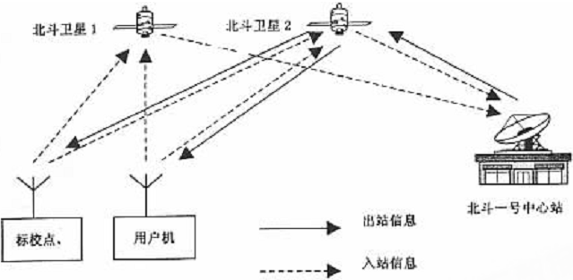

# 1 概述

北斗系统分为两代：北斗一代和北斗二代。其中北斗一代是区域系统，导航信号只覆盖我国及周边，采用双星有源定位技术。北斗二代是全球系统，导航信号覆盖全球，采用类似GPS的无源定位技术。北斗一代计划2颗工作星，2颗备份星。北斗二代计划30多颗卫星，由地球静止轨道、中轨道、倾斜同步轨道等多种卫星混合组成。

北斗卫星系统发射历程如下：

北斗一代：

卫星代号|发射日期|运载工具|发射场|卫星轨道|性质
--------|--------|--------|------|--------|----
BeiDou-1A(又称北斗一号01星)|2000年10月31日|长征3号甲|西昌|地球静止轨道（轨道高度36000km），东经140度|工作
BeiDou-1B(又称北斗一号02星)|2000年12月21日|长征3号甲|西昌|地球静止轨道（轨道高度36000km），东经80度|工作
BeiDou-1C(又称北斗一号03星)|2003年5月25日|长征3号甲|西昌|地球静止轨道（轨道高度36000km），东经110.5度|备份星
BeiDou-1D(又称北斗一号04星)|2007年2月3日|长征3号甲|西昌|地球静止轨道|故障、失效

北斗二代：

卫星代号|发射日期|运载工具|发射场|卫星轨道|性质
--------|--------|--------|------|--------|----
Compass-M1|2007年4月13日|长征3号丙|西昌|中地球轨道，轨道高度21500km|工作
Compass-G2|2009年4月14日|长征3号丙|西昌|地球静止轨道|工作
Compass-G1|2010年1月16日|长征3号丙|西昌|地球静止轨道（轨道高度36000km），东经144.5度|工作
Compass-G3|2010年6月2日|长征3号丙|西昌|地球静止轨道（轨道高度36000km），东经84.7度|工作
Compass-IGSO1|2010年8月1日|长征3号甲|西昌|倾斜同步轨道，轨道高度36000km|工作

注：M表示中轨，IGSO表示倾斜同步轨道，G表示地球静止轨道；中轨卫星高度低，绕地球一圈只有十几小时，位于赤道上空；倾斜同步轨道卫星绕地球一圈24小时，与地球同步，但它不在赤道上空，而是与赤道有一定夹角，因此地面看来并非静止；地球静止轨道卫星绕地球一圈24小时，与地球同步，它位于赤道上空，因此地面看来卫星是静止的；

北斗导航卫星都由中国空间技术研究院进行研制，研制基于东方红3号卫星平台进行。
 

# 2 北斗一代系统—试验系统

70年代后期以来，国际上开展了探讨适合各国国情的卫星导航定位系统的体制研究。先后提出过单星、双星、三星和 星的区域性系统方案，以及多星的全球系统的设想，并考虑到导航定位与通信等综合运用问题，但是由于种种原因，这些方案和设想都没能够得到实现。

1982年7月由美国三位科学家提出并于同年月定名的GEOSTART系统，就是两颗卫星的主动式卫星导航定位系统。后来在实施的过程中，由于有更优越的GPS卫星导航系统的兴起并迅速发展，使GEOSTAR系统不得不在1991年9月撤走资金，导致正在实施中的 系统宣告失败。

1983年“两弹一星”功勋奖章获得者陈芳允院士提出了利用两颗同步定点卫星进行定位与导航的设想，并指出了建立两颗同步卫星导航系统的基本技术路线。在此基础上，1994年中国“北斗一号”卫星导航系统项目正式立项。

## 2.1 系统组成

“北斗一号” 卫星导航定位系统是由三个部分组成：

### （1） 空间卫星部分

两颗地球静止卫星、 一颗在轨备份卫星。其三颗卫星的登记位置为赤道面东经80、140、110.5度， 其中前两颗卫星位置的经度相距60度， 最后一个为备份星星位。卫星遥测遥控分系统在国际电信联盟登记的频段为卫星无线电定位业务频段。

### （2） 地面控制与标校系统

1个配有电子高程图的地面中心定位控制站、几十个分布于全国的参考标校站。

### （3） 用户设备

## 2.2 功能

“北斗一号” 采用双星有源导航定位体制， 只能提供低动态和静态导航定位服务， 可以全天候、全天时提供区域卫星导航信息。服务范围包括中国大陆、 台湾、 南沙及其它岛屿、 中国海、 日本海、 太平洋部分海域及我国部分周边地区。

“北斗一号” 卫星导航定位系统是利用地球同步卫星为用户提供快速导航定位、 简短数字报文通信和授时服务的一种全天候、 区域性的卫星导航定位系统。系统的主要功能体现在三个方面：

### （1） 定位

快速确定用户所在地的地理位置， 向用户及主管部门提供导航信息。

### （2） 通讯

用户与用户、 用户与中心控制系统间均可实现双向简短数字报文通信； 北斗系统用户终端具有双向数字报文通信能力， 用户可以一次传送多达120个汉字的短报文信息。

### （3） 授时

中心控制系统定时播发授时信息， 为定时用户提供时延修正值。可向用户提供20ns~100ns时间同步精度。其中单向授时精度：100ns， 双向授时精度20ns。

## 2.3 定位原理

### （1） 系统组成部分在定位解算中的作用

“北斗一号” 卫星导航定位系统采用双星定位体制， 由2颗地球静止卫星 （GEO） 对用户双向测距， 由1 个配有电子高程图库的地面中心站进行位置解算。定位由用户终端向中心站发出请求， 中心站对其进行位置解算后将定位信息发送给该用户。

### （2） 定位原理的几何解释

“北斗一号” 卫星导航系统采用的定位原理是基于三球交会原理， 即以2颗卫星的已知坐标为圆心， 各以测定的本星至用户机距离为半径， 形成2个球面， 用户机必然位于这2个球面交线的圆弧上。中心站电子高程地图库提供的是一个以地心为球心、 以球心至地球表面高度为半径的非均匀球面。求解圆弧线与地球表面交点， 并已知目标在赤道平面北侧， 即可获得用户的二维位置。

### （3） 定位解算的工作过程

“北斗一号” 卫星导航定位系统的具体定位解算工作过程是：

#### 1） 首先由中心控制系统向卫星 1 和卫星2同时发送询问信号， 经卫星转发器向服务区内的用户广播。

#### 2） 用户响应其中一颗卫星的询问信号， 并同时向两颗卫星发送响应信号， 经卫星转发回中心控制系统。

#### 3） 中心控制系统接收并解调用户发来的信号， 然后根据用户的申请服务内容进行相应的数据处理。对定位申请， 中心控制系统测出两个时间延迟： 即从中心控制系统发出询问信号， 经某一颗卫星转发到达用户， 用户发出定位响应信号， 经同一颗卫星转发回中心控制系统的延迟。

#### 4） 由于中心控制系统和两颗卫星的位置均是已知的， 因此由上面两个延迟量可以算出用户到第二颗卫星的距离， 从而知道用户处于二颗卫星为球心的一个球面， 另外中心控制系统从存储在计算机内的数字化地形图查寻到用户高程值， 又可知道用户处于某一与地球基准椭球面平行的椭球面上。从而中心控制系统可最终计算出用户所在点的三维坐标， 这个坐标经加密由出站信号发送给用户。、

## 2.4 特点

由于北斗卫星导航定位系统是双星系统，因此，共用户接收器只能测得二维(平面)的定位数据。用户若位于海平面上，因高度为零，可以直接求得三维(平面和高 度)的定位数据；但用户若位于陆地或空中，就需要利用地面控制中心的数值地图资料厍或用户自备的测高仪才能求得用户的高度，并进一步确定用户的三维坐标。 若控制中心的数值地图数据库数据不够准确，尤其是要拿到非本国的地理精确数据并不容易，定位出的位置数据就会有问题。 

北斗卫星导航定位系统用户的定位申请要送回地面控制中心，经由中心控制系统解算出用户的三维位置资料之后再发回用户。无线电信号从地面发出，经卫星返回地 面的上下行时间约为0.24—0.28秒，从用户接收器应答测距信号到接收定位结果，信号经过两次上下行链路的传送，时间约需0.56秒，加上中心控制系 统的计算时间，整个定位时间约需1秒钟，即用户接收器约可在1秒钟完成定位。这1秒的定位时间对飞机、导弹这种高速运动的用户嫌时间长，会加大定位的误 差，因此，若要利用北斗卫星导航定位系统进行精确定位，以车辆、船舶等慢速运动的用户较适合。

由于北斗卫星导航定位系统的客户端耍请求定位服务时，必须发出应答信号，即有源应答，如果使用者是军方单位就会使自身失人隐蔽性，且这个定位服务要求的信 号也可被敌方定位，而遭致攻击。另外，客户端除了要和卫星一样接收来自地面控制中心的询问信号，也要发出应答信号，因此，整个系统的同一时间内服务用户的 数量便受用户可使用的通信频率数量、询问信号速率和用户的响应速率等条件的限制，所以北斗卫星导航定位系统的用户设备容量是有限的，每秒钟只能容纳 150个用户。虽然每个客户端都有专用识别码，不过一旦被破解，很容易使整个系统被敌人或有心人士以伪冒信号加以饱和，使系统瘫痪或者是传送假信息，迷惑 友军。由于北斗卫星导航定位系统中地面控制中心扮演着系统关键角色，如：承转卫星信息、解算用户位置等，因此，一旦地而控制中心被毁，整个系统就不能运作 了，这也是北斗系统的致命伤。北斗卫星导航定位系统使用的卫星是同步轨道卫星，这意味着落地信号功率很小，因此，用户机需要有较大天线(直径达20厘米) 才能接收信号，而且因有源应答运作方式，所以，用户机还要包含发射机，因此在体积(普通型用户机长20厘米、宽17.5厘米、高5.2厘米)、重量、耗电 量，甚至价格都远比GPS接收机来得大、重、耗电与贵，而且这么大且重的用户机，不要说是装在导弹上，就是单兵使用都是一大负担。

北斗一号与GPS对比：

项目|北斗一号|GPS
----|--------|----
卫星数量|2|24
轨道特性|北斗导航系统是在地球赤道平面 （轨道高度为36000km） 上设置2 颗地球同步卫星， 2 颗卫星的赤道角距约60度。| 是在6个轨道平面上设置24颗卫星 （轨道高度为20183km ） ， 轨道赤道倾角55度 ， 轨道面赤道角距60度 。卫星绕地球一周需11小时58分。
覆盖范围|北斗一代导航系统是区域性导航系统。|是覆盖全球的全天候导航系统。能够确保地球上任何地点、 任何时间能同时观测到4颗卫星 （实际上最多能观测到11颗）。
定位原理|北斗导航系统是主动式双向测距二维导航。地面中心控制系统解算， 供用户三维定位数据。 “北斗一号” 的这种工作原理带来两个方面的问题， 一是用户定位的同时失去了无线电隐蔽性， 这在军事上相当不利， 另一方面由于设备必须包含发射机， 因此在体积、 重量上、 价格和功耗方面处于不利的地位。	|GPS是被动式伪码单向测距三维导航。由用户设备独立解算自己三维定位数据。
定位精度|北斗导航系统三维定位精度约几十米， 授时精度约100ns。|GPS三维定位精度 P码目前己由16m提高到6m，C/A码目前己由25-100m提高到12m， 授时精度目前约20ns。
用户容量|北斗导航系统由于是主动双向测距的询问-应答系统， 用户设备与地球同步卫星之间不仅要接收地面中心控制系统的询问信号，还要求用户设备向同步卫星发射应答信号，这样， 系统的用户容量取决于用户允许的信道阻塞率、 询问信号速率和用户的响应频率。因此， 北斗导航系统的用户设备容量是有限的。	|GPS是单向测距系统， 用户设备只要接收导航卫星发出的导航电文即可进行测距定位， 因此的用户设备容量是无限的。
生存能力|同所有导航定位卫星系统一样，北斗一号是基于中心控制系统进行工作的， 但“北斗一号” 对中心控制系统的依赖性明显要大很多， 因为定位解算在中心控制站， 而不是由用户设备完成的。|GPS正在发展星际横向数据链技术， 使万一主控站被毁后 GPS卫星可以独立运行。而 “北斗一号” 系统从原理上排除了这种可能性， 一旦中心控制系统受损， 系统就不能继续工作了。
短信功能|	“北斗一号” 卫星导航系统具备短信通讯功能。|GPS系统不具备。
通信功能|	“北斗一号” 卫星同时具备定位与双向通信能力， 可以独立完成移动目标的定位与调度功能。具有物流跟踪、搜救等多样、应急通信等多样业务能力|GPS系统本身不具备通信能力， 需要和其他通讯系统结合才能实现移动目标的远程定位与监控功能。
高动态|“北斗一号 “卫星定位系统是一种有源定位系统， 因此对于高速运动体， 就加大了定位的误差。所以只能提供低动态和静态定位服务， 不能满足高动态和保密的军事用户要求。|GPS系统适用高动态。
自主性|北斗导航系统是有中国自主控制|GPS系统则是由美国军方控制。
时间延迟|“北斗一号” 用户的定位申请要送回中心控制系统， 中心控制系统解算出用户的三维位置数据之后再发回用户， 其间要经过地球静止卫星走一个来回， 再加上卫星转发、 中心控制系统的处理， 时间延迟就更长了。|GPS系统的时间延迟远远小于 “北斗一号” 导航卫星。
寿命周期|目前“北斗一号”3颗星的寿命都是8年|目前GPS卫星的寿命都是12年左右
