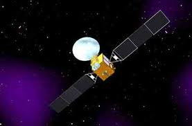

# 概述

北斗系统分为两代：北斗一代和北斗二代。其中北斗一代是区域系统，导航信号只覆盖我国及周边，采用双星有源定位技术。北斗二代是全球系统，导航信号覆盖全球，采用类似GPS的无源定位技术。北斗一代计划2颗工作星，2颗备份星。北斗二代计划30多颗卫星，由地球静止轨道、中轨道、倾斜同步轨道等多种卫星混合组成。

北斗卫星系统发射历程如下：

北斗一代：

卫星代号|发射日期|运载工具|发射场|卫星轨道|性质
--------|--------|--------|------|--------|----
BeiDou-1A(又称北斗一号01星)|2000年10月31日|长征3号甲|西昌|地球静止轨道（轨道高度36000km），东经140度|工作
BeiDou-1B(又称北斗一号02星)|2000年12月21日|长征3号甲|西昌|地球静止轨道（轨道高度36000km），东经80度|工作
BeiDou-1C(又称北斗一号03星)|2003年5月25日|长征3号甲|西昌|地球静止轨道（轨道高度36000km），东经110.5度|备份星
BeiDou-1D(又称北斗一号04星)|2007年2月3日|长征3号甲|西昌|地球静止轨道|故障、失效

北斗二代：

卫星代号|发射日期|运载工具|发射场|卫星轨道|性质
--------|--------|--------|------|--------|----
Compass-M1|2007年4月13日|长征3号丙|西昌|中地球轨道，轨道高度21500km|工作
Compass-G2|2009年4月14日|长征3号丙|西昌|地球静止轨道|工作
Compass-G1|2010年1月16日|长征3号丙|西昌|地球静止轨道（轨道高度36000km），东经144.5度|工作
Compass-G3|2010年6月2日|长征3号丙|西昌|地球静止轨道（轨道高度36000km），东经84.7度|工作
Compass-IGSO1|2010年8月1日|长征3号甲|西昌|倾斜同步轨道，轨道高度36000km|工作

注：M表示中轨，IGSO表示倾斜同步轨道，G表示地球静止轨道；中轨卫星高度低，绕地球一圈只有十几小时，位于赤道上空；倾斜同步轨道卫星绕地球一圈24小时，与地球同步，但它不在赤道上空，而是与赤道有一定夹角，因此地面看来并非静止；地球静止轨道卫星绕地球一圈24小时，与地球同步，它位于赤道上空，因此地面看来卫星是静止的；

北斗导航卫星都由中国空间技术研究院进行研制，研制基于东方红3号卫星平台进行。
 

