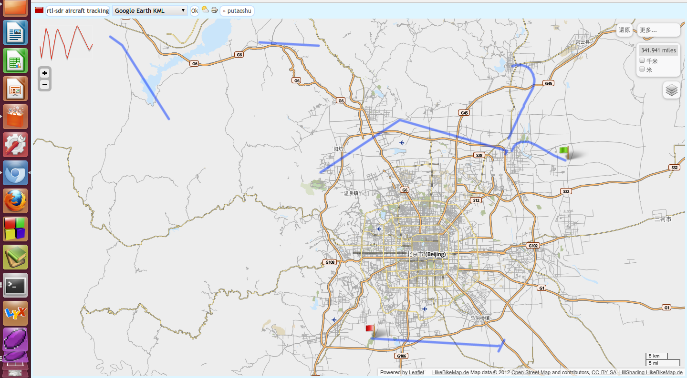
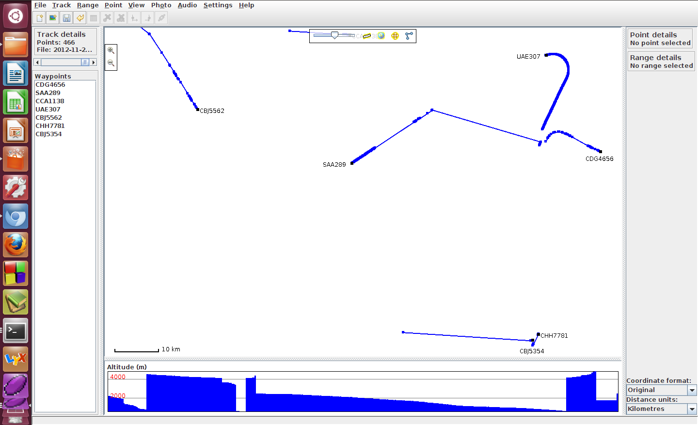
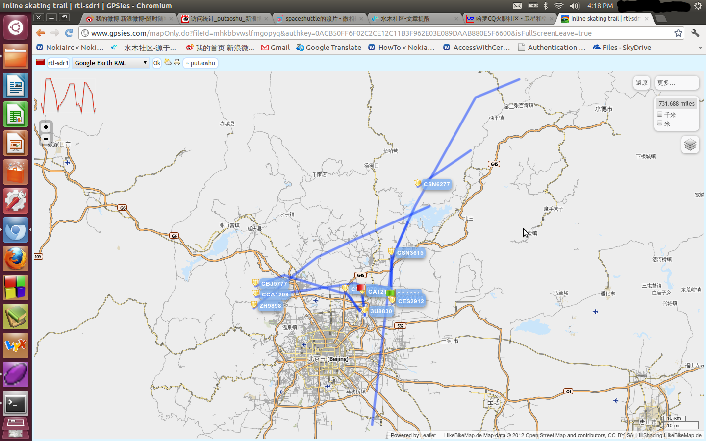
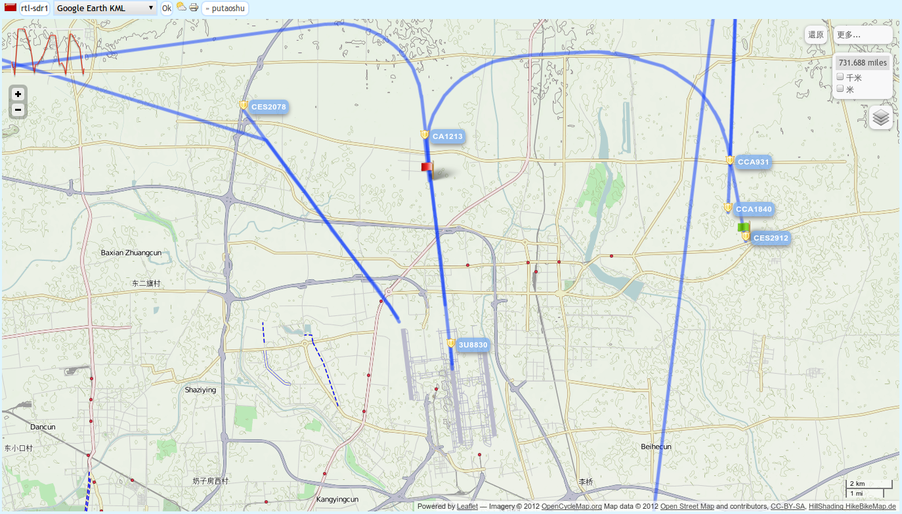

(原文刊于被sina关闭的我的sina博客)

什么是rtl-sdr电视棒跟踪飞机，神奇的简介就是用那个淘宝上仅50多元的电视棒，天线靠近窗户接收飞机在1090MHz广播的ADS-B信号，rtl-sdr电视棒可以把收到的原始信号通过usb送给电脑，电脑解调后得到飞机编号、航班号、位置轨迹等信息。

普通的电视棒当然不能把原始信号送给电脑，不过用了rtl2832芯片的电视棒被破解了，可以把原始信号送给电脑，这样就可以用电脑分析解调任意信号而不是局限于电视信号了。

关于什么是rtl-sdr，请参考这个网页：  

[http://sdr.osmocom.org/trac/wiki/rtl-sdr](http://sdr.osmocom.org/trac/wiki/rtl-sdr)

你会发现大家搞的不亦乐乎。  

这个网页上有一堆rtl-sdr能用的程序，比如这个gr-air-modes，我就是用这个程序追踪的飞机。

我手头电视棒实测:  （验证了两种rtl-sdr电视棒,一个是E4k tuner另外一个是新的r820t tuner.  ）

1.  

E4k tuner 电视棒Terratec T Stick PLUS不丢包最大采样率2.4Msps,增益范围-1 ~ 42dB,频率范围:  

E4K range: 52 to 2205 MHz  

E4K L-band gap: 1104 to 1243 MHz  

2.048Msps时有大概正负60Hz的采样频差.  

2.  

ezcap USB 2.0 DVB-T/DAB/FM dongle电视棒  

不丢包最大采样率2.4Msps,增益范围0 ~ 49.6dB,频率范围rtl_test测不到,因为不支持测非E4k的电视棒.  

2.048Msps时有200多Hz的采样频差.  

使用上面网页给的链接，linux下的软件:    

gr-air-modes    ADS-B RX    Nick Foster     [https://www.cgran.org/wiki/gr-air-modes](https://www.cgran.org/wiki/gr-air-modes) call with --rtlsdr option    

可以接收飞机自行广播的数据，以及空中防撞系统TCAS和空中监视二次雷达的查询和飞机的应答信号，直观的说你可以获得地
平线以上飞机的飞行信息：位置高度速度id等等。  

接收时注意要把增益设置的高一些,记录的坐标可以存为kml文件。因为google封掉了,可以用gpsprune看轨迹或者上传到gpsies.com看轨迹。

一些飞机轨迹图：平面：

这张白图（gpsprune软件）除了包含平面轨迹，还包含高度剖面，可以看到一些轨迹是飞机高度从4000多米降下来的过程(白图最下面是高度)(或者起飞?)

另一次采集最远采集到了144km之外承德上空的飞机，高度万米以上，  
另外能清楚地看到图中首都机场左边和中间跑到上起降的过程和进近路线。

放大的机场起降过程和轨迹

