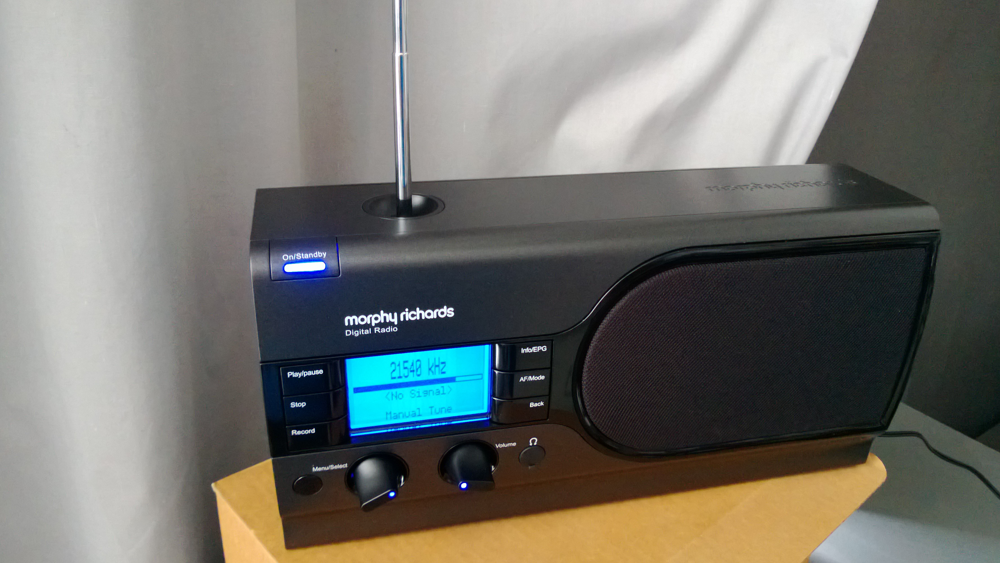

(原文刊于被sina关闭的我的sina博客)

机子58，邮费税等大概51。

高兴的下单，心算了一下600多，比德生660贵不了多少。
  
今早班车上突然想起，不会是欧元吧，那样就要800多，忍了。
  
过了一会儿心中升起可怕的念头，赶紧上去看看那货币符号啥意思，果然是。。。。英镑。。。
  
心在流血

---------------下文分割线---------------------------------------------

快递追踪，UPS不得不赞一个

    Beijing, China 08/13/2013 10:41 A.M. Delivered
    08/13/2013 8:20 A.M. Out For Delivery
    08/13/2013 12:49 A.M. Arrival Scan
    Beijing, China 08/12/2013 10:47 P.M. Departure Scan
    08/12/2013 3:04 P.M. Clearing Agency is requiring an invoice comparison to the items being shipped. / Released by Clearing Agency. Now in-transit
    08/12/2013 1:46 P.M. Clearing Agency is requiring an invoice comparison to the items being shipped.
    08/12/2013 1:45 A.M. Warehouse Scan
    08/12/2013 1:37 A.M. Import Scan
    Beijing, China 08/11/2013 9:09 P.M. Adverse weather conditions.
    08/11/2013 8:50 P.M. Arrival Scan
    Chek Lap Kok, Hong Kong 08/11/2013 2:55 P.M. Departure Scan
    08/11/2013 3:00 A.M. Arrival Scan
    Dubai, United Arab Emirates 08/10/2013 3:29 P.M. Departure Scan
    08/10/2013 1:22 P.M. Arrival Scan
    Koeln, Germany 08/10/2013 5:09 A.M. Departure Scan
    08/10/2013 12:41 A.M. Arrival Scan
    Castle Donnington, United Kingdom 08/09/2013 10:30 P.M. Departure Scan
    08/09/2013 9:46 P.M. Export Scan
    08/09/2013 9:10 P.M. Arrival Scan
    08/09/2013 7:48 P.M. Package data processed by brokerage. Waiting for clearance. / Released by Clearing Agency. Now in-transit
    08/09/2013 7:31 P.M. Package data processed by brokerage. Waiting for clearance.
    Exeter, United Kingdom 08/09/2013 5:50 P.M. Departure Scan
    08/09/2013 11:35 A.M. Pickup Scan
    United Kingdom 08/09/2013 5:52 A.M. Order Processed: Ready for UPS  
  
机器收到了，天线很短，灵敏度估计差的一塌糊涂。

在北京亦庄开发区扫不到DAB。

从 [drm.org](drm.org) 看到有一个90KW的印尼对华汉语广播：

UTC 0400-0430 daily 21540Hz beam 67 China 90kW RRI Tiganesti Chinese

手动输入DRM频率也收不到。
  
看来接下来要折腾天线了。
  
上个pp。 

<noscript>Please enable JavaScript to view the <a href="http://disqus.com/?ref_noscript">comments powered by Disqus.</a></noscript>

