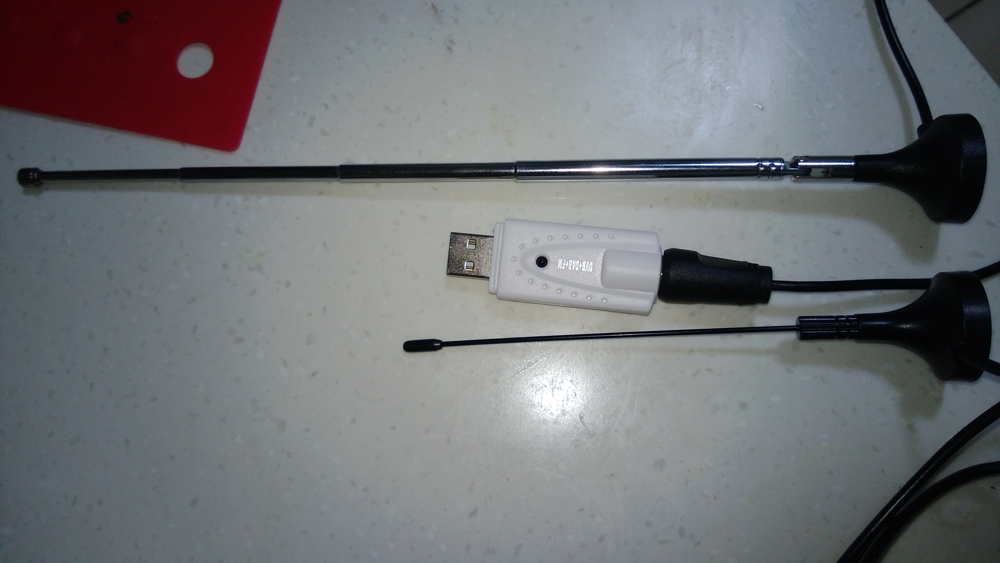
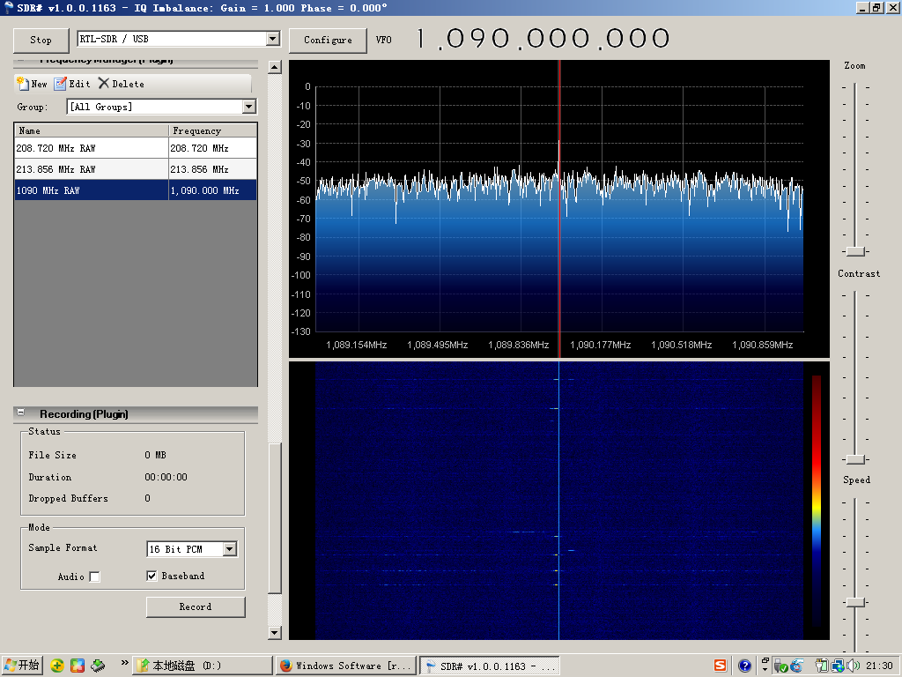
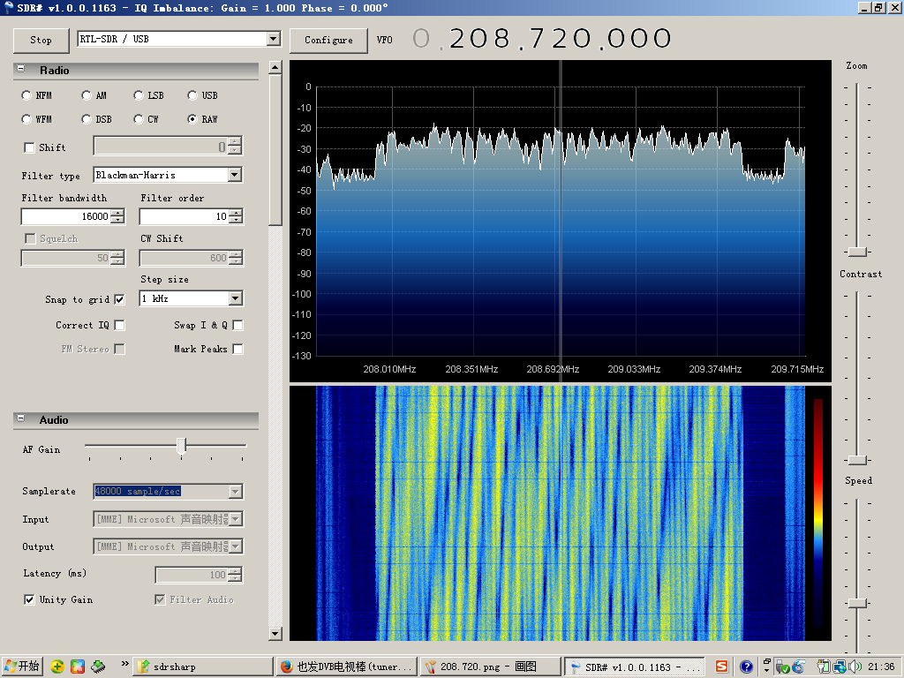

(原文刊于被sina关闭的我的sina博客)

立水桥，北向，14楼，玻璃窗，天线放在屋内窗台，底盘吸在倒置的奶粉桶底部，天线向上。

白色是电视棒， tuner 820t

小黑短天线是原装的，信号不太好，长一些的天线是借用另外一个电视棒的，信号好一些。

长天线长度26.4cm，从底座底部算起。

不过虽然小黑天线信号不太好，但其实长天线能搜到的台它也能搜到，只不过时断时续。
  

最新经验是天线吸在接地良好的平面很重要，我吸在暖气上比吸在奶粉桶上好很多！
  
使用随机光盘里的driver和软件，软件叫 Presto! PVR。
  
**说说搜到的结果：**

**1. 设置为DVB/DMB-T，区域选择china**

在794MHz收到4个台，都能看

标示    |内容
----------|-----------
DT| 北广传媒

GJ| 北广传媒移动电视

CITY| 城市电视

CCTV1| 中央1
  
**2. 设置为DAB，区域选择china**

收到17个台，都能顺畅收听。中文支持不好，台名字显示乱码，频率分别是：

频率  |     音频ID
----------------|---------------
208.720MHz |49154
208.720MHz |49153
208.720MHz |49155
-----------|------------
210.432MHz |49153
210.432MHz |49155
210.432MHz |49154
-----------|------------  
212.144MHz |49158
212.144MHz |49153
212.144MHz |49154
212.144MHz |49155
212.144MHz |49156
212.144MHz |49157
  -----------|------------
213.856MHz |49153
213.856MHz |49154
213.856MHz |49155
213.856MHz |49156
213.856MHz |49157
  
**3. 设置为FM 收到23个台**
  
总的说来接收到台的数量和质量出乎我的意料，看来北京这几年DMB-T/DAB布网一直在进行啊，这里可是北5环6环中间的地方啊。

美中不足，电视棒用一会儿好烫，不能用手摸金属部分，例如USB口，恐怖。 

来几张信号的频谱瀑布图。

213.856MHz DAB信号

1090MHz 飞机的ADS-B信号

208.72MHz DAB信号

