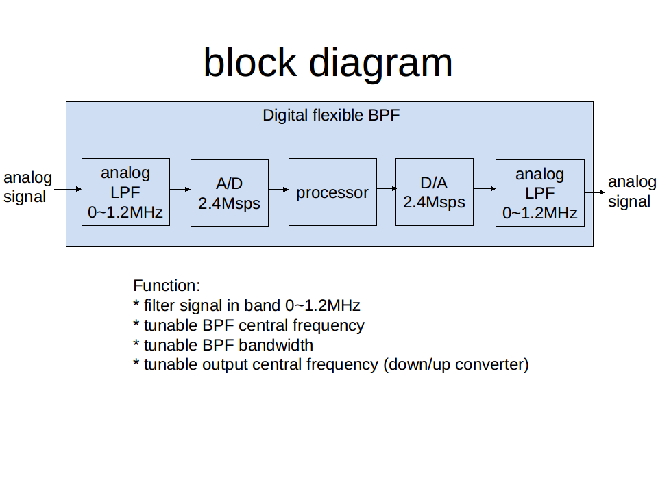
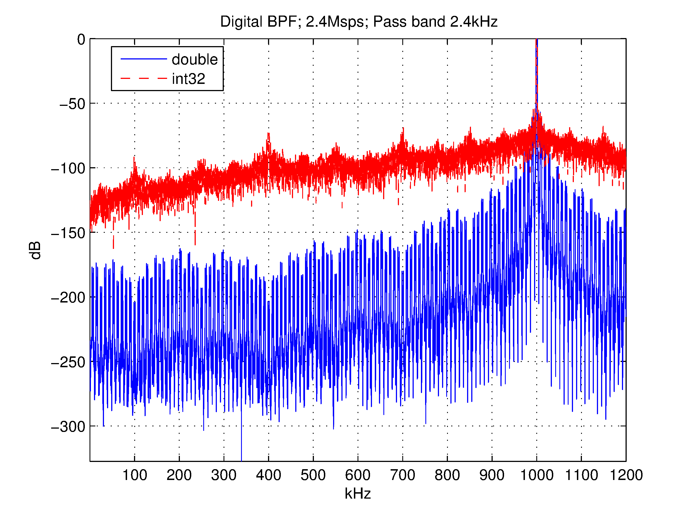
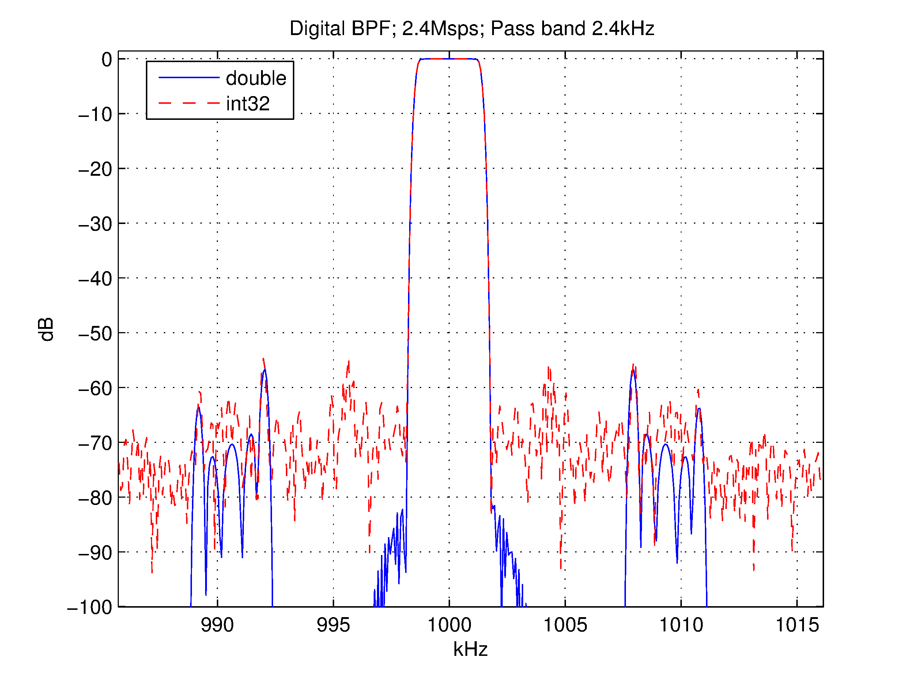

(原文刊于被sina关闭的我的sina博客)

现在的一些ARM单片机处理能力越来越强，于是想到有可能diy一个工作频率比较低的数字化BPF了。
  
系统框图

输入的模拟信号需要带限在1.2MHz以下，通过2.4Msps的A/D进入数字系统，进行变频滤波等操作，最后通过D/A还原为模拟信号。
  
主要功能：中心频率和带宽可调的窄带滤波器，输出的模拟信号频率可以和输入相同也可以不同，即滤波器可以附加变频器功能，将来也可以尝试一些解调操作，比如包络检波之类的。
  
添加32bit定点化的结果，基本做到和双精度一样的选择性（16bit还是不容易做到那么窄的选择性，除非增加滤波器阶数，

但这会增大运算量，trade-off），因为目标是用单片机，所以就不像FPGA那样细tuning位宽了。剩下就是估算一下MIPS需求，选择相应的单片机。

两张频谱图是一个工作在1MHz中心频率的3.6kHz带宽的数字化滤波器仿真结果。
  
定点仿真的频谱图 -- 全景：

定点仿真的频谱图 -- 细节：

<noscript>Please enable JavaScript to view the <a href="http://disqus.com/?ref_noscript">comments powered by Disqus.</a></noscript>

<!-- Global site tag (gtag.js) - Google Analytics -->

