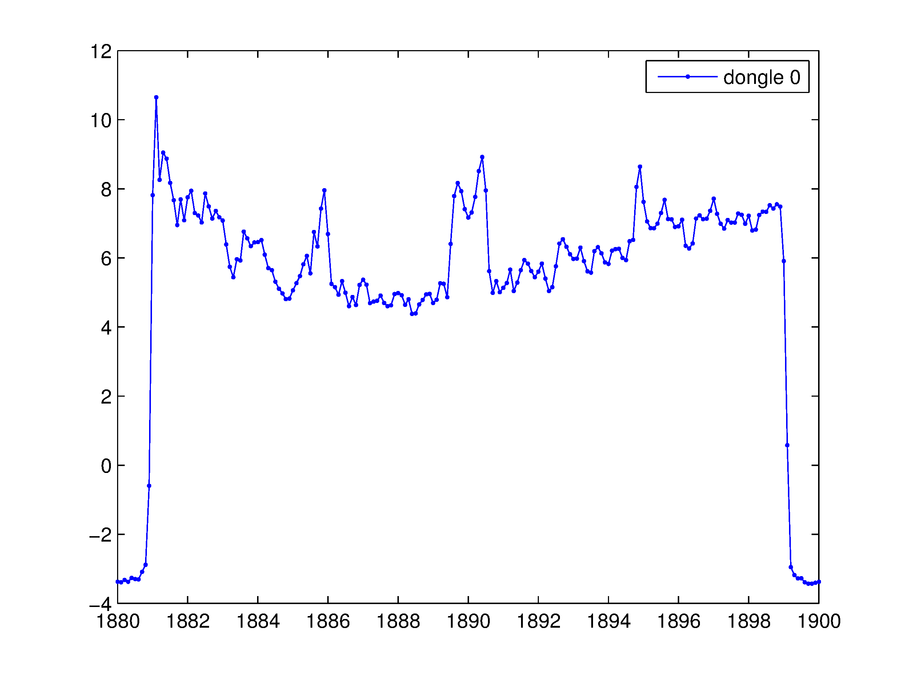

(原文刊于被sina关闭的我的sina博客)

用一个几十块钱的USB电视棒来扫描运营商的LTE信号频谱，以及解调一些小区信息。

关于电视棒软件无线电，rtl-sdr有兴趣的请参见这篇：["rtl-sdr, RTL2832电视棒追踪飞机教程(ADS-B)"](link)

这里只说说我用电视棒扫描LTE信号的的一些结果。

从网上搜到三大运营商的LTE频率为（超出电视棒 E4000 tuner最高调谐频率2200M的频率没写）：

中国移动 1880-1900MHz

中国电信 1755-1785MHZ（上行）/1850-1880MHz（下行）

中国联通 1955-1980MHz（上行）/2145-2170MHz（下行）

因为移动是TDD，所以上下行频率相同，电信和联通是FDD，上下行频率是分开的。

E4k tuner的电视棒，能调到1880～1900MHz（据网上说移动lte是这个频率），820T的tuner是调不到这个频率的。
但是E4K的性能又一般，没办法。

一些初步的观察是这样：

1. 移动的LTE信号带宽20MHz，竟然在北五环外立水桥有很强的疑似信号（有人说移动在1880-1900跑的TD-SCDMA而不是LTE，但从频谱看 又比较像LTE，因为TD的一个载波没那么宽），但在雍和宫附近室内却没扫到（可能是频率占用/规划问题）。由于工具问题（软件解FDD没问题，可能对 TDD水土不服）未能成功解调小区信息。

2. 电信的LTE下行信号带宽20MHz，在雍和宫附近室内成功扫到频谱，并解调出一个20MHz小区和一个5MHz小区的信息。最新发现在立水桥也能扫到小区并解调一些信息，电信已经覆盖这么好了？ 

3. 联通的LTE下行信号似乎是两个并行的5MHz，在雍和宫附近室内成功扫到频谱，由于工具问题未能解调。

4. 因为周围LTE手机远未普及，所以没扫到上行信号。

---------最新进展分割线---------------------------------

写这篇blog时，还不支持电视棒外接变频器扩展频段和TDD，后来经过改进已经支持TD-LTE，以及外接变频器。

详见：

[土法again LTE D频段(2500~2690MHz)三大运营商TD-LTE频谱全抓(TD-LTE Beijing capture scan)](http://sdr-x.github.io/%E5%9C%9F%E6%B3%95again%20LTE%20D%E9%A2%91%E6%AE%B5%282500~2690MHz%29%E4%B8%89%E5%A4%A7%E8%BF%90%E8%90%A5%E5%95%86TD-LTE%E9%A2%91%E8%B0%B1%E5%85%A8%E6%8A%93%28TD-LTE%20Beijing%20capture%20scan%29/)

[搞定LTE Scanner的TDD以及LNB模式,rtl-sdr电视棒扫描小区MIB](link)

[OpenCL加速LTE小区搜索(rtl-sdr电视棒)半秒扫一个频点!](link)

以下是真相时间！

地点40.046787,116.403211，近立水桥，14层楼窗内。北向窗，移动1880-1900MHz，明显的OFDM矩形频谱，陡峭的边沿。

地点40.046787,116.403211，近立水桥，14层楼窗内。南向窗，移动1880-1900MHz，信号比北向弱一些，仍然是陡峭的边沿。
两种可能，天通苑布设了LTE基站？或者是因为南边的楼距离我较近，遮挡严重，导致北窗好一些。

地点39.951908,116.420465，近雍和宫，3层北向室内。
移动1880-1900MHz，没看到LTE OFDM矩形谱，但是1900的那侧似乎有较强的其他信号，这可能是这里不用LTE的原因？通过一些技术配置手段其实LTE是可以在这里用的，但可能移动初期还没有深入去弄这些东西？

--------2014-1-11----------------------------------------

最新发现在立水桥也能扫到小区并解调一些信息，电信已经覆盖这么好了？
  
--------我是2014-1-10更新分割线-----------------------------

在 @piview 的提醒下扫了一下电信和联通的频段，果然有所斩获！

好戏来了。地点39.951908,116.420465，近雍和宫，3层北向室内。
电信1850-1880MHz，实际LTE下行信号占用1850-1870MHz 共20MHz带宽，中心频率1860MHz。

使用LTE-Cell-Scanner （ https://github.com/Evrytania/LTE-Cell-Scanner ）成功解调如下信息：

  Detected a cell!
  
    cell ID: 22
    
    RX power level: -12.1782 dB
    
    residual frequency offset: -39480.6 Hz
    
  Detected a cell!
  
    cell ID: 245
    
    RX power level: -30.5947 dB
    
    residual frequency offset: -57346 Hz

奇怪的是除了中心频率1860，居然在1860.9也检测到一个下行信道，不知道是虚假的还是真的远方小区信号窜过来的。

CID|A |fc     |foff  |RXPWR|C |nRB|P |PR |CrystalCorrectionFactor
-----|-----|-------|------|-----|------|------|------|-----|------------------------
22 |2 |1860M  |-39.5k|-12.2|N |100|N |one|0.99997877433266058045
245|2 |1860.9M|-57.3k|-30.6|N |25 |N |1/6|0.99996918467920425933

上面第一列是小区ID，第二列是基站下行天线端口数量，第三列载波频率，第四列为频偏（和我用的破电视棒有关系，不表示信号质量），接下来一列为接收功 率，再接下来表示循环前缀CP类型为normal而不是extended，接下来是RB数量第一个小区100RB（即20MHz带宽LTE配置），第二个 小区25RB（是一个5MHz小区），再接下来是PHICH 信道duration为normal类型而不是extended类型，再接下来是PHICH信道的REs组的数量有关的一个参数，20MHz小区为 1,25MHz小区为1/6，这些都是运营商可配的参数。最后是一个用于本地硬件时钟校准的估计值，即依靠LTE信号校准这个破USB电视棒。
这个软件还能动态监视天线端口0、1的信噪比以及PSS/SSS信道的信噪比、信道的幅度、相位响应。

最新发现，在立水桥同样的频率，可以得到除了Cell ID之外都很像的两个小区信息，不过信号比雍和宫要弱。 

  Found Elonics E4000 tuner 
  
  Waiting for AGC to converge... 
  
  Examining center frequency 1860 MHz ... 
  
  Capturing live data 
  
    Calculating PSS correlations 
    
    Searching for and examining correlation peaks... 
    
    Detected a cell! 
    
      cell ID: 86 
      
      RX power level: -36.1527 dB 
      
      residual frequency offset: -39689.7 Hz 
      
    Detected a cell! 
    
      cell ID: 142 
      
      RX power level: -40.2478 dB 
      
      residual frequency offset: -39696.3 Hz 
      
  Detected the following cells: 
  
  A: #antenna ports C: CP type ; P: PHICH duration ; PR: PHICH resource type 
  
  CID|A|fc|foff|RXPWR|C|nRB|P|PR|CrystalCorrectionFactor
  ----|----|----|----|----|----|----|----|----|-------
  86 |2 |  1860M |-39.7k| -36.2| N |100| N |one| 0.99997866189535433712 
  142| 2 |  1860M |-39.7k| -40.2| N |100| N| one| 0.99997865837659749566 

地点39.951908,116.420465，近雍和宫，3层北向室内。
联通2145-2170MHz，看起来像2个并行的5MHz信号，中心频率分别为2147.5MHz和2152.5MHz。由于工具的原因，未能解调，调试中。

