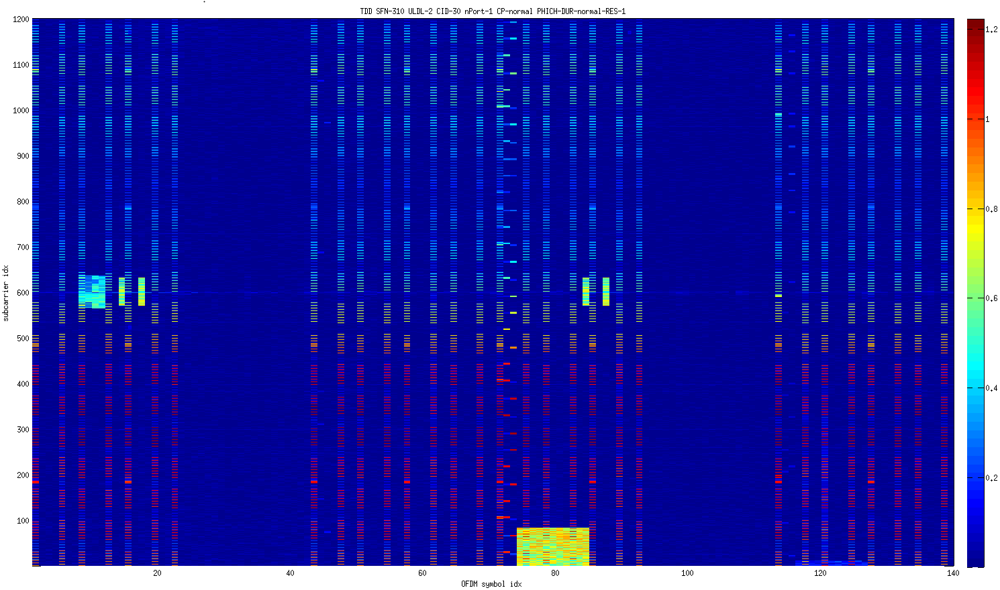

(原文刊于被sina关闭的我的sina博客)

原文发表于： [http://www.hackrf.net](http://www.hackrf.net)

这篇文章是["LTE小区搜索软件加入对HACKRF的支持，有望将来解调LTE SIB信息(Add hackrf support to LTE Cell Scanner)"](http://sdr-x.github.io/LTE%E5%B0%8F%E5%8C%BA%E6%90%9C%E7%B4%A2%E8%BD%AF%E4%BB%B6%E5%8A%A0%E5%85%A5%E5%AF%B9HACKRF%E7%9A%84%E6%94%AF%E6%8C%81%EF%BC%8C%E6%9C%89%E6%9C%9B%E5%B0%86%E6%9D%A5%E8%A7%A3%E8%B0%83LTE%20SIB%E4%BF%A1%E6%81%AF%28Add%20hackrf%20support%20to%20LTE%20Cell%20Scanner%29/)和["使用C和C++直接调用HACKRF来支持LTE小区搜索(LTE Cell Scanner by HACKRF(C, C++))"](http://sdr-x.github.io/%E4%BD%BF%E7%94%A8C%E5%92%8CC++%E7%9B%B4%E6%8E%A5%E8%B0%83%E7%94%A8HACKRF%E6%9D%A5%E6%94%AF%E6%8C%81LTE%E5%B0%8F%E5%8C%BA%E6%90%9C%E7%B4%A2%28LTE%20Cell%20Scanner%20by%20HACKRF%28C,%20C++%29%29/)的一个延续。[最终解析SIB的方法在此](http://sdr-x.github.io/%E4%BD%BF%E7%94%A8lameditor%E5%92%8Casn1c%E5%BC%80%E6%BA%90%E5%B7%A5%E5%85%B7%E8%A7%A3%E6%9E%90%E5%8C%97%E4%BA%ACLTE%E7%8E%B0%E7%BD%91%20RRC%20SIB%20ASN1%E6%B6%88%E6%81%AF/)

HACKRF比起电视棒的巨大优势之一是带宽和采样率高了很多，因此如果不用来玩完整带宽的LTE信号的话让掏了比电视棒贵xx倍的钱买HACKRF的人情何以堪！

从HACKRF公开的指标来看，带宽和采样率最大约20M。目前部署的主流LTE（至少用小区搜索程序在国内看到的）均为20MHz带宽配置。那么用HACKRF能接收整个20MHz带宽的LTE信号吗？这里给出答案：

YES！

根据LTE标准，20MHz带宽的配置下，基本采样率为30.72Msps，但HACKRF最高采样率约20Msps，这是我们需要克服的第一个困难。根据采样理论和HACKRF的硬件架构，HACKRF应该是能无损保存20MHz带宽信号的（不考虑A/D量化噪声和模拟电路非理想因素），这扫清了理论上的障碍。只不过HACKRF保存下来的信号采样率为20Msps左右，剩下的就是怎么把采集的信号从大约20Msps变换为LTE标准的 30.72Msps。其实这在数字信号处理里是一个再经典不过的问题，就是"分数倍采样率变换"。一般的做法是进行M倍过采样和N倍抽取，得到M/N倍的有理数倍采样率变换。需要选择合适的参数使得M和N不是太大，否则处理负担会很重，当然采样率变换过程中滤波器也少不了，采用成熟设计手段即可。最终采样率变换使用的参数为：

HACKRF设置采样率19.2M；M=8；N=5；最终得到30.72M采样率。（其实直接在19.2Msps上做解调也是可以的，只不过接收算法中OFDM点数，CP长度等都做相应的调整即可）

其实这里有两点我们非常幸运。一是国内扫到的LTE信号基本都是100RB的，即实际带宽为100*180kHz=18MHz, 20M只是一个网络配置的问题，并非信号实际占用带宽。二是经过测试HACKRF和计算机之间 USB实际传输带宽，发现最大吞吐也就支持20Msps左右采样率。我们能用19.2Msps采样率搞定一切真的很幸运，基本上已经将HACKRF的能力发挥到极致了！

其实一开始知道HACKRF采样率只有20M时，我心想看来最多只能玩玩10MHz的LTE了，因为LTE-10MHz所需的15.36Msps采样率对于HACKRF还是没问题的，但30.72Msps采样率HACKRF就不行了。不过有一次王康打电话和我讨论LTE，我说LTE信号带宽是20MHz，王康问那是不是能用HACKRF接收？因为HACKRF最大支持20MHz带宽。就在那一瞬间激发了我的灵感，心想：是啊，虽然采样率比标准规定的低，但理论上应该没问题。于是答应下来想想怎么弄。到今天终于证明了其可行性。“无知者无畏”绝对是褒意词！估计手机芯片商和基站厂商没一个这么做的，人家都是不差钱的高大上，30.72M的采样率还不是小case？A/D直接给支持喽！你要30.72M给你61.44M行不行？

这里用19.2Msps玩LTE，借用某工匠的话：不是为了证明我赢了那些厂商，只是认真做做看行不行。

有了 30.72Msps采样率的LTE信号，剩下的就好办了。把LTE下行接收机所需的流程和算法一溜烟做一遍就是了：PSS(主同步) SSS(辅同步)检测、时频同步、信道估计和PBCH(物理广播信道)盲捡得到MIB和其他一些必要信息（SFN(系统帧号)，端口数之类的）、然后就是在整个20M带宽内提取各个信道的符号，按照标准去解调解码： PCIFCH(物理控制信息格式信道) --> PHICH(物理HARQ指示信道) --> PDCCH(物理下行控制信道)盲检，最后可以看到format1A的DCI(控制格式指示)所指示的SIB(系统信息块)的星座图。从开始到PBCH盲检借用了原作者James Peroulas的不少代码，TDD支持以及PCFICH之后都是按照标准自己做的。

下面是真相时间！（你可已从这里 [https://github.com/JiaoXianjun/LTE-Cell-Scanner](https://github.com/JiaoXianjun/LTE-Cell-Scanner) 下载代码和抓取的LTE信号，自己运行一下：Matlab/LTE_DL_receiver.m）

2360MHz 解析出来的TD-LTE 20MHz时频格（纵轴子载波，横轴OFDM符号）。这是一帧10ms信号。TDD模式，帧号310、上下行配置2、物理层小区ID 30、端口数1、Normal CP、PHICH duration Normal、PHICH resource 1（参见图标题）。

图中可明显看到CRS、PSS、SSS、PBCH、PDCCH和子帧5上的一个PDSCH（SIB1）。

2360MHz MATLAB的一些解调输出信息：

    TDD SFN-310 ULDL-2-|D|S|U|D|D|D|S|U|D|D| CID-30 nPort-1 CP-normal PHICH-DUR-normal-RES-1
    
    SF5 PHICH1 PDCCH3 RNTI: SI-RNTI SI-RNTI
    
    No.0 4CCE: Localized VRB from RB0 to RB6 MCS-2 HARQ-0 NEWind-0 RV-1 TPC-1 DAI-0
    
    No.0 8CCE: Localized VRB from RB0 to RB6 MCS-2 HARQ-0 NEWind-0 RV-1 TPC-1 DAI-0

以上信息表明在子帧5上检测到一个PDCCH（通过SI-RNTI校验），和时频格相符合。这是一个format1A的DCI指示SIB1的位置，根据这个指示，找到SIB1所在的PDSCH资源格，画出均衡后的星座图：

上面的基站正好在发射单端口的信号，因此时频格和星座图比较好看。下面是一个双端口发射信号。

2585MHz 解析出来的TD-LTE 20MHz时频格。这是一帧10ms信号。TDD模式，帧号900、上下行配置2、物理层小区ID 216、端口数2、Normal CP、PHICH duration Normal、PHICH resource 1（参见图标题）。图中可明显看到CRS、PSS、SSS、PBCH、PDCCH和子帧4、5上的PDSCH。

2585MHz MATLAB的一些解调输出信息：

    TDD SFN-900 ULDL-2-|D|S|U|D|D|D|S|U|D|D| CID-216 nPort-2 CP-normal PHICH-DUR-normal-RES-1
    
    SF4 PHICH1 PDCCH1 RNTI: SI-RNTI SI-RNTI
    
    No.0 4CCE: Localized VRB from RB0 to RB5 MCS-2 HARQ-0 NEWind-0 RV-0 TPC-1 DAI-0
    
    No.0 8CCE: Localized VRB from RB0 to RB5 MCS-2 HARQ-0 NEWind-0 RV-0 TPC-1 DAI-0
    
    SF5 PHICH1 PDCCH1 RNTI: SI-RNTI SI-RNTI
    
    No.0 4CCE: Localized VRB from RB0 to RB5 MCS-2 HARQ-0 NEWind-0 RV-3 TPC-1 DAI-0
    
    No.0 8CCE: Localized VRB from RB0 to RB5 MCS-2 HARQ-0 NEWind-0 RV-3 TPC-1 DAI-0

以上信息表明在子帧4、5上都检测PDCCH（通过SI-RNTI校验），和时频格相符合。具体信息已在上面列出。

按照惯例，最后放出demo视频：

国内：[http://v.youku.com/v_show/id_XNzE3NDYwMDgw.html](http://v.youku.com/v_show/id_XNzE3NDYwMDgw.html)

(好像hack或者hackrf变成youku过滤词了,得避免才能发布)

国外：[http://youtu.be/2JH_EGdHyYE](http://youtu.be/2JH_EGdHyYE)

<noscript>Please enable JavaScript to view the <a href="http://disqus.com/?ref_noscript">comments powered by Disqus.</a></noscript>
