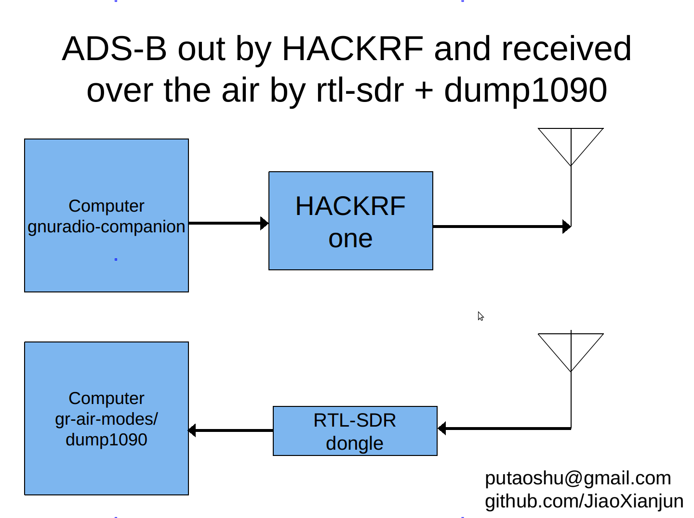

Hi,

I did a simple experiment on ADS-B. See attached picture for principle. 

And video here: [http://youtu.be/xpLDqBkUiKc](http://youtu.be/xpLDqBkUiKc)

You can get GRC for replay here: [https://github.com/JiaoXianjun/GNSS-GPS-SDR/tree/master/adsb](https://github.com/JiaoXianjun/GNSS-GPS-SDR/tree/master/adsb)

**But I need your attention!!! if you want do some experiments.**

**ATTENTION!!!**

Transmit at 1090MHz is dangerous if you are not authorized!

Do not transmit at 1090MHz!

Select legal frequency and legal/low-enough power to transmit very locally for example in a basement or chamber/room via a close-loop RF cable.

Make sure you are not interfering any other systems! 

Have fun with safety.
