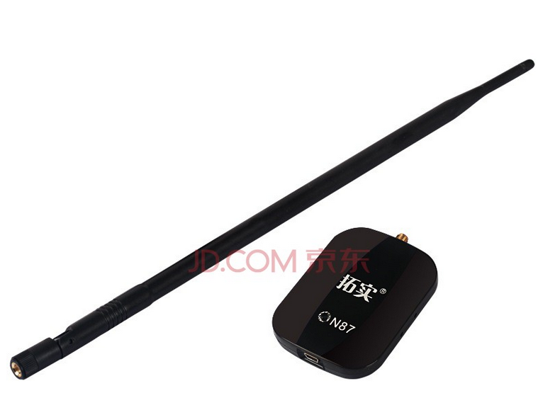
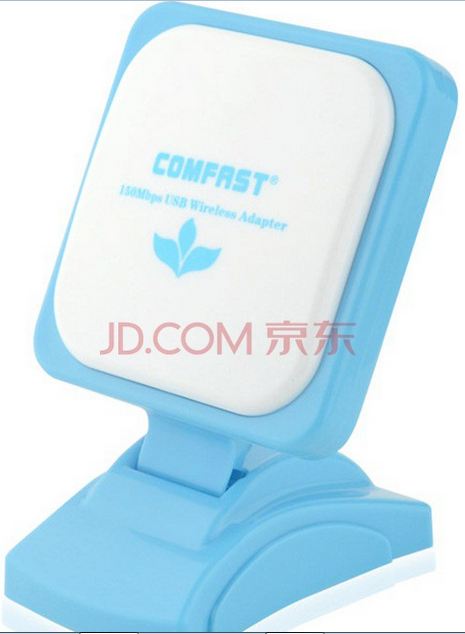

家里的wifi路由器和某房间的台式机没有直视路径，因此信号太差经常断线，遂想办法。

第一款89元,号称10dB增益,天线实测大约38cm长.这长了果然不是盖的,速率和信号指示明显改善,看视频不卡了. 不过估计比淘宝贵不少.

第二款59元,号称12dB高增益.
结果买来发现完全是骗子,和我原来的信号一样差(因为房间距离问题,原来的信号太差,所以想搞个天线给力的),但显示一堆AP都信号指示爆好,明显是虚假的. 卡卡卡. 于是退货，某东就一点好, 退货和送货一样方便.

(我是不是又涉嫌广告了....)
  
-------------------2014-10-11更新：----------------------------

用了长天线，虽然不断线能用了，但下载速率还是有限，大概能到170kB吧。最近上某东买了最后一张图那个wifi中继的小东西，插在了一个我台式机和无线路由器都能看到的插座上，这下下载速度竟然提高到了900多kB，还是加中继釜底抽薪啊。 

<noscript>Please enable JavaScript to view the <a href="http://disqus.com/?ref_noscript">comments powered by Disqus.</a></noscript>
