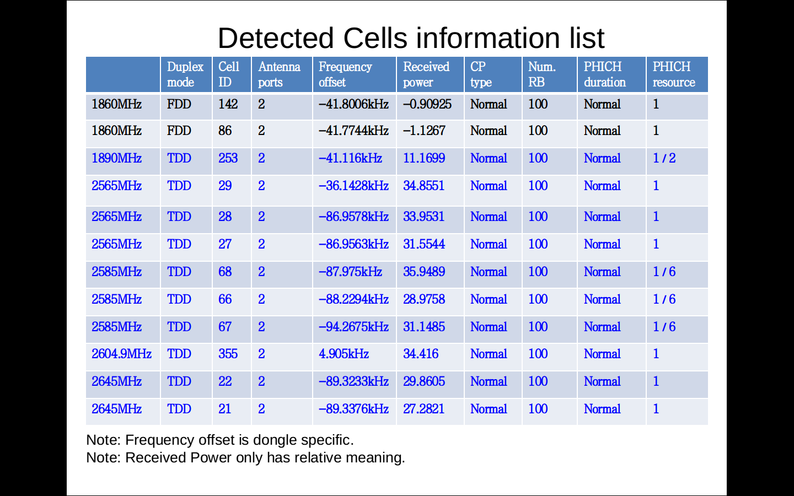

-----------------------------------------------------------------------------------

LTE-Cell-Scanner tool: [Whole 20MHz config LTE signal is decoded by HACKRF 19.2Msps with ASN1 SIB parsed](http://sdr-x.github.io/Whole%2020MHz%20config%20LTE%20signal%20is%20decoded%20by%20HACKRF%2019.2Msps%20with%20ASN1%20SIB%20parsed/). Find field samples in **regression_test_signal_file directory** at [https://github.com/JiaoXianjun/LTE-Cell-Scanner](https://github.com/JiaoXianjun/LTE-Cell-Scanner)

Freq plan according to [http://labs.chinamobile.com/news/101634_p2](http://labs.chinamobile.com/news/101634_p2)

 OP  | China Mobile  |  China Unicom  |  China Telecom
--------|---------------|----------------|----------------
TDD LTE | 1880-1900MHz, 2320-2370MHz, 2575-2635MHz  |  2300-2320MHz, 2555-2575MHz  |   2370-2390MHz, 2635-2655MHz
FDD LTE | N/A           | 1955-1980MHz(UL), 2145-2170MHz(DL)  |   1755-1785MHZ(UL), 1850-1880MHz(DL)

New deteced:

China Telecomm:

frequency  | mode  |  #RB  |   CID   |   #ANT Ports
-----------|-------|-------|---------|--------------
1852.5MHz; |  FDD;  | 25RB;   | Cell ID 271;      | 2 ANT ports;
1865MHz;   |  FDD;  | 100RB;  | Cell ID 86, 48;   | 2 ANT ports;
1867.5MHz;  | FDD;  | 75RB;   | Cell ID 54;       | 2 ANT ports;
1871.75MHz; | FDD;  | 25RB;   | Cell ID 271, 272; |  2 ANT ports;

Former result:

<noscript>Please enable JavaScript to view the <a href="http://disqus.com/?ref_noscript">comments powered by Disqus.</a></noscript>

<!-- Global site tag (gtag.js) - Google Analytics -->

