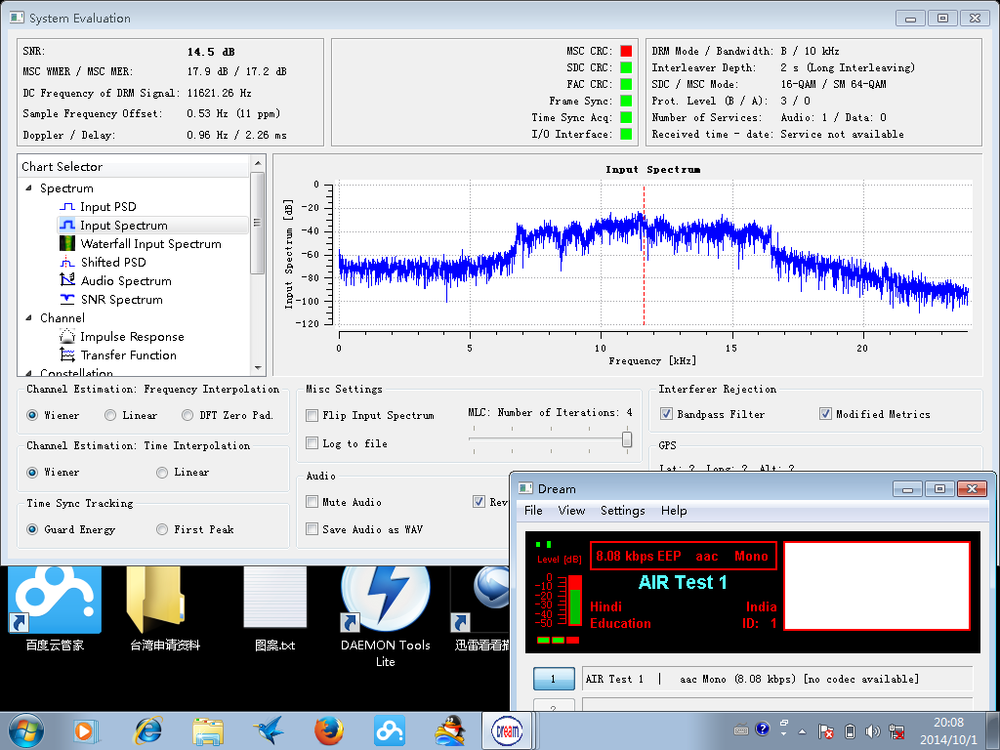

难得的不忙的日子，拿出我n年前那堆破烂听DRM。n年前是指这几篇blog：[1](http://sdr-x.github.io/%E7%BB%88%E4%BA%8E%E6%88%90%E5%8A%9F%E6%94%B6%E5%90%AC%E5%BE%B7%E5%B9%BF%E5%92%8C%E4%BF%84%E7%BD%97%E6%96%AF%E7%9A%84DRM%E7%9F%AD%E6%B3%A2%E5%B9%BF%E6%92%AD%28DRM%20shortwave%20radio%20receiving%20result%20-%20deutsche%20welle%20and%20Russia%29/), [2](http://sdr-x.github.io/DRM%E6%8E%A5%E6%94%B6%E5%8F%8Amatlab%E5%AE%9E%E9%AA%8C%28DRM%20shortwave%20radio%20receiving%20experiment%29/)

扫了许多频点，发现一个信号较强和稳定的频率是15795kHz，根据drm的schedule应该是阿三从Bengaluru面向Asia进行的测试广播，从schedule里的信息来看竟然是中文广播。。。，时间是从UTC 1145到1315（北京时间晚上7点45到9点15），节目叫做AIR test。

大概从今晚7点40多开始折腾，开始能看到频谱中间和边缘有两个模拟广播，不过很快竟然停掉了，天赐良机，很快得到了很好看的频谱和不错的信噪比，以及数据信道稳定的解调，电台的信息什么的都出来了，见附图。

按照以往这种情况应该能很快听到声音，无奈主业务信道MSC的CRC总是错，不出声。不知道是阿三在实验新技术还是干扰的原因。

大约8点15分，频谱中心频率出现非常强的模拟广播，打开声音，说的像汉语，但是听不懂，刚想录音，却消失了，之后DRM频谱貌似变强不少，但仍旧主业务信道失败。

又过了一会儿，强台再次出现，这次好像没有要消失的迹象。赶紧录音，还是那种听不懂的汉语，
只听懂开头一小段像陕西话的：“这次运动的目标是到2017年至今。。。。。”，录音也附上了，陕西的或者听力厉害的朋友听听？

录音链接：[drm20141001_001.amr](../media/drm20141001_001.amr)
  
刚才又听了一下，神秘的模拟“中文”广播又消失了，DRM信号依旧，难道是阿三DRM电台测试流程？插播一段模拟“中文”广播？ 

<noscript>Please enable JavaScript to view the <a href="http://disqus.com/?ref_noscript">comments powered by Disqus.</a></noscript>

