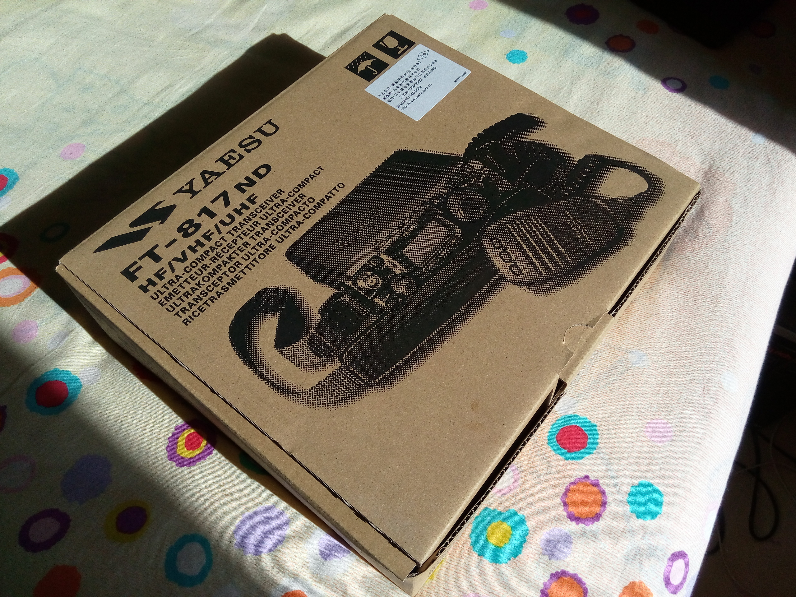
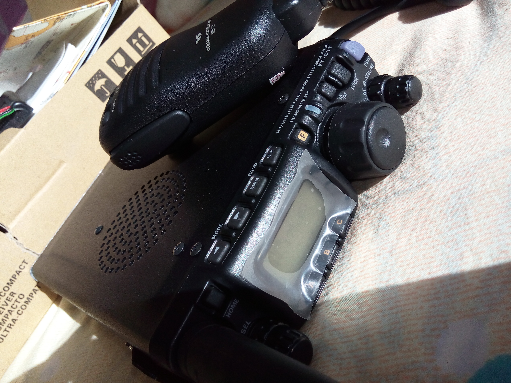

Took the class B exam at Oct. 18th, and today I got noticed passing the exam: [http://www.bjwxdxh.org.cn/news/html/?428.html ](http://www.bjwxdxh.org.cn/news/html/?428.html ) . 

That means my HAM Radio ability has been improved from class A to class B in China, and can use shortwave besides UV band now!

Some milestones:

2013-12-01: took class A exam

2014-04-28: got my first eyeball QSL from my Nokia colleague Frank LA90SA. Hope he is good now. (Microsoft lay off many former Nokians in 2014-07! Don't know if he was affected. I was laid off!)

2014-05-03: got my Baofeng UV-5R certificated and got my call sign BH1RXH

2014-10-18: took class B exam (pre-condition is that getting class A for longer than half year)

Next step: Buy Yaesu FT-817 and wait for next round of equipment certification activity. Then after two years, I will have rights to take exam of class C (the highest class in China).

2014-10-31: Got my FT-817. Will take it to verification activity in 2014-11-16!

<noscript>Please enable JavaScript to view the <a href="http://disqus.com/?ref_noscript">comments powered by Disqus.</a></noscript>

<!-- Global site tag (gtag.js) - Google Analytics -->

