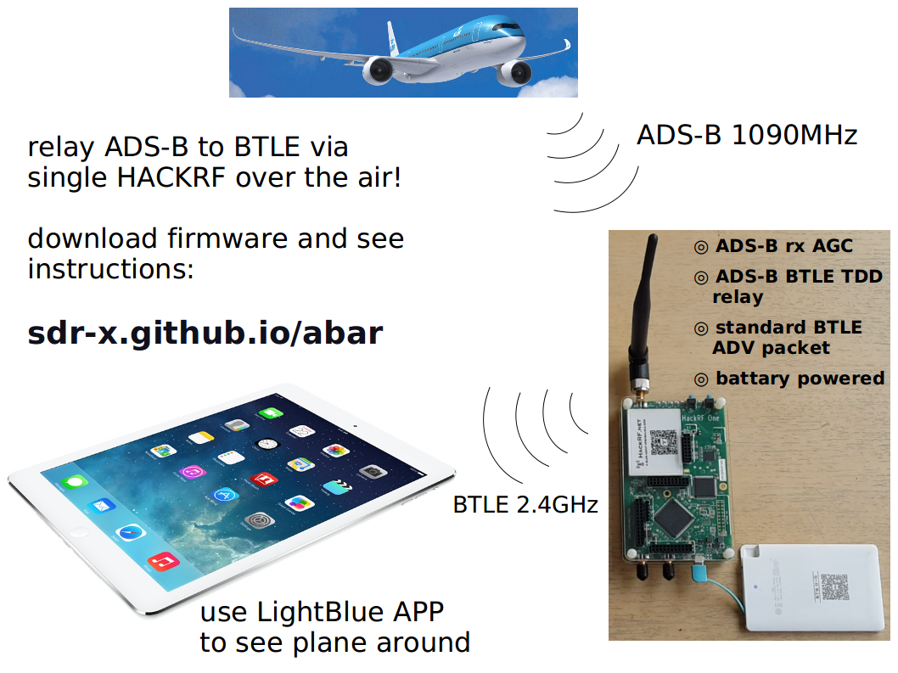

A HACKRF firmware to convert ADS-B (1090MHz) packet to BTLE (2.4GHz) packet. Let you use Phone/Pad to see plane around. (Such as LightBlue in APP store).

Two ways to try my firmware:

####1. try this firmware temporarily

(will lost after HACKRF reset. won't change HACKRF native firmware)

Download [adsb-btle-air-relay.dfu](https://github.com/sdr-x/sdr-x.github.io/blob/master/_resource/adsb-btle-air-relay.dfu) to local.

Download and install dfu-util:

    git clone git://gitorious.org/dfu-util/dfu-util.git

or [here](https://github.com/JiaoXianjun/ADS-B-BTLE-air-relay-HACKRF-firmware)

To start up HackRF One in DFU mode, hold down the DFU button while powering it
on or while pressing and releasing the RESET button.  Release the DFU button
after the 3V3 LED illuminates. (See detailed info here [https://github.com/mossmann/hackrf](https://github.com/mossmann/hackrf))

Load ADS-B BTLE air relay firmware to RAM and RUN:

    sudo dfu-util --device 1fc9:000c --alt 0 --download adsb-btle-air-relay.dfu

(After reset or power cycle you have to do DFU again because RAM content will lost after that.)

####2. flash this firmware into HACKRF permanently

(will change HACKRF native firmware. but you can restore HACKRF native firmware later)

Download [adsb-btle-air-relay.bin](https://github.com/sdr-x/sdr-x.github.io/blob/master/_resource/adsb-btle-air-relay.bin) to local.

Make sure your board is running HACKRF native firmware, then

    hackrf_spiflash -w adsb-btle-air-relay.bin

When the firmware run, TX led (red) should blink very fast. If the firmware doesn't run, you should put the board into DFU mode (hold down DFU button while resetting) then press RESET button again.

hackrf_spiflash tool should have been installed along with [https://github.com/mossmann/hackrf](https://github.com/mossmann/hackrf). I also upload one  [here](https://github.com/JiaoXianjun/ADS-B-BTLE-air-relay-HACKRF-firmware)

####* restore HACKRF native firmware permanently

Because my firmware doesn't support hackrf_spiflash, you have to DFU HACKRF native firmware into RAM firstly, then use hackrf_spiflash to flash navtive firmware into board.

Put board into DFU mode, then (I have put one file here [hackrf_usb.dfu](https://github.com/sdr-x/sdr-x.github.io/blob/master/_resource/hackrf_usb.dfu))

    sudo dfu-util --device 1fc9:000c --alt 0 --hackrf_usb.dfu

Don't reset or power cycle your board here!

Flash HACKRF native firmware: (I have put one file here [hackrf_usb.bin](https://github.com/sdr-x/sdr-x.github.io/blob/master/_resource/hackrf_usb.bin))

    hackrf_spiflash -w hackrf_usb.bin

Now you get your HACKRF board back to original status.

Want to know how to make your own firmware and flash/dfu it? See firmware directory of [https://github.com/mossmann/hackrf](https://github.com/mossmann/hackrf)

