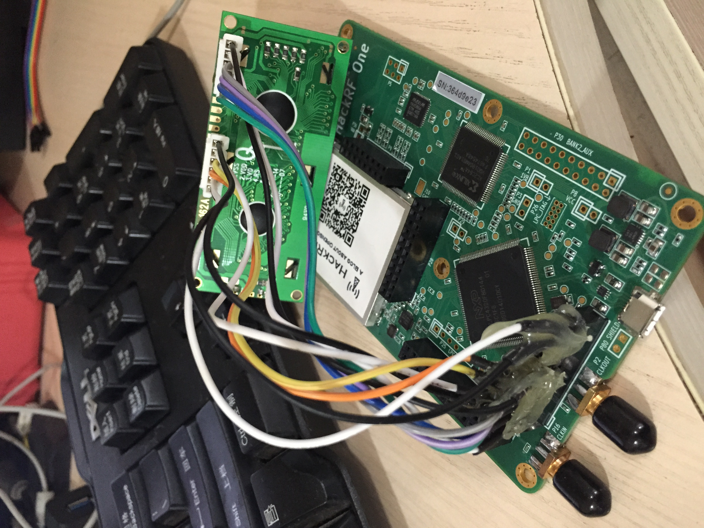
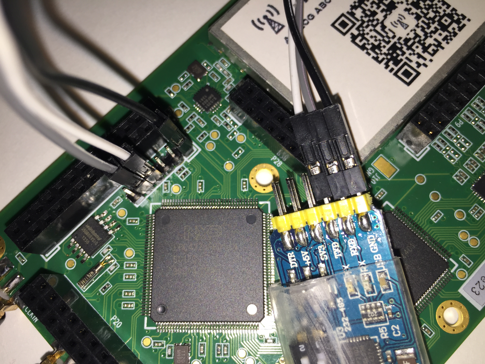
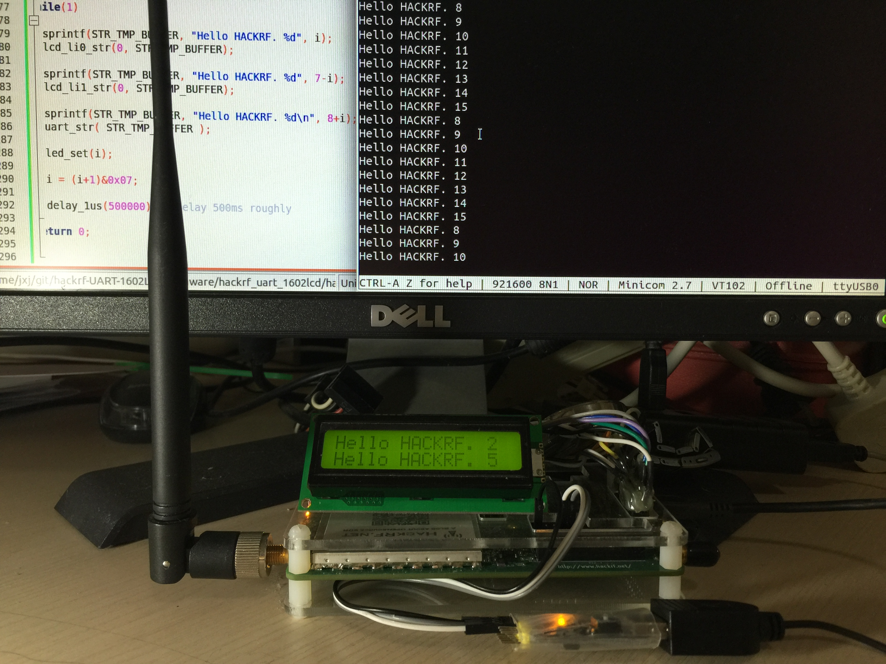

English version：[http://sdr-x.github.io/UART1602LCD/](http://sdr-x.github.io/UART1602LCD/)

代码库（在hackrf原代码库基础上只添了两个文件，改了一个文件）：
[https://github.com/JiaoXianjun/hackrf-UART-1602LCD](https://github.com/JiaoXianjun/hackrf-UART-1602LCD)
  
目的主要是为了帮助想更改调试hackrf固件的人。因为没有调试手段的话改固件基本两眼一摸黑，黑暗中摸索很难。前段日子弄[收飞机的固件](http://sdr-x.github.io/%E4%BD%BF%E7%94%A8%E5%8D%95HACKRF%E6%9D%BF%E6%8E%A5%E6%94%B6ADS-B%E4%BF%A1%E6%81%AF%E5%B9%B6%E9%80%9A%E8%BF%87BTLE%E5%8F%91%E8%87%B3%E6%89%8B%E6%9C%BA/)时已经在黑暗中把调试手段弄通了，共享给需要的人。
  
就是给hackrf板子加上了1602液晶屏以及uart，然后就能愉快的在自己的固件代码中输出到液晶屏或者printf到电脑的串口终端了。

####1 硬件连线（无需hackrf任何改动，利用它留出的现有io）

**1602LCD HACKRF pin connection**
  
    HACKRF P20 20 -- 1602LCD pin11
    HACKRF P20 18 -- 1602LCD pin12
    HACKRF P20 16 -- 1602LCD pin13
    HACKRF P20 14 -- 1602LCD pin14
    HACKRF P20 11 -- 1602LCD pin6
    HACKRF P20  9 -- 1602LCD pin5
    HACKRF P20  7 -- 1602LCD pin4
    HACKRF    VCC -- 1602LCD pin2 pin15
    HACKRF    GND -- 1602LCD pin1 pin3 pin16

  
**UART HACKRF pin connection**
  
    HACKRF P25 1 GND        -- GND of computer or USB-uart dongle
    HACKRF P25 4 UART0 RXD  -- TXD of computer or USB-uart dongle
    HACKRF P25 5 UART0 TXD  -- RXD of computer or USB-uart dongle

  
其中hackrf的P20和P25定义，大家去看它的
[hackrf-one-assembly.pdf](https://github.com/sdr-x/sdr-x.github.io/blob/master/_resource/hackrf-one-assembly.pdf) and [hackrf-one-schematic.pdf](https://github.com/sdr-x/sdr-x.github.io/blob/master/_resource/hackrf-one-schematic.pdf) （hackrf代码库doc/hardware目录）。关于1602LCD模块pin脚定义，以及usb串口的pin脚定义更是烂大街了，自己搜吧。
  
####2 软件demo

上图中我给的hackrf固件代码循环在液晶屏显示两行，同时也往电脑上的minicom打印串口输出。波特率921600。

核心源文件[hackrf_uart_1602lcd.c](https://github.com/sdr-x/sdr-x.github.io/blob/master/_resource/hackrf_uart_1602lcd.c)

整体的可编译的代码库放在这里了：
[https://github.com/JiaoXianjun/hackrf-UART-1602LCD](https://github.com/JiaoXianjun/hackrf-UART-1602LCD)

目录firmware/hackrf_uart_1602lcd/build/下放了一个编译好的DFU固件，你若不想编译，可以直接DFU模式下尝试，快速验证你的硬件连接对不对。
  
####3 关于固件编译的一些坑

**1。不是任何dfu-util都能用的，我测试了n个，这个可以用**

    git://gitorious.org/dfu-util/dfu-util.git  

我也放了一份在这里：
[https://github.com/sdr-x/sdr-x.github.io/blob/master/_resource/dfu-util.tar.gz](https://github.com/sdr-x/sdr-x.github.io/blob/master/_resource/dfu-util.tar.gz)
  
**2。hackrf-common.cmake需要改一下**

COMMAND dfu-suffix --vid=0x1fc9 --pid=0x000c --did=0x0 -s 0 -a _tmp.dfu 中的 "-s 0"去掉。后面再添加一行：

COMMAND dfu-prefix -s 0 -a _tmp.dfu

改完是这个样子：[hackrf-common.cmake](https://github.com/JiaoXianjun/hackrf-UART-1602LCD/blob/master/firmware/hackrf-common.cmake)

**3。Ubuntu自带的gcc-arm-none-eabi编译器不能用！要用这个：**

[https://launchpad.net/~terry.guo/+archive/ubuntu/gcc-arm-embedded](https://launchpad.net/~terry.guo/+archive/ubuntu/gcc-arm-embedded)
  
!!! If you are using Ubuntu 14.04 and later, please be careful because there are packages with same name but produced by Debian and inherited by Ubuntu. Simply follow the above 3 steps, you may end up with gcc-arm-none-eabi from Ubuntu. So to install gcc-arm-none-eabi from ARM, steps are:
  
    1). sudo apt-get remove binutils-arm-none-eabi gcc-arm-none-eabi
    2). sudo add-apt-repository ppa:terry.guo/gcc-arm-embedded
    3). sudo apt-get update
    4). sudo apt-get install gcc-arm-none-eabi=4.9.3.2015q1-0trusty13
       or
       sudo apt-get install gcc-arm-none-eabi=4.9.3.2015q1-0utopic14
  
如果有找不到命令的错误，可能还需要如下操作:
  
    cd /usr/lib/arm-none-eabi
    sudo ln -s /usr/arm-none-eabi/bin bin
  

<noscript>Please enable JavaScript to view the <a href="http://disqus.com/?ref_noscript">comments powered by Disqus.</a></noscript>

