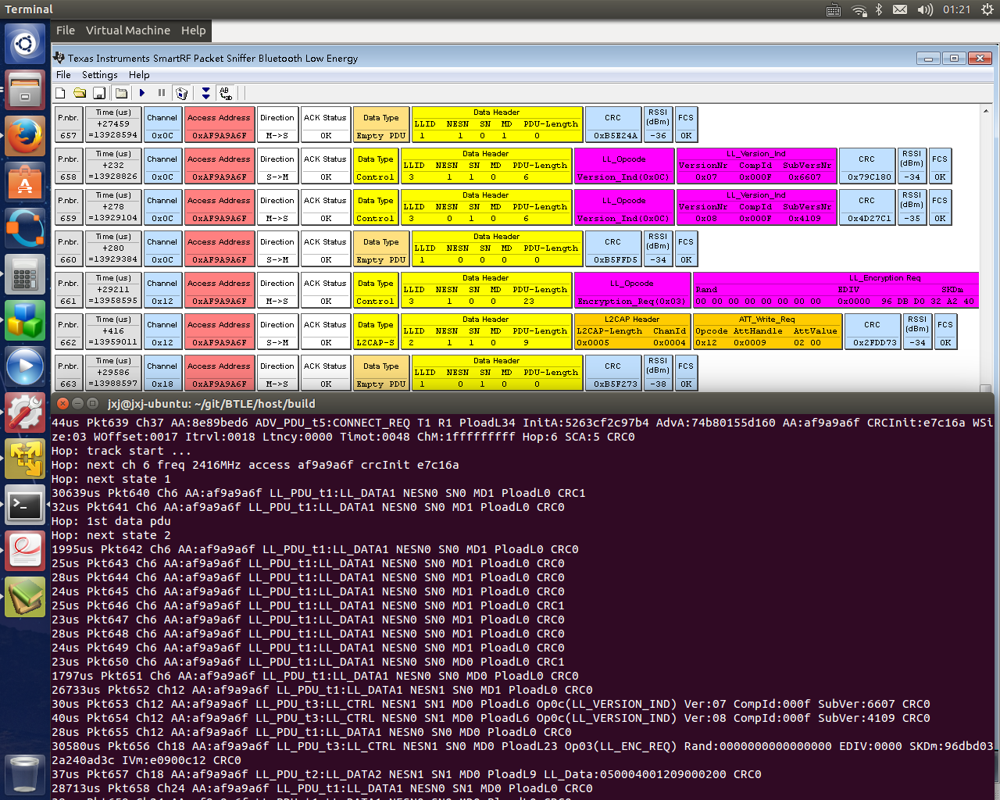
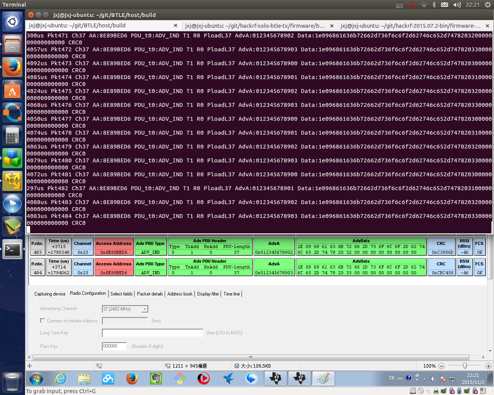

Nov. 2015: So excited that the HACKRF BTLE packet sniffer/scanner can follow hopping data channels automatically now! Just like TI's sniffer.

New added options:

-o --hop

This will turn on data channel tracking (frequency hopping) after link setup information is captured in ADV_CONNECT_REQ packet.

-f --freq_hz

This frequency (Hz) will override channel setting (In case someone want to work on freq other than BTLE. More general purpose).

-m --access_mask

========================================

This is extended from my [btle_tx project](http://sdr-x.github.io/A%20BTLE%20%28Bluetooth%20Low%20energy%29%20BT4.0%20radio%20packet%20sender%20%28BladeRF,%20HACKRF%29/)

Now all BTLE channels (0~39, bothe ADV and DATA channels) are supported. You can use btle_tx and btle_rx to send or sniff on any BTLE channel.

A Raw mode is added to both btle_tx and btle_rx. Under this mode, after access addr is detected, following raw 42 bytes (without descrambling, parsing) are printed out. By this way, you can do other experiments or communication between HACKRF boards easily.

[Introduction source code and usage](https://github.com/JiaoXianjun/BTLE)

[youtube video](https://youtu.be/9LDPhOF2yyw)

[video in China](https://vimeo.com/144574631)

Snapshots of HACKRF BTLE packet sniffer VS TI's packet sniffer under fastest flow of continuous/non-gap BTLE packets sequence to demonstrate full real-time processing ability. They capture the same amount of packets and contents:

<noscript>Please enable JavaScript to view the <a href="http://disqus.com/?ref_noscript">comments powered by Disqus.</a></noscript>

