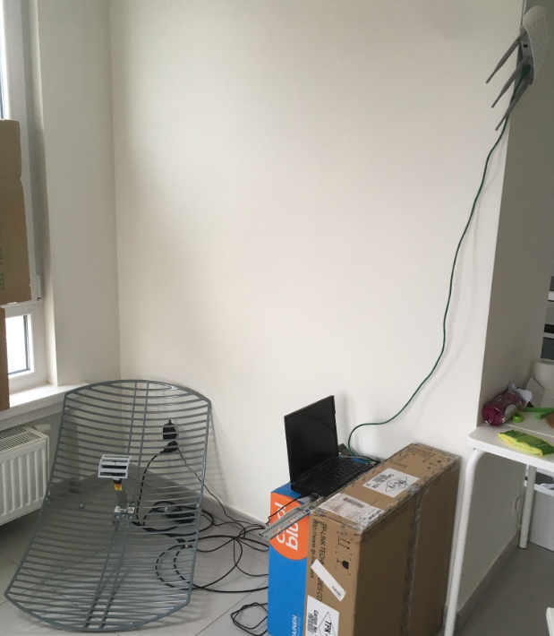
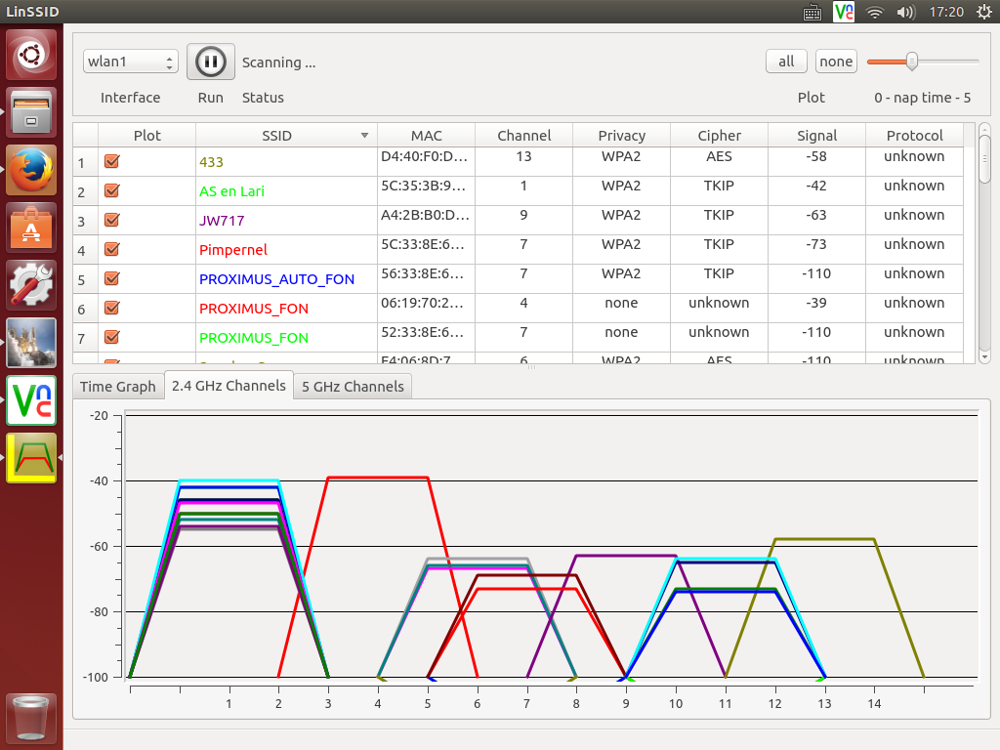

记录一下这一个多月折腾网络的历程和心得。 

先说重要的： 

0. 要想信号好，还得大天线。参见图中放在地上那个tp-pink无源的反射面天线。增益高（貌似24？），有极化。馈源上还有一个小反射面和大反射面配合，貌似是卡塞格伦结构？天线后边甩一根短粗N头同轴电缆，还有一些金属件用于室外调整和固定（我在室内用不上了） 
  
1. 面对那种付费的无密码wifi热点（就是连上自动打开网页让登录账号的那种），我目前只能做到一个笔记本登录它，然后笔记本下挂一个AP覆盖家里。只用一个多功能路由器（神马中继、repeater、多模式）不借助电脑实在办不到让它既连接热点又带起家里的终端上网。 
  
2. 这个付费热点貌似限制了同一个账号下的连接/终端数量，因为一开始老是终端一多就自动被踢下来。所以在笔记本上简单的开启ip转发还不行，得用NAT模式把AP下的多个终端“掩盖”起来，这样多个终端才能愉快的共同上网。 
  
4. 需要在家里搬着大天线仔细寻找好信号：天线位置，天线朝向，天线极化（栅格方向），这三个都要调整。调整的目标不光是目标网络信号最强，最好也要使目标网络信号尽量比其他干扰信号强。参见linssid扫到的信号。信道4即我要用的付费热点。信道9是我的AP用于覆盖家里。都是见缝插针。 

下面流水账开始： 
  
五一搬入新租的房子（比利时根特），开始寻思架设网络。这里已经有telenet运营商的modem到户。查了一下最便宜的是27欧每月（外加开通费60还是100），27欧这档每月只有4G流量。不限流量需要大概60多欧每月。以上都包括有线电视节目（但对我们没啥用，绝大多数都是荷兰语频道）。 
  
偶然间搜索到一个无密热点PROXIMUS_FON，连上一看是移动运营商PROXIMUS和FON合办的付费网络。一个月30欧不限流量。立刻paypal付款登录，体验还不错，youtube看720p，1080p无压力，虽然笔记本显示信号只有两格。这样每个月可以省30欧，还无开通费。遂决定就它了。 
  
而后开始找教程，用笔记本既登录热点又扮演AP带其他终端。虽然成功了，但很不稳定。笔记本经常提示信道冲突，断掉。 
  
亚马逊是个好东西，买了TP-LINK大天线（图中地面上那个），SMA-N头的同轴电缆，能接SMA的无线网卡，还有TP-LINK路由器（斜挂在墙上那个）。开始在家找信号，折腾网络。最终方案如下： 
  
大天线--同轴电缆--无线网卡--Ubuntu笔记本（古老的x61）--无线路由器。 
  
Ubuntu笔记本通过无线网卡和大天线连接并负责登录付费热点，同时跑IP转发并NAT掩盖无线路由器带的内网。无线路由器工作在AP模式下。还用octave写了个自动脚本跑在笔记本上，一旦发现付费热点断掉（有时会不稳定），就自动重新连接。之所以用octave是因为实在用matlab太习惯了，脚本是matlab的m脚本。 
  
这么一弄，笔记本显示PROXIMUS_FON热点信号满格，而且从扫描看，比右边重叠较多的干扰信号明显要高20dB以上，和左边的那一堆热点强度差不多，但信道交叠较小，只能拼碰撞和运气了。连接还算稳定，平时上网看视频没问题。youtube看1080p不会卡，但1440p会卡。 虽然从照片看那个大天线和我的AP距离不远，但扫到的AP信号（图中的信道9-JW717）并不强。这说明大天线的方向性和极化都很强烈，对不上就衰减很大。 
  
费用： 

    带SMA接口的无线网卡 21.30英镑 
    ALFA AWUS036H 54Mbp/s 2.4GHz USB WiFi Dongle with Detachable 5dBi RP-SMA Antenna 
    Sold by: EURO DK 
  
    同轴电缆 5.36英镑 
    TP-LINK TL-ANT24PT3 3m Pigtail Cable 
    Sold by: Amazon EU S.a.r.L. 
  
    大天线 35.67英镑 
    TP-Link TL-ANT2424B 2.4GHz 24dBi Grid Parabolic Antenna 
    Sold by: Amazon EU S.a.r.L. 
  
    无线路由器 36.91英镑 
    TP-LINK TL-WA901ND V4 450 Mbps Wireless N Access Point 
    Sold by: Amazon EU S.a.r.L. 
  
    x61 0英镑 废物利用 
  
插曲，比利时没有亚马逊，都是上UK，德国和法国亚马逊。我每次买东西都认真对比三个亚马逊的价格，总是UK的略便宜，于是我总是在UK买。后来觉得貌似银行账单有点问题，购物时间对的上但数字老是不太对得上，账单上的数字貌似都比我买商品价格的数字大。某天猛然醒悟，UK亚马逊的数字代表英镑而不是欧元，怪不得老觉得UK的“便宜”！！！ 
  
最终综合来看：对于比利时网购， 
UK亚马逊商品种类多，价格适中运费略贵。 
德国亚马逊商品丰富度还行，运费免或者很低，总的说来最划算。 
法国亚马逊商品丰富度不行，价格波动很大，运费免或者很低，总的说来需要碰。 
  
此外比利时也有一些本地电商，和京东类似，也能做到次日达，但价格都比亚马逊贵。一般商品本地商店也大都比亚马逊贵。不得不说亚马逊在世界范围内都能提供服务，这一点比淘宝牛不少。。。 
  
另外，就是疯狂的从IKEA搬东西回家，都变成IKEA专家了，找东西直接奔仓库无需去看show room。其实，一些东西从亚马逊买也比IKEA便宜，对于一些不追求必IKEA品牌的一般东西，还是亚马逊合算，送货上门还便宜。 
  
补充： 

x61 Ubuntu笔记本NAT配置： 
  
    echo '1' > /proc/sys/net/ipv4/ip_forward 
    iptables -F 
    iptables -A FORWARD -j ACCEPT 

    iptables -t nat -A POSTROUTING -s 192.168.0.0/24 -o wlan2 -j SNAT --to-source 192.168.182.8 

注意，最后这个ip地址192.168.182.8是从运营商付费热点自动获取的ip地址，每次重连可能会变，而变了之后iptable需要重新配置（有没有更好的iptables配置方法，不用变ip后重新配置的？）。 
  
不重启电脑就使新的iptable生效的方法，编辑/etc/network/iptables.up.rules 

    # Generated by iptables-save v1.4.21 on Sat May 28 23:11:40 2016 
    *nat 
    :PREROUTING ACCEPT [619:46668] 
    :INPUT ACCEPT [77:5275] 
    :OUTPUT ACCEPT [552:35286] 
    :POSTROUTING ACCEPT [552:35286] 
    -A POSTROUTING -s 192.168.0.0/24 -o wlan2 -j SNAT --to-source 192.168.182.3 
    COMMIT 
    # Completed on Sat May 28 23:11:40 2016 
    # Generated by iptables-save v1.4.21 on Sat May 28 23:11:40 2016 
    *filter 
    :INPUT ACCEPT [4144:1002307] 
    :FORWARD ACCEPT [0:0] 
    :OUTPUT ACCEPT [3610:2892097] 
    -A FORWARD -j ACCEPT 
    COMMIT 
    # Completed on Sat May 28 23:11:40 2016 
  
然后 iptables-apply 

经水木网友指点：

    iptables -t nat -A POSTROUTING -s 192.168.0.0/24 -j MASQUERADE 
  
这样就会自己根据default route条目出去... 

<noscript>Please enable JavaScript to view the <a href="http://disqus.com/?ref_noscript">comments powered by Disqus.</a></noscript>

