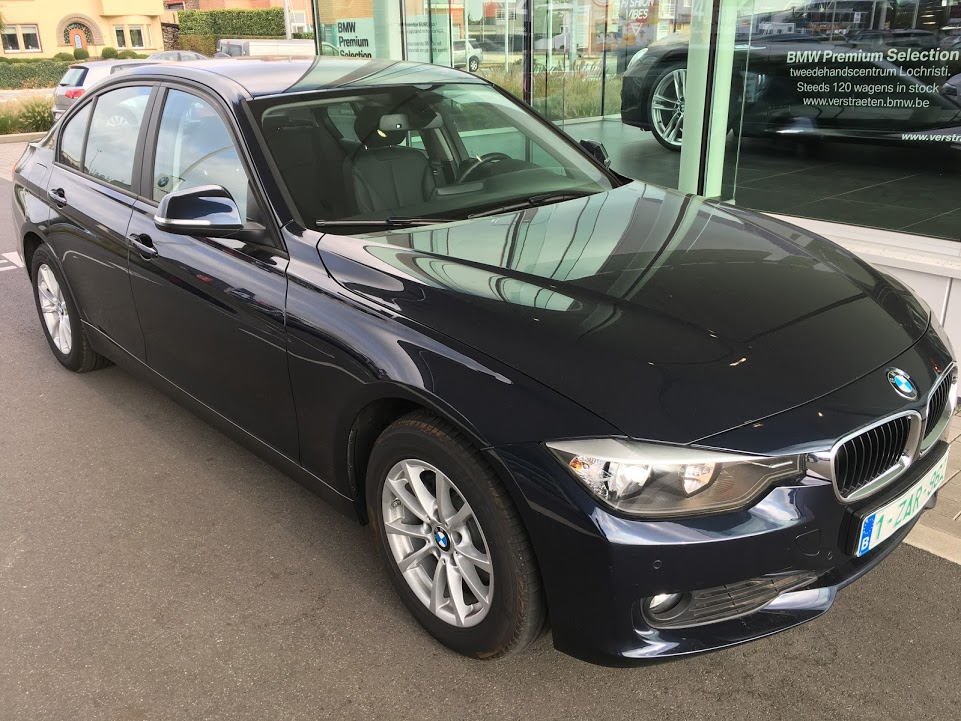
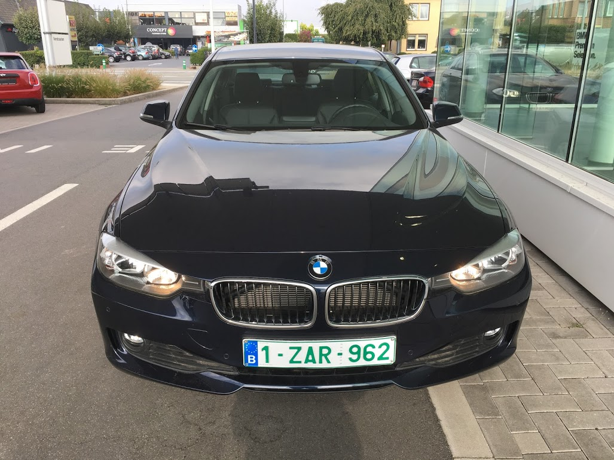

--------------保险更新-------------------- 

保险的确挺贵，对比了几家后，选了这边很多人入的口碑还可以的一家公司。2000欧一年的全险。包含： 

- 评估车目录价格34000欧 
- 律师和文档费，最高75000欧（还是说涉案金额最高75000欧内免费） 
- 不计免赔：三者盗抢火玻璃自然灾害动物等。 
- 驾驶员保险100万欧（包含我和lp两个人，我老是怀疑看错了，看零的个数的确是100万欧。。。） 
- 境内事故可以获得10天的备用车使用。 
- 丢车或者 total loss 最长获得30天的备用车使用。
  
询问了一圈下来，其实还是有一些能更便宜的办法： 

1. 提供国内保险公司的投保证明，无事故证明。英文公正。 
2. 找一些小保险公司，会便宜。 

基本规则是证明你的驾驶经验，越能证明越便宜。虽然我们在国内时交管局开了个证明并英文公正，可惜入的这家保险公司不认，他们说只认保险公司开具的。想快点开上车，懒得再折腾国内的证明了。 
  
欧洲在一个统一的系统里有对驾驶员的评级，每年根据你的纪录来浮动，新来的最吃亏。即使国内驾驶经验很多，如果没有国内保险公司证明，则很难用的上。 
  
--------------原文分割线------------------

在欧洲某小国，安顿的差不多了，寻思买辆车。刚好这边有宝马的店，遂跑过去。 
  
新车一问提车需要8周，考虑还想趁天气暖和赶紧周围转转，而且将来出售价格折的厉害（不好说要长待还是几年就走了），遂跑到旁边的宝马二手车 BMW Premium Selection。（我承认我在装，说了这么多，其实主要还是穷啊。。。） 
  
一个大停车场，按系分开，停了120辆左右。内心设置了基本条件：去年出厂的3系车，公里数不要太多，一定要自动挡（被北京路况手动挡虐惨后遗症）。看来看去只有一辆蓝色318d符合我的要求： 
  
三厢柴油车，含税26000欧。车主购入日期去年5月（销售说出厂日期一般大约比车主购入日期提前1个月）。行驶了21000km。配置：看那个车的信息号称它的配置新车全下来目录价格是41500欧（实际销售应该肯定没这么高我猜）。该有的基本都有了，自动挡，倒车雷达，导航，自动巡航，USB，皮座椅，铝合金轮x，后视镜LED之类的。才1年多2万公里就26000欧拿下了。。。。 其中包括宝马给二手车提供的4年或20万公里质保。 
  
其实停车场里更多的是旅行车，对于我看的三系来说同等状况和配置下旅行车大约比三厢贵上4000欧。估计是这里家庭孩子多，旅行车比较能装所以更受欢迎。貌似没看到汽油车。 
  
问销售能否试驾，说可以。看了看身份证，签了个单子，（竟然连驾照都没看。。。），销售取下车玻璃上的锁，给了我车钥匙，简单说了一下怎么开，然后说车里的油大概还能开50km，去吧！就留下我一个人在那。我已经半年多没开过车了，说实话当时的心情有点忐忑啊。但松开刹车的那一刻，瞬间感觉老司机回来了。呜呜的就开了出去。 
  
驾驶貌似没啥太特殊的感觉，就是普通城市道路，柴油、后驱也不知道应该有啥不同的感觉。当然了现在任何一款车对于我都是天堂--对比我之前那个很老的1.4丐版手动乐风，何况这可是BMW啊。 
  
开了一会儿，担心拐弯太多记不住回去的路，就开回去了。于是前后大概只花了1个小时，秒杀了一辆二手BMW。销售说两天后他们做完车辆的技术检测和注册后会联系我付款，然后我就可以拿着这些信息找保险公司以及上牌子，再然后就可以来开车。 
  
（题外。n年前有一天晚上对lp说等我年薪30万时，咱们也买个宝马开开。后来的薪水的确涨的比我想象的快一些，但更出乎意料的是房价。。。。我去。于是在国内一直也没去买宝马，还觉得挺愧对lp。如今算是了却一桩小心愿） 
  
最后上真相。(车上的“斑点”和“划痕”其实是周围的灯光和地面上的白色标志线） 

<noscript>Please enable JavaScript to view the <a href="http://disqus.com/?ref_noscript">comments powered by Disqus.</a></noscript>

