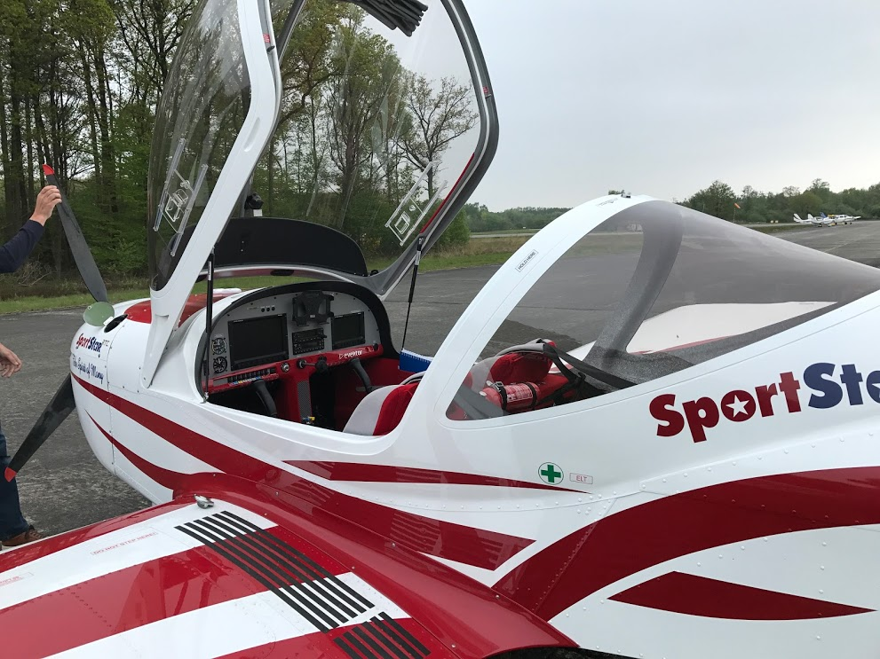
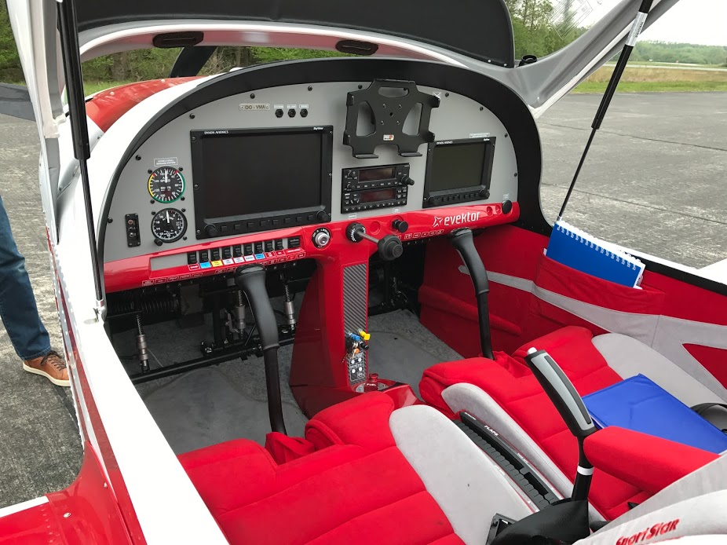
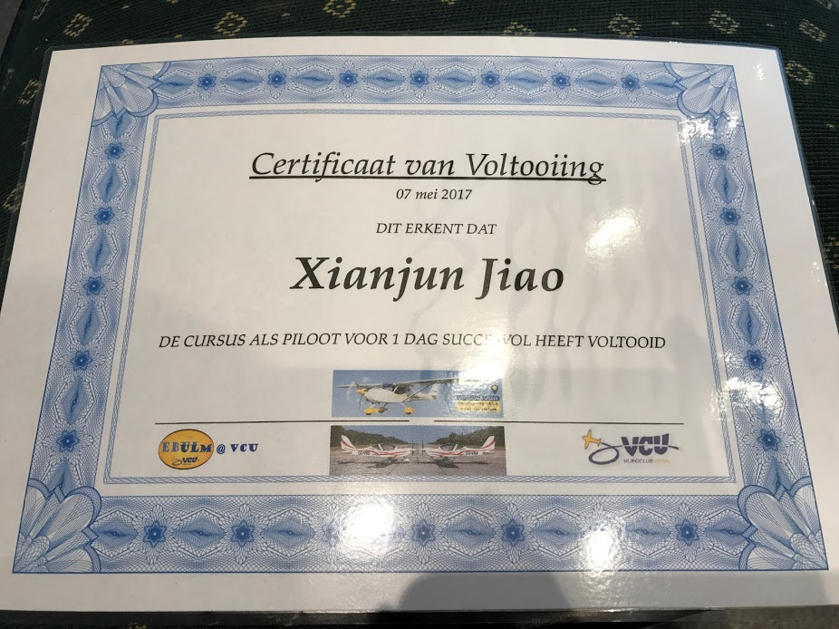
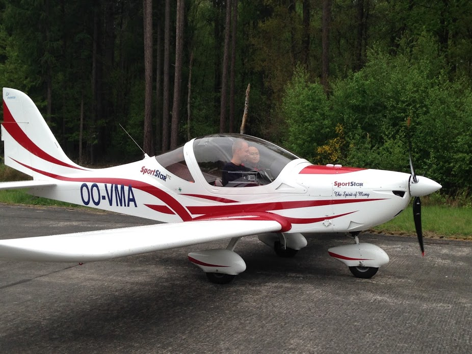

#飞行日记#  
  
今天是ursel驾校开放日pilot for a day。 
  
先是理论学习，然后体验飞行。飞的型号是捷克Evektor-Aerotechnik生产的sport star，据说是驾校最近采购的新飞机。教练说他们称之为mustang，因为很轻但动力强劲。 
  
虽然是超轻型（ULM）飞机，但已改装通过PPL（私人驾照）训练认证。机上两台大的多功能显示屏，但关键的航电比如电台和应答机都是garmin的（照片中央下部两台小设备）。驾驶台中央上部的架子是放ipad的。 
  
开飞机（空中部分，纯操作驾驶杆）比我想象的简单，也拜今天没风。飞机很稳定，反应也很灵敏。上去后教练就让学员自己飞，沿着马路飞，在地标拐弯之类的，只要轻柔操作都可以顺利完成，足足过了把开飞机的瘾。起降有一些侧风，但感觉飞机即便在低速时教练控制下也很听话，降落前速度已经降到很低了，比想象的平稳很多，感觉冲击比客机还小，毕竟很轻。 
  
教练还在空中故意减速演示了失速告警等功能，飞机还是很听话，当然不会拉到进入到抖动状态只是告警而已。 

<noscript>Please enable JavaScript to view the <a href="http://disqus.com/?ref_noscript">comments powered by Disqus.</a></noscript>

<!-- Global site tag (gtag.js) - Google Analytics -->

