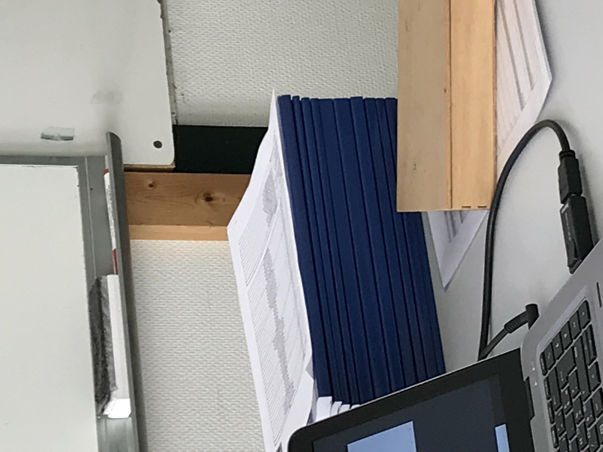
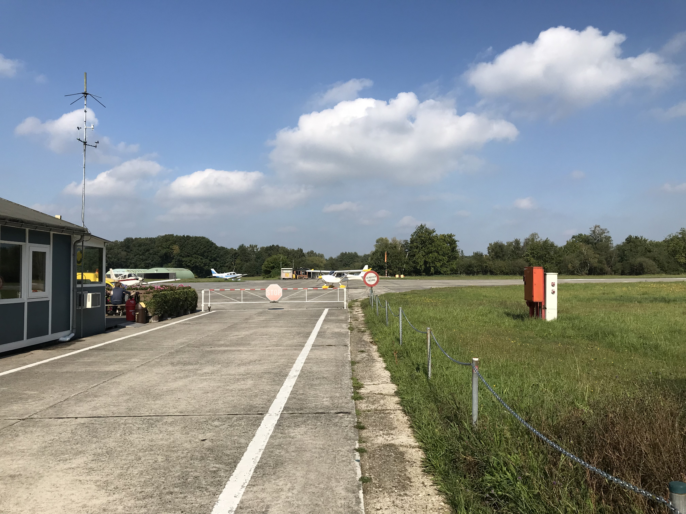
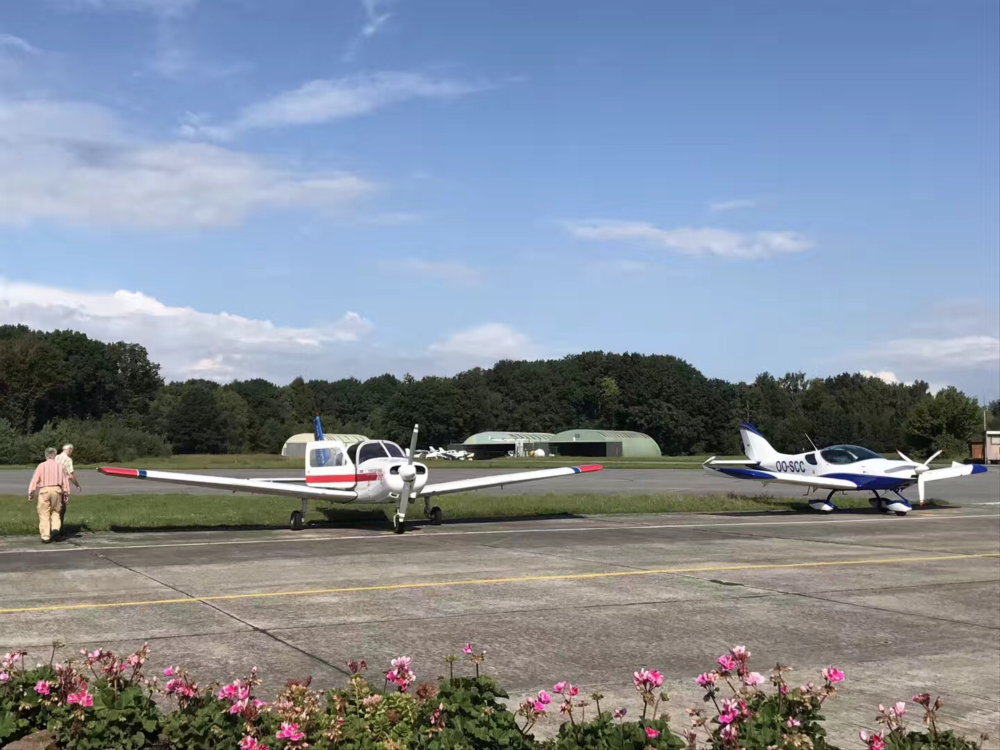
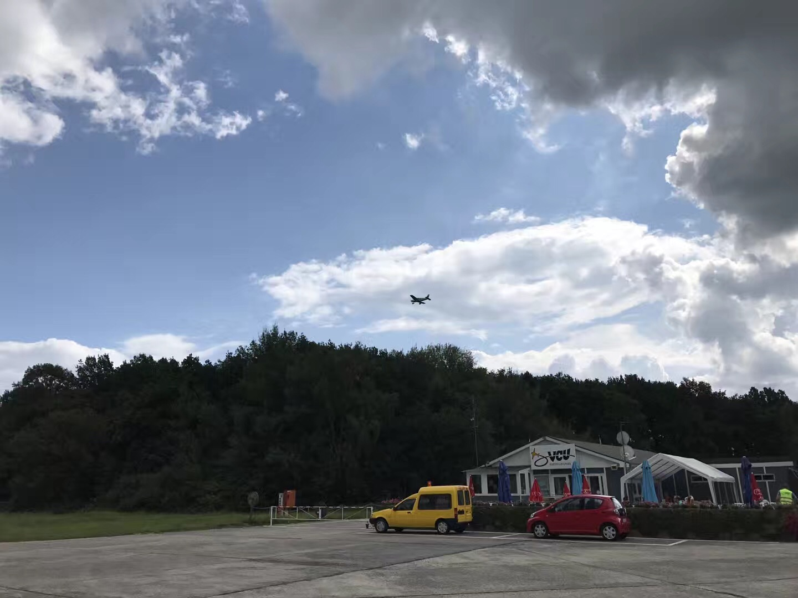

#飞行日记2#  
  
随着9月2号驾校的开学，至今上了4次课（每周六9点半到下午1点），完结了第一部分aircraft general knowledge。课堂测验30道题答对29个，这下我放心多了。
要知道这是一个英语水平一般的没学过荷兰语的中国人在一个用荷兰语教学的驾校取得的成绩。果然当初驾校的CTO对我说没问题不是在忽悠我。

稍微总结，并上图。

1. 虽然没学过荷兰语，但自我感觉貌似课堂上说的事情朦朦胧胧可以理解。因为平时耳濡目染，并且荷兰语的一些词语和英语很像，再加上航空术语更是很多来源于英语，
通过猜测，对照，翻译ppt，能感觉到一些东西。当然，真正主要的学习只能在课下，有问题可以在上课时问老师，老师英文都很好，因为毕竟空中通行的是英文。他们
考虑过用英语教学，但绝大部分学生都是说荷兰语的，也就作罢了。

2. 理论课程9月开学，第二年6月去布鲁塞尔机考。都是选择题，有英文版。（他们口中的multiple choice，我一直以为是多选题，但其实不是，是单选题。英文水平有限，
不太理解为啥multiplle choice不是多选题）

3. 和汽车驾校不同，参加和教练一起的飞行训练并不需要先通过理论考试。就算一节理论课没上过你也可以立刻开始和教练一起飞行训练。但是放单飞（solo）需要有三个
前提条件：有资质的医生或者机构出具的体检证明；市政厅出具的good conduct证明；去布鲁塞尔买一个飞行员记录本（log）

4. 体检相当简单，正常人都没问题。PPL驾照需要的体检类别为class 2。
有资质体检机构可以查询这里：[https://mobilit.belgium.be/nl/Resources/publicaties/luchtvaart/pub_vergunningen_medisch_aeromedical_centra](https://mobilit.belgium.be/nl/Resources/publicaties/luchtvaart/pub_vergunningen_medisch_aeromedical_centra) 
有资质的医生可以查询这里：[https://mobilit.belgium.be/nl/resource/aeromedical_examiners](https://mobilit.belgium.be/nl/resource/aeromedical_examiners)

5. 和汽车类似，获得PPL驾照需要：飞行训练至少45小时，其中至少25小时和教练一起，至少10小时单飞，单飞至少要包括overland flight（不知道是跨机场还是跨国）和
270km navigation（至少飞270km不迷路？），然后通过理论考试和实际道路（空中，考官坐旁边）考试。

6. 教材。见照片（一大摞）。驾校用的是一套荷兰语教材。去年换过一套教材，有荷兰语和英语两个版本，但认为不如传统的荷兰语教材（主要是便宜），
所以又换回荷兰语版本。荷兰语教材对我就没什么用了。补钱买了一套Jeppesen的EASA PPL培训教材，貌似是德国出的。和老师讲的内容是对应的。

7. 比起汽车，飞机还是落后很多啊。考试里不少内容都是关于发动机的化油器的，很多发动机的参数都需要通过仪表判断然后手工调节到最佳。印象中国内大规模
电喷车替代化油器车2000年就开始了。

8. 机型。PPL驾照是限定机型的。你需要一开始就决定用什么机型学习。全都考完拿到驾照后，你就能开这种机型了。想换个其他飞机开，你还需要在你想开的飞机上
训练个4、5个小时，然后驾照上就能添加一种机型。可以以此节约学费，比如可以用Evektor Sportstar飞机训练和考试，这种机型只有两个座位，
训练飞行每小时费用最便宜。拿到Evektor Sportstar飞机驾照后要带你装b带你飞时，可以在Piper四座的飞机上再练习几小时，然后飞Piper。

9. 驾校还是很繁忙，只要是天气允许，就有很多人过来训练。我看有时候下着小雨都有人在飞，可能是能见度满足目视飞行即可，PPL驾照仅限于目视飞行。有一个
预约系统，里面有教练和飞机的可用时段，和驾校约车差不多。飞行训练费用按分钟计算，分为飞机的费用和教练的费用两部分。最便宜的飞机训练一小时也要大概
130欧左右的样子？费用根据油价每年会略微浮动。

10. 这里的小飞机用的大都是标号100的航空汽油，具体是100LL，LL意味着低铅。和汽车类似，加油可以加更高标号的，不能加低标号的。100LL航空汽油是蓝色的，
颜色是故意加的染料，为了防止加错油。

<noscript>Please enable JavaScript to view the <a href="http://disqus.com/?ref_noscript">comments powered by Disqus.</a></noscript>

<!-- Global site tag (gtag.js) - Google Analytics -->

