#飞行日记3#  
  
挑战来临！

飞机基础知识部分（三节课加最后一节课测验）让我觉得小case，测验20道题对了19个。这一部分的气象学（Meteorology）学习（四节课加今天这一节测验课）
让我觉得有挑战了。20道题只做对了12个，其中有一些是蒙对了，有一些是本该做对的做错了。原因一个是复习时间不足，只上了两节课，另外两节课因为在
美国出差没有上成，另一个是高中初中地理知识和大学物理知识实在忘的差不多了。还有一个原因是，老师是根特大学教授，教授嘛最拿手的就是考学生，他完全
自己想的题目，目的就是考你是否真的理解并且掌握扎实了，而不是简单的从某些题库拿了一些题。今天考完答疑时他还说：出题比做题要难，他花了整整
两天来出题。。。。。我即刻向他表示强烈感谢（心里活动：好吧，你很得意吧。。。。）！

记录一下错的题目，以免再犯。

飞机基础知识部分做错的题目是问飞机前轮（前三点）或者后轮（后三点）上的damper作用是什么。因为飞机地面滑行超过一定速度时，那个轮子会有flutter，
高频振荡，导致损坏。dumper是用来阻止这个高频振荡的。

今天错的题目以及自认为掌握不熟练的题目有：

第二题，答案为a

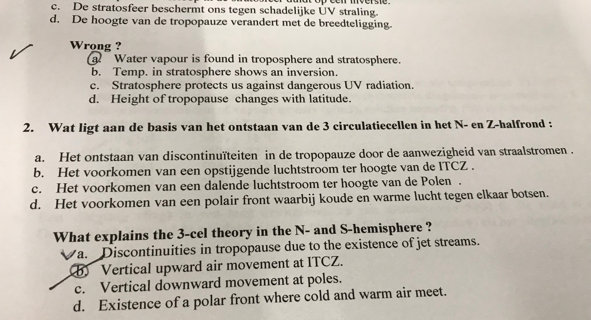

但我觉得老师翻译的有问题。应该问的是那种现象是三圈环流理论特有的。b，c，d的现象就算是一圈环流理论里也会有，只有a的现象是三圈环流特有的，也就是北纬
30度附近由于科里奥利力的影响导致了高空气流的不连续，一圈环流无法蔓延到极地地区。

第五题，答案为c

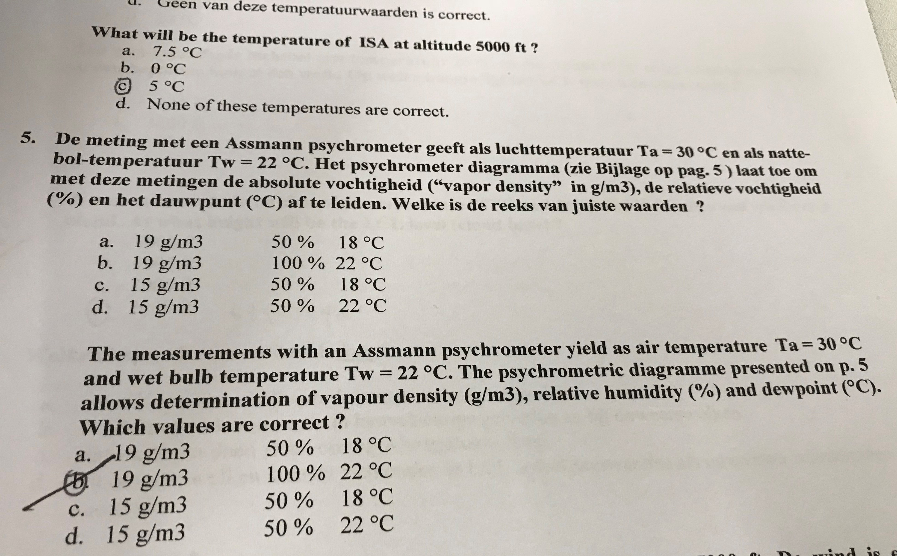

第六题，答案为d

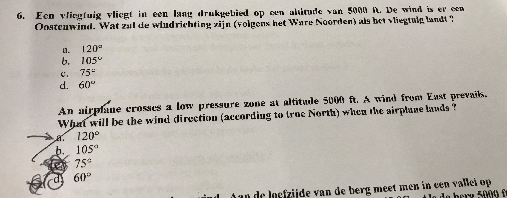

这道题考的是摩擦力和科里奥利力对风的影响。飞机在5000ft遇到东风（来自90度方向的风），问降落时风的角度是多少，我一开始选了60是对的，可惜后来
改120改错了。这道题和高气压低气压无关（我被迷惑了，因为高气压产生顺时针方向反气旋，低气压产生逆时针方向气旋，风向不同）。因为北半球
科里奥利力使得风向右偏转，在高空风会完全偏转到平行于等压线，在地面因为地面摩擦力，风还不会完全向右偏转到高空风的那个方向，也就是说地面
来自60度的风，到了高空继续右偏就90度了，也就是高空的东风。所以应该选60度。这里还有个狡猾的地方，老师说题目中的lands指的着陆，默认是在
陆地上空，因此摩擦立引起的地面高空风向差是30度，如果是水面上，因为水面摩擦力小，风向差就是15度了。

第七题，答案b，蒙对了。

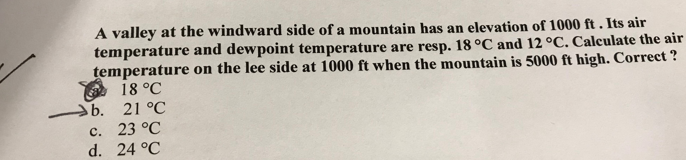

这道题说的是迎风坡1000ft的地方温度18露点12，问气流翻越5000ft山峰到达背风坡1000ft时，温度是多少。首先对于我这种基础不扎实的人来说很容易
套用标准大气模型的每升高1000ft温度降低2度，但实际上现实中，干空气湿空气绝热膨胀和压缩时高度差1000ft导致的温度差是不同的。这道题是现实问题，
不能套用标准大气模型。

正确的计算方法如下：

开始是非饱和空气，那么空气绝热膨胀情况下每升高1000ft温度降低3度，所以1000ft升高到3000ft时，温度低至露点12，云开始形成，空气由干变湿，
湿空气绝热膨胀抬升1000ft温度只会降低1.5度，因为水的比热大，凝结也会释放热量。所以3000ft抬升到5000ft山顶时，温度变为9度。因为温度达到露点，
迎风坡会有
云和降水，失去一部分水。抬升过程中温度低过了露点温度之后，露点温度也会随着温度下降，基本上在山顶露点温度和温度相同。越过山丘，空气
下降，温度升高，此时空气变为不饱和，开始非饱和空气的绝热压缩，温度上升，一路上以1000ft升高3度计算，下降到1000ft时，温度变为9+3*4=21。
所以正确答案为21.

第八题，答案d，蒙对了。

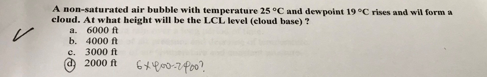

我简单套用Cumulus云底计算公式 spread*400ft 或者 spread*125m，spread是气温和露点温度差，这题目中为6，得到2400ft，所以选择了最接近的2000ft。
正确计算方法还是按照干空气绝热膨胀的1000ft 3度来计算，升高2000ft即达到露点，开始形成云。

第九题，正确答案为c

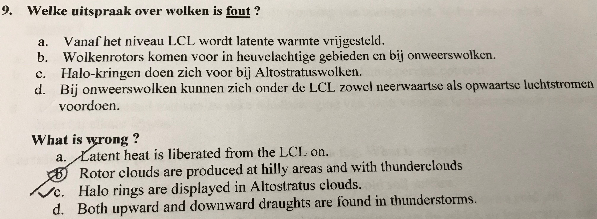

第十一题，正确答案为c

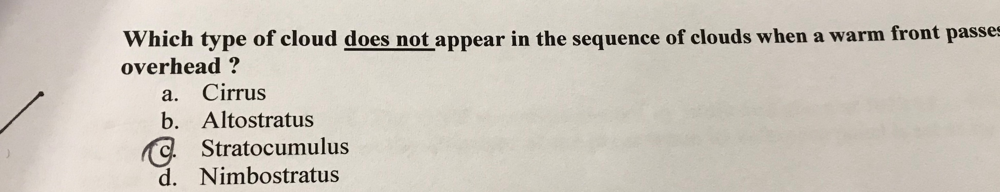

第十四题，答案b

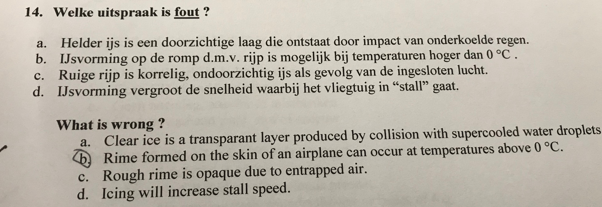

第十五题，答案a

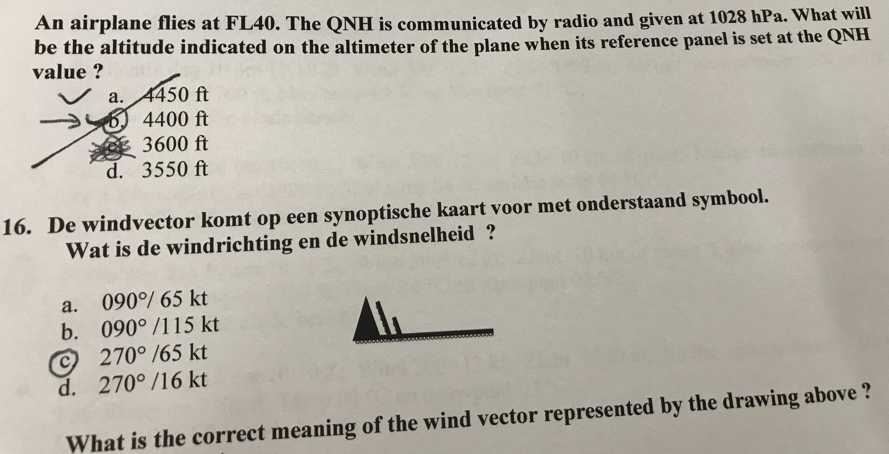

一个飞机在FL40（也就是4000ft）飞行，气压高度计没有调整（就是参考点是标准大气1013hPa），这时候收到地面通信，修正海压QNH（1028hPa），那么请问调整
气压计参考点为QNH之后显示的飞行高度是多少。

正确计算方法：修正海压比比标准大气压力高，以为着飞机从低压区飞进了高压区，而此过程中飞机自动维持高度表读数不变，意味着飞机实际上必须飞的高一些
才能找到原来一样的低压。修正高度表之后，高度表指示实际高度，肯定要比4000ft高，高多少呢？1028-1013=15hPa，1hPa = 30ft，也就是高了450ft，因此是4450ft。
答案a。

第十七题，答案a

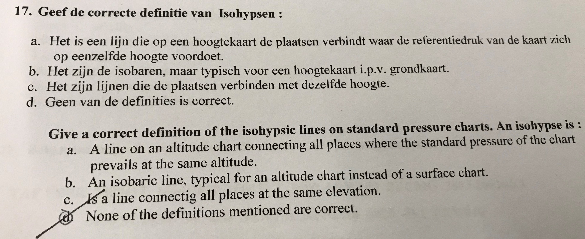

第二十题，答案c

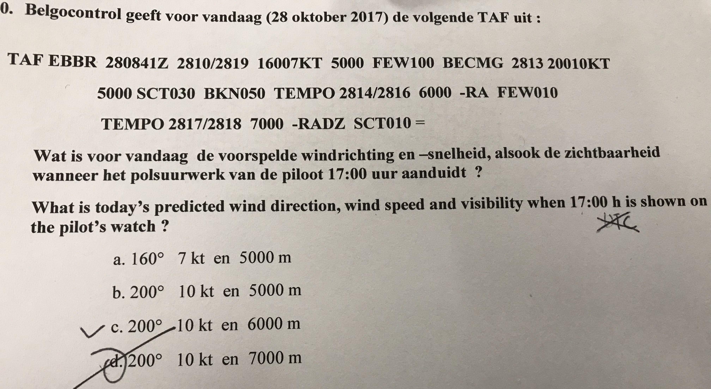

这道最坑爹。。。。题目中说飞行员看自己的手表，隐含的意思是手表显示的是当地时间而不是UTC或者zuloo时间！你得知道当地时间是UTC加上几才能作对！

<noscript>Please enable JavaScript to view the <a href="http://disqus.com/?ref_noscript">comments powered by Disqus.</a></noscript>

