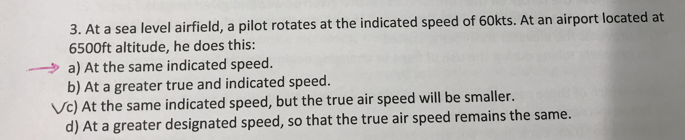
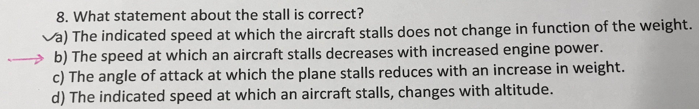
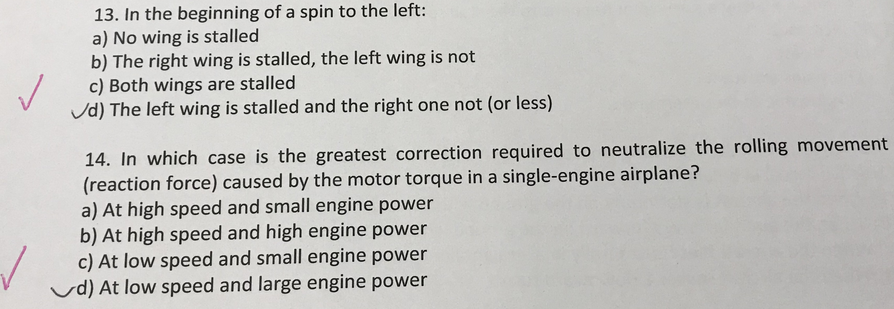
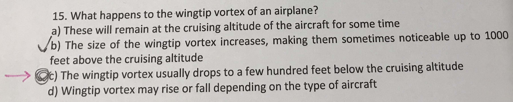
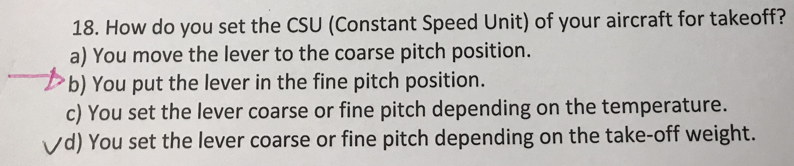
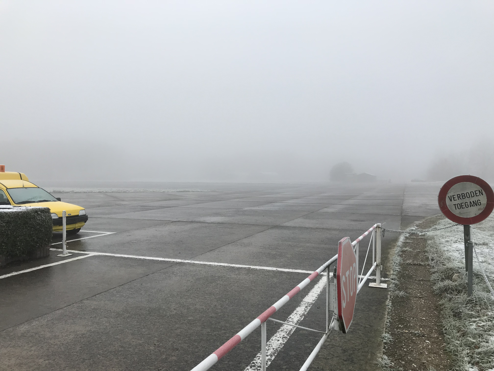
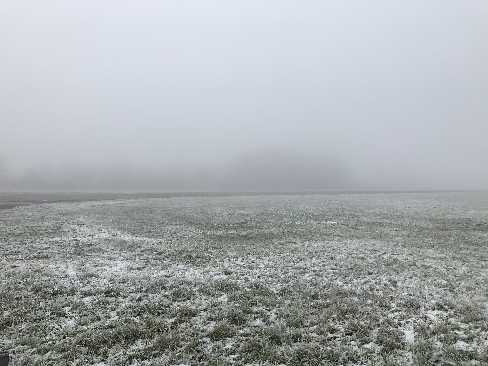
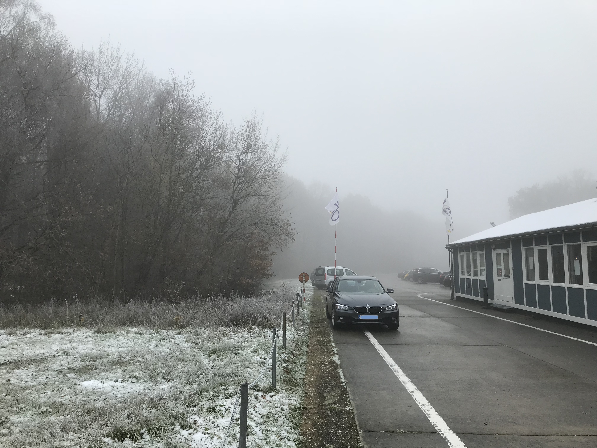

#飞行日记4#  
  
这一部分是飞行原理（principle of flight)。4次课加今天的1次测验。成绩凑合吧，20道题，对了16道。体会是想要取得更高的分数，只做习题是不够的。
俱乐部网站的习题和网上的题库覆盖的知识点并不全，一些老师课堂讲的内容并没有覆盖到。老师出的题也并非题库里的原题。
还是需要彻底理解了所有知识点的内容才能高分。

测验之前和本地同学讨论，一致认为这部分大家普遍应该能考比上一部分气象学更高分数。因为气象学实在是难，相比之下飞行原理理解起来容易一些，所需要
死记硬背的东西比气象学更少。结果左右两边的两位荷兰语母语的同学这次一个考了12分一个考了13分。。。。。难道他们上一次气象学考的更惨？（我上次只有12分）

今天错的题目以及自认为掌握不熟练的题目有：

question 3:

题目说在海平面机场，飞机起飞离地指示空速是60kts，请问在海拔6500ft的机场飞机起飞离地指示空速。英文rotate就是指飞机离地瞬间。看到这道题目
有点蒙，首先就没理解rotate是什么意思。其次把真空速大小搞反了。所以错答了c。

正确答案是a，仍然是60kts。而真空速应该是比60kts更大。

关于指示空速和真空速，网上有很多讨论。简单总结如下：

指示空速是飞机前进产生的动压减去大气的静压，是飞机和大气作用的结果。所以指示空速直接反映飞机当前性能。飞机手册里的起飞降落速度等都是
指示空速，一般不随高度变化。就是说无论在哪个机场起飞，都应该看指示空速是否超过最小离地速度。

相同的指示空速，海拔越高真空速越大。基本原理是，高海拔地区空气密度小，而动压Q=(空气密度*速度平方)/2，所以空气密度减小时，为了获得相同
的动压，需要提高速度（飞机相对于空气的速度，也就是真空速）。这就是为了高海拔机场，虽然你起飞的指示空速没变，但实际上飞机在空气中
运动的速度更大了。具体真空速比起海平面高了多少，取决于当地空气密度比海平面小了多少再开根号。

question 6:

虽然答对了。但这个颠覆之前的认知。是关于放下襟翼flap可以提高滑翔距离还是降低滑翔距离。我之前一直觉得放下襟翼，提高升力可以使飞机滑翔
的更远。其实不对。虽然放下襟翼可以提高升力系数，但同时也会提高阻力系数，总的说来最佳升阻比（滑翔比）会变差，也就是会滑翔的更近。
因为一般说来飞机机翼的设计是为了在不放下襟翼等装置的情况下达到最佳升阻比，所以放下肯定升阻比变差，滑翔比变差。

所以以后如果空中发动机失效，需要滑翔时，要慎重放下襟翼，如果距离机场太远会悲剧。

question 8:

关于飞机失速的。

a是错的，因为失速速度和飞机重量是有关系的，越重的飞机失速速度越高，也就是为了托起飞机重量需要飞的更快产生更多升力。关于失速速度和
哪些因素有关，可以从飞机升力公式出发：

升力=(空气密度*速度平方*机翼面积*升力系数)/2

因此：速度=根号下（2*升力/(空气密度*机翼面积*升力系数)）

最小速度（也就是失速速度）在最小升力和最大升力系数时达到。而最小升力等于飞机重量。所以失速速度和飞机重量有关。

b是对的，因为在快要失速的时候，增大引擎功率会给予流过机翼上表面的气流更大的能量，推迟气流分离，推迟失速，因此失速速度会更低。

c错误。因为失速攻角就是按照失速的定义来的。超过这个攻角，机翼上表面气流分离，飞机失速。和其他都没关系。

d错误。根据指示空速的定义，飞机手册里的失速速度，起飞速度，着陆速度都是指示空速。这个不随高度变化。

question xxx:

一些问题是问飞机过载的（load factor）。小知识：飞机在协调转弯时，过载只取决于倾角（bank angle），过载=1/cos(倾角)。倾角60度时，过载为2，
也就是你会体会到两倍身体重量。飞机在转弯时失速速度会变大，因为飞机“重量”变大了（过载），需要更大的升力来支撑，也就是更大的速度。

question 13 14

凭感觉做对了。

spin的前提是一边机翼失速，另一边还有一些升力，所以飞机开始螺旋。

单引擎螺旋桨飞机会采用一些设计来抵抗螺旋桨转动产生的反向力矩，但这些设计一般是针对巡航速度设计的。在低速，大功率情况下，需要飞行员
的额外操作来抵抗螺旋桨产生的反向力矩。

question 15

关于翼尖涡流(wingtip vortices)的，大型飞机的翼尖涡流非常强，一般建议大飞机起飞后6~8分钟之后再起飞。否则进入它的涡流就死定了。

这道题目考的是，涡流的位置会在产生涡流的飞机的飞行高度之下几百米。如果非要在大飞机后面起飞，一定要尽快爬到它飞行高度之上。

网上有很多关于翼尖涡流(wingtip vortices)的视频，非常壮观。可以自行搜索。

question 18

关于恒速系统CSU (constant speed unit)以及变距螺旋桨控制的。

简单说来飞机螺旋桨相当于一个小机翼，螺旋桨转动时，这个“机翼”在空气中产生升力，只不过
这个升力方向是向前的，拉动飞机前进，同时也会产生阻力，和旋转方向相反。
这个机翼（螺旋桨）也有自己的攻角（angle of attack)。攻角超过关键攻角（critical angle of attack)也会失速，也会
升力（也就是拉力）下降。还有一个概念是，这个攻角不但受到螺旋桨本身安装角度的影响，还受到飞行速度的影响，因为攻角的定义是相对气流，
根据矢量合成原理，飞机有了飞行速度后也会改变螺旋桨处相对气流的方向。

飞机起飞前静止状态下，因为此时气流静止，相对气流方向仅仅是螺旋桨旋转的方向的反方向，螺旋桨攻角即安装角。而飞机具有一定速度之后，螺旋桨在空气中
前进，相对气流有了向后的方向分量（飞机在前进），所以会减小螺旋桨攻角（对于固定安装角的螺旋桨），降低了螺旋桨升力系数。此时需要提高发动机功率和转速来
提高螺旋桨速度，保持拉力（用于平衡飞行阻力）。

为了提高发动机效率，飞机设计了变角度螺旋桨（变距螺旋浆）。也就是螺旋桨安装角可以实时控制。它的作用类似于汽车上的1~5档。如果没有高挡位，那么
汽车高速行驶只能靠提高转速（2档上高速），很不经济。设计了5档之后，较低的转速就能有较高的速度。实际的浆距连续可变，类比于CVT的汽车，而不是1~5档的汽车。

CSU的作用是实时控制螺旋桨角度，来确保发动机恒定功率和转速情况下即可驱动螺旋桨（螺旋桨角度会影响旋转阻力，进而需要不同的发动机功率输出来克服，
如果螺旋桨角度能够被CSU自动调整保持合适的阻力，则可能一直用恒定发动机功率驱动）。有了变距螺旋桨，只需要起飞时设置一个较高的目标转速，
CSU就会自动把螺旋桨设置在较小的安装角（fine pitch），确保不会超过静止空气中的关键攻角，并且阻力较小。此时螺旋桨效率和拉力有保障，
大功率快速起飞。

起飞后随着
飞行导致的相对气流变化，如果不调整螺旋桨攻角，则实际攻角会变小，阻力变小，如果发动机输出功率不变，则会转速上升。为了保持恒定转速（也就是发动机恒定
功率），CSU会自动加大螺旋桨角度（大角度即coarse pitch)，保持实际气流中的攻角大致上不变，因此在恒定发动机输出功率的情况下，转速不变。CSU的设计
可以使得发动机恒定功率输出，有很大的好处。因为发动机一般在某一个较窄的功率转速范围内效率才最高，有了CSU，可以使得发动机大部分时间工作在
高效率区域，简化发动机点火系统的设计等。

关于气象报告里的能见度

0150 R8/0225N R26/0355N

上面有三个能见度，第一个150m是全向能见度，第二个和第三个是仪器测量的跑道能见度，R8是8号跑道，R26是26号跑道（其实是同一条跑道，仅仅是前一个跑道反方向），为啥同一条跑道仪器测量的能见度不同（225m和335m）？是因为是在跑道的两端各有两组仪器，并不是在跑道端一组仪器测量得到。最后的N代表无明显趋势，如果是U说明能见度正在上升，如果是D说明能见度正在下降。

昨天大雪，今天大雾，机场静悄悄：

下一部分是飞行仪表。

<noscript>Please enable JavaScript to view the <a href="http://disqus.com/?ref_noscript">comments powered by Disqus.</a></noscript>

<!-- Global site tag (gtag.js) - Google Analytics -->

