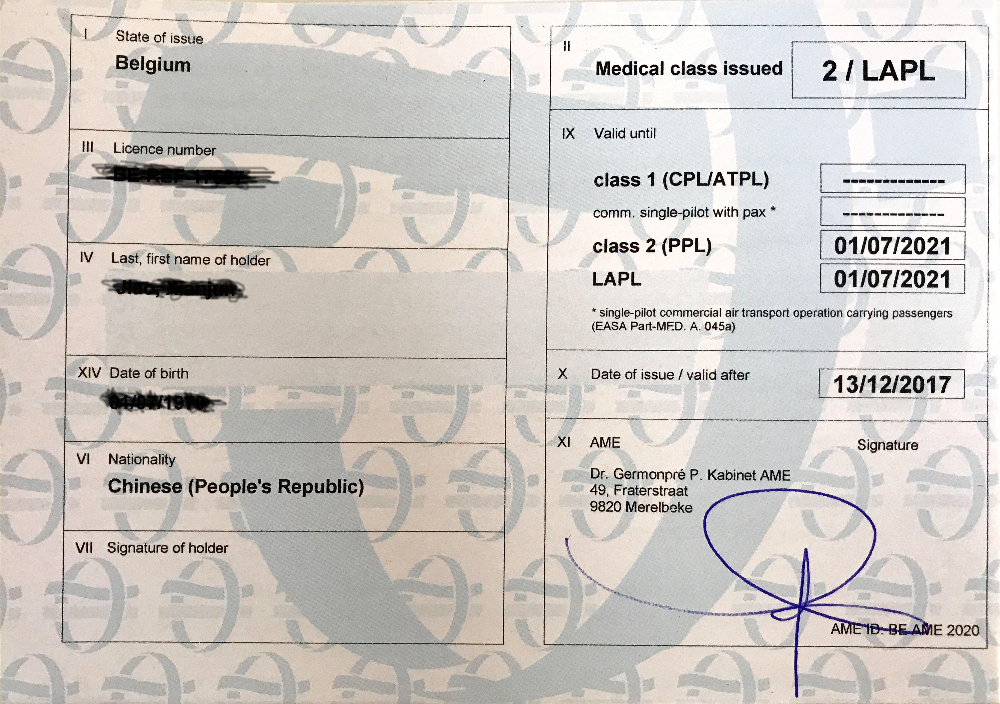

#飞行日记5#  

谈谈体检吧。

先总结：基本上能开车的就能开飞机。。。。。

残疾人呢？其实这里残疾人可以开车，只要车经过改装和认证。你坐轮椅，只靠手就可以开车。这种车drive by wire。有个坐轮椅的同事就是每天开这
样的车上下班。

所以残疾人也是可以开飞机的。在那个驾校网站上特意说了有一架飞机是经过了改装的，残疾人也可以来学开飞机！充分体现了社会资源公平性。

体检证书与飞行执照对应，有三类：

    Class 1 - CPL， ATPL -- 相当于巴士司机，搞运输的，体检最为严格
    Class 2 - PPL -- 相当于私家车司机，体检标准一般
    Class 3 - LAPL -- 相当于三蹦子助力车或者卡丁车？总之要求最低了。目的就是纯玩玩。

Class 1 体检证书只能欧洲航空安全局（EASA）认可的体检中心发放。Class 2 体检证书可以体检中心或者有EASA资质的医生发放。Class 3 除了体检中心和
有资质的医生发放外，GMP也可以发放。（GMP我理解就是更普通一点的医生）。

有资质体检机构可以查询这里：[https://mobilit.belgium.be/nl/Resources/publicaties/luchtvaart/pub_vergunningen_medisch_aeromedical_centra](https://mobilit.belgium.be/nl/Resources/publicaties/luchtvaart/pub_vergunningen_medisch_aeromedical_centra) 
有资质的医生可以查询这里：[https://mobilit.belgium.be/nl/resource/aeromedical_examiners](https://mobilit.belgium.be/nl/resource/aeromedical_examiners)

我拿到的是Class 2体检证书，因为申请的是PPL驾照。

过程：先是找了一个距离最近的有资质的医生，预约体检（一般检查类的都要提前1～2个月预约）。约到了7月25日，跑去医生那里体检。医生有很大的
自主权，而且完全信任你的调查问卷答案（抽烟喝酒家族病史心里健康等等）。医生通过“望闻问切”决定检查哪些项目不检查哪些项目。这个医生仅仅给我检查
了一些常规的内科外科，听一听内脏，心电图，肺活量，血压，心率，四肢等等。其他主要靠询问。x光，血，尿在我们看来很常规的项目，医生大笔一挥，
不需要检查。。。。

他不是眼科医生，所以给了我一张Class 2的眼科检查项目表，让我去任何一家医院或者眼科诊所检查，然后结果给他就行。

眼科类的常规检查预约时间更长。找了一个诊所，一下子就预约到了10月中旬。赶上出差，取消又重新预约，就到了12月份。于是12月跑过去检查眼睛。
首先是一堆比较常规的检查，视力，眼压，色盲，眼底等。另外有一些比较奇怪的可调节器具对在鼻梁，让你盯着看的同时他调节器具上的目标，听他指令告诉他
何时出现重影等等，目的貌似是测量眼睛的聚焦或者肌肉调节范围，这一类的检查的确第一次见到。看荷兰语的最后检查结果也是一知半解，翻译过来貌似有些项目
是在检查眼睛神经反应，眼睛周围的肌肉反应。

检查完毕，医生说没问题，虽然矫正视力不是那么高（貌似只有1.0了），但他说不碍碍事。果然我把眼科检查结果扫描发给了7月份的那个医生，医生很快便邮寄过来
体检证书。show一下体检证书（medical certificate)

上面其实只是体检证书的很小一部分，展开后是一张大纸。上面详细列出了做了哪些项目，以及这个证书的适用范围和限制。在限制那里写了几句关于视力的话。我不是
很明白，就email医生问我是不是需要配个新的眼镜。医生回答，完全不需要配新眼睛，矫正视力足够了。唯一的限制是上飞机时必须携带一个备用眼镜，有时候
会有人检查。

至此体检完毕。我的证书有效期到2021年。Class 2体检间隔的要求是：40岁以下5年一次；40岁到49岁2年一次；50岁以上1年一次。

理论课程目前正在进行飞行仪表以及重量和平衡计算部分，考试亚历山大。

<noscript>Please enable JavaScript to view the <a href="http://disqus.com/?ref_noscript">comments powered by Disqus.</a></noscript>

