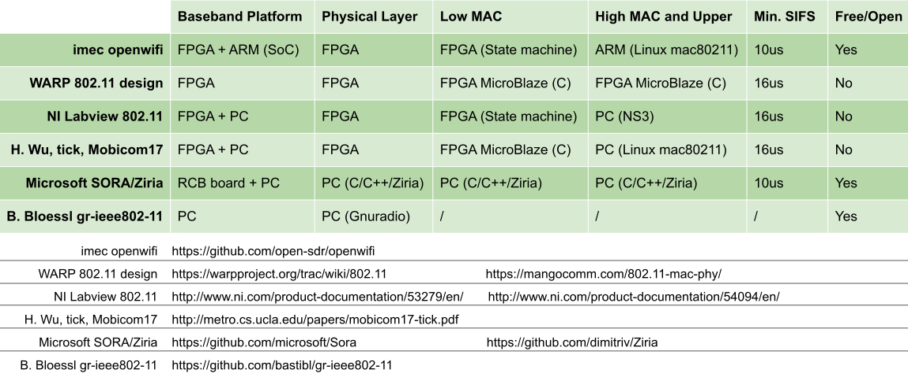

”白菜价”的Wi-Fi芯片为何用软件无线电实现起来如此困难。openwifi项目为你揭秘。

站在21世纪后4/5开始之际，回望前段时间发布的openwifi项目([https://github.com/open-sdr/openwifi](https://github.com/open-sdr/openwifi))，对个人而言，再一次提升了自己的能力边界。对社区而言，我想说这是中国开发者给Wi-Fi研究领域的一点点基础性贡献。

正文：

Wi-Fi已经诞生20多年了。如今，Wi-Fi就像空气和水，视而不见却如影随形。一方面它是连接互联网的”生活必需品”，另一方面，因为十分低廉的硬件价格和无线电信号的开放性，也成为黑客们最喜欢的研究对象之一。

这里的黑客也包括各大学和研究机构的研究员们。他们的利用Wi-Fi开展了各种”脑洞”研究。比如从Wi-Fi信号里窃取或保护你的隐私，2015年央视315晚会上现场从Wi-Fi信号中获取的用户隐私展示仍历历在目。近几年，Wi-Fi信号甚至被用来探测物理世界里人的活动。MIT的研究人员利用无处不在的Wi-Fi信号实现了穿墙无源雷达，可以”看到”墙后面的人。其他”脑洞”研究还有比如利用Wi-Fi信号给低功耗物联网芯片供电等。这些有趣的研究工作大都是基于商用芯片或者软件无线电（SDR）。基于商用芯片主要采用开源驱动，反向驱动或固件的手段（比如github上的nexmon项目）。SDR在这些研究中一般“仅接收”或者“仅发射”，而不是”实时收发”。因为像商用Wi-Fi芯片那样实时收发对于SDR并不容易，原因后面会讲到。

说到软件无线电（SDR），在无线通信和安全研究领域它是一种重要的手段。SDR的基本思想是用软件实现无线通信硬件（比如芯片或基站）的功能。比如在移动通信领域，2G/3G时代的gsm监听以及伪基站，就是基于OsmocomBB发布的SDR硬件和软件。到了4G/5G时代，著名的SDR项目有开源的srsLTE，OAI（Open Air Interface），以及非开源但性能逆天的Amarisoft（法国传奇黑客Fabrice Bellard出品）。

反观Wi-Fi领域，廉价/免费的且广为应用的开源设计却几乎没有。难道写出一个几块钱的Wi-Fi芯片功能的软件，比移动通信（2/3/4/5G）基带芯片更难？这种现象背后的原因涉及到Wi-Fi和移动通信频谱性质以及设计哲学的不同。

Wi-Fi工作在共享频谱（比如免费的2.4GHz和5GHz ISM频段）。在这个频谱中，不只Wi-Fi一种通信系统，蓝牙和Zigbee等也使用同一频谱，因此各国的无线电法规大都要求共享频谱中的设备采用Listen-Before-Talk （LBT）方式工作，即：发射前，先监听信道确保当前信道是空闲的，避免干扰到其他设备正在进行的传输。基于类似考虑，当一个设备发送完一个数据包之后最好能立刻从对方的反馈（ACK）中知道成功与否，这样可以缩短一次传输对信道的占用时间。因为，如果对方需要较长的时间才能给出反馈，那么其他设备则必须等待，此时信道白白浪费。如果其他设备不等待，那么这个关键的反馈信息可能被其他设备的传输所阻塞/干扰，其本身的不确定度加大，这是协议所不希望看到的，因为反馈信息对于协议是重要的状态信息。所以在尽可能短的时间内立即反馈成为一种简单有效的策略，它也可以避免芯片记录太长时间的状态/队列信息，从而减小片上RAM，降低成本。因此Wi-Fi协议规定如果成功接收到一各数据包（CRC校验通过），则需要在SIFS（Short Inter Frame Space）时间内发送给对方ACK包，这样对方就知道自己发送成功，可以发下一包了。如果对方在SIFS时间内没有接收到ACK包，则认为自己发送失败，对方会根据高层设置决定立刻重传（高层设置最大重传次数）或者放弃。SIFS在2.4GHz频段为10us，在5GHz频段为16us，在60GHz频段则更短。极短的SIFS时间保证了两个Wi-Fi设备每次通信对信道的占用是”连续”的（因为SIFS远小于包时间长度）。两个Wi-Fi设备的一次交互（数据包+ACK）未完成前，信道中的其他设备都会安静等待，但因为SIFS很短，这种等待造成的浪费并不严重。这种快速ACK只是Wi-Fi CSMA/CA MAC协议的一小部分，但对芯片来说也是收发时延要求最苛刻的部分。Wi-Fi标准中详细描述了CSMA/CA协议的各方面功能，确保信道共享公平且高效。这里不进一步展开。

与Wi-Fi不同，移动通信使用昂贵的授权频谱，追求最高的频谱利用率。所有终端的发送和接收都受到基站的管理和控制。发送（包括发送ACK这种反馈）都是被基站按时调度的。比如LTE的HARQ（混合自动请求重发）过程就规定，收到一个1ms的subframe数据后，给对方的反馈是调度在4ms之后的，这个反馈延迟比起Wi-Fi的10us那就长很多了。当然，这4ms之内信道并不会闲着，基站会调度有需要的终端继续发送/接收新数据。对频谱的调度式占用一般说来会比随机竞争效率更高。4ms的反馈延迟，也留给接收方足够的处理时间。

请记住这两个数字10us和4ms，他们决定了能否方便的用电脑软件来实现无线通信协议。最流行的软件无线电架构是电脑加射频前端（USRP/BladeRF/HackRF等）。他们之间的连接方式主要有pcie，以太网和USB这三种方式。目前主流射频前端（比如USRP）和电脑的通信延迟最快都在几百us量级。所以对于移动通信，可以利用电脑强大的处理能力按照协议要求从容计算，然后在规定时间之内发送反馈（比如LTE的4ms反馈延迟）。反而对于Wi-Fi的10us SIFS 反馈延迟，基于电脑软件的实现则变成了几乎不可能完成的任务。（我用了”几乎”，不是完全没可能，请看到最后）。

因此，用软件无线电（SDR）去实现Wi-Fi的合理选择是用FPGA芯片直接连接射频前端芯片。调制解调以及CSMA/CA MAC层都在FPGA内部实现，那么是可以实现10us的ACK反馈延迟的。这也是商用Wi-Fi芯片的实现方式，只不过商用Wi-Fi芯片从成本和功耗角度考虑不会使用FPGA而是设计并流片ASIC。

用基于FPGA的软件无线电平台去实现完整的Wi-Fi协议理论上不存在问题，问题是这世界上熟练的FPGA工程师数量估计不到软件工程师数量的百分之一。而开发同样一个功能模块，软件的开发时间可能是FPGA开发时间的几十分之一。因此，并不是说Wi-Fi的协议有多么复杂，而是用FPGA来开发Wi-Fi比起软件更耗时耗力。

以上只是介绍了Wi-Fi实现的一个关键点，并不是Wi-Fi实现的全部。要实现一个完整的Wi-Fi芯片功能，仅用FPGA实现Wi-Fi标准定义的OFDM调制解调是远远不够的，还需要MAC功能（CSMA/CA），驱动和上层协议软件（Association/Authentication/Encryption/etc)的支持。

以目前广泛应用（尤其在嵌入式，路由器和手机领域）的Linux操作系统为例，在 [https://wireless.wiki.kernel.org/](https://wireless.wiki.kernel.org/) 详细描述了它是如何支持Wi-Fi芯片的。Wi-Fi芯片厂家只需要按照Linux的要求提供Driver（即驱动程序，面向Linux内核实现Linux预定义的ieee80211_ops API）。在驱动之上，Linux内核提供了Wi-Fi的高层MAC支持（mac80211，cfg80211），链路速率自动调整功能，user space和kernel space的通信接口nl80211，以及user space丰富的工具软件，比如作为station模式的wpa_supplicant和作为AP模式的hostapd。因此，借助Linux对于商用Wi-Fi芯片的支持，可以减轻很大部分基于FPGA的Wi-Fi实现的工作量。即便如此，基于FPGA的Wi-Fi实现依然涉及到调制解调之外的许多工作。主要有：

* 克服本振泄漏等零中频收发机自干扰（目前流行的射频前端架构是零中频）。因为Wi-Fi收发频率是相同的，即TDD半双工。这涉及到FPGA数字中频的一些设计考量。
* 实时获取射频前端AGC增益，并根据I/Q采样值大小计算RSSI。因为Linux高层需要RSSI报告。RSSI在不同频率和射频通道/天线可能需要不同的校准/补偿值。RSSI也是判断信道是否被占用的重要依据，是CSMA/CA协议的基础。
* 在FPGA上实现完整的CSMA/CA协议（Low MAC层）。根据Linux wireless的设计，Wi-Fi的MAC层分为实时的low MAC （比如SIFS，ACK，重传，CCA，NAV，backoff等CSMA/CA操作）和非实时的high MAC。Linux的mac80211子系统负责high MAC，但low MAC必须由FPGA实现，因为Linux的实时性不足以实现us量级的精确时延，此架构即典型的SoftMAC Wi-Fi芯片。还有一种Wi-Fi芯片类型是FullMAC芯片，此时high MAC也在芯片里而不是Linux中。这种芯片厂家不必依赖Linux mac80211子系统的high MAC实现，有更大的性能优化自由度，当然芯片开发也需要更多人力物力。
* FPGA和Linux的通信接口。比如Wi-Fi包的DMA接口，FPGA寄存器配置和状态接口。需要在Linux驱动里去响应Wi-Fi包的收发中断，以及访问FPGA寄存器。
* FPGA内发包队列的管理。因为Linux Driver把包交给FPGA后，FPGA需要等待合适的发送时机（CSMA/CA里的TXOP），因此必须先把包缓存到队列中。此队列需要被Linux Driver查询和操作。
* Linux Driver和FPGA交互所需的各种信息（RSSI，timestamp，序列号等）的插入和提取，因为这些信息是Linux上层所需要的。有些信息跟随数据包，有些信息通过寄存器交换。
* Linux Driver（驱动）的编写。驱动程序需要综合调用FPGA和射频前端的各种功能接口，实现Linux mac80211子系统预定义的ieee80211_ops API。
* 基于nl80211的user space工具的编写（例如openwifi里的sdrctl）。如果你想从user space实时访问/配置一些driver/FPGA/射频底层功能的话，则需要通过nl80211接口与内核中的驱动程序通信。

从上面的介绍可以看到，看似简单的Wi-Fi芯片，”全栈”开发是必须的。在商业公司内部，Wi-Fi的实现需要一个工程团队密切分工合作，并假以年计来完成。但在研究领域，具有完整和丰富工程经验的学生和老师/研究员并不多，实现完整Wi-Fi对于大多数博士生来说是投入产出比太低的工作，这也是为何在研究领域鲜有完整Wi-Fi实现的原因。

openwifi项目的目标就是要为研究领域提供一个完整的Wi-Fi基带芯片/FPGA实现。这样广大博士生和研究人员就无需Wi-Fi实现所需的巨大投入，直接进入产出阶段。目前openwifi第一版基于Xilinx的Zynq FPGA实现（SoC，System on Chip）。这款FPGA内嵌了ARM处理器，可以跑Linux，即可以提供我们所需要的mac80211子系统，而且开发板可以方便的连接Analog devices的射频前端（例如AD9361）。因此在这个Xilinx加Analog devices的SDR平台上，射频，FPGA，ARM和Linux都齐了。因为是基于ARM处理器，并且ARM和FPGA在一颗芯片内（SoC），所以openwifi的设计也很适合用于嵌入式领域（无人机图传，Wi-Fi视频会议，IoT等）。

需要说明的是，虽然openwifi实现了”全栈”，但它并不是每个部分都从头开始，比如OFDM接收机模块就是在openofdm开源项目之上修改，添补，整合而来。下面梳理一下社区多年来不同研究者在Wi-Fi实现上的各种尝试，以及openwifi与他们的异同。

* WARP 802.11 design
[https://warpproject.org/trac/wiki/802.11](https://warpproject.org/trac/wiki/802.11)
[https://mangocomm.com/802.11-mac-phy/](https://mangocomm.com/802.11-mac-phy/)
这是rice大学很早就发布的基于FPGA的Wi-Fi参考设计。需要购买license才可以使用，费用大约30k欧左右（根据需要哪部分），费用不包括自己购买板子（比如ADRV9361-z7035）的费用。从公开资料来看，它并没有使用Linux mac80211子系统，而是high MAC和low MAC用FPGA里的MicroBlaze软核处理器实现。

* National Instruments Labview 802.11 framework

[http://www.ni.com/product-documentation/53279/en/](http://www.ni.com/product-documentation/53279/en/)

[http://www.ni.com/product-documentation/54094/en/](http://www.ni.com/product-documentation/54094/en/)

来自大厂NI的基于FPGA的参考设计，除了这套集成在Labview的设计的license费用（6k欧左右）之外，你还需要购买9k欧左右的高端USRP-2944才能跑起来。从公开资料来看，它也没有使用Linux mac80211子系统，而是使用PC上的NS3网络仿真器作为high MAC，FPGA内实现low MAC。因为绑定Labview，所以开发环境必须Windows。

* Microsoft SORA和ziria

[https://github.com/microsoft/Sora](https://github.com/microsoft/Sora)

[https://github.com/dimitriv/Ziria](https://github.com/dimitriv/Ziria)

微软亚洲研究院n年前发布的一个Wi-Fi实现。物理层和MAC全部使用PC上的软件实现，他们在多年前就做到了我之前说的“几乎”不可能。他们设计了一块pcie的RCB（radio control board，FPGA实现低延迟pcie接口）卡和射频板相连，这说明pcie延迟实际上足够低。项目的水平的确逆天，至今无人超越。涉及大量PC架构下的优化技巧（查表替代计算，缓存替代计算等），以及如何在Windows操作系统下隔离出几个核专用于高实时处理。RCB板加射频板大约2.5k欧的样子。许多高校也在此架构基础上做了4G/5G实现。在项目创始人Kun Tan离开去了华为之际，SORA放到github上开源了。但貌似github上开发活动并不活跃也基本不再更新。后来微软的两个老外设计了一种DSL（Domain Specific Language），并用这种新语言重写了SORA架构下的Wi-Fi实现。但即使用了DSL，要想实现最严苛的SIFS延迟，还是需要用基于pcie的RCB卡，使用其他接口的射频前端（例如基于USB的BladeRF和USRP）满足不了SIFS反馈延迟。公开资料来看也并没有使用Linux mac80211子系统。（Windows实现可能用Linux内核里的子系统么？）

* mobicom 2017上北大Haoyang Wu的FPGA实现（tick）

[http://metro.cs.ucla.edu/papers/mobicom17-tick.pdf](http://metro.cs.ucla.edu/papers/mobicom17-tick.pdf)

在2017年美国盐湖城mobicom会上，北京大学Haoyang Wu 发表了 The Tick Programmable Low-Latency SDR System。印象中还获得了community贡献奖，因为这是社区首次有人基于FPGA实现了全栈Wi-Fi，工作相当硬核，和我们的实现架构也非常接近。主要的不同是，他们做了USB3.0接口把FPGA接到电脑上，然后使用电脑上Linux的mac80211子系统，也就是说他们的驱动是基于USB3.0接口。而我们的openwifi是”全栈”都在单芯片上（SoC）：Linux跑在片上ARM处理器，通过Xilinx AXI DMA通道和片上FPGA相连。因为省去了USB这种PC接口，端到端延迟更低。如果你用ping来测试openwifi，并与其他基于USB/pcie的Wi-Fi网卡对比，就会发现片上全栈的延迟更低。此外，在mobicom上作者貌似提到过将来会开源，但两年过去了依然没有任何消息。

* gnuradio/USRP/RFNoC社区

[https://static1.squarespace.com/static/543ae9afe4b0c3b808d72acd/t/55f85aaee4b02e1b84d8ff51/1442339502956/7-pendlum_johathan-OFDM_RFNoC-2015-08-27.pdf](https://static1.squarespace.com/static/543ae9afe4b0c3b808d72acd/t/55f85aaee4b02e1b84d8ff51/1442339502956/7-pendlum_johathan-OFDM_RFNoC-2015-08-27.pdf)

这是目前最大最活跃的SDR社区。但对于Wi-Fi大都是一些小模块实现或者为了写论文的一些快速原型，没有相对完整的模块级和系统级实现。在USRP的FPGA开发框架RFNoC（RF Network on Chip）提出的初期，曾经在一个ppt（见前面链接：Building an OFDM receiver with RFNoC）中提到过基于RFNoC框架在USRP的FPGA中实现Wi-Fi接收机，不过貌似始终没发布一个相对完整的RFNoC Wi-Fi接收机模块。而且RFNoC开发门槛还是略高，本来使用FPGA原厂工具链开发FPGA已经有一定门槛，使用RFNoC则还需要在FPGA基础架构上再多一层，涉及到和gnuradio companion的通信和控制接口，需要对整个USRP和gnuradio的概念有比较深入的了解。因此RFNoC框架中开发者贡献的IP core并不多，猜测RFNoC主要还是Ettus公司内部开发USRP上的FPGA用。

* gr-ieee802-11项目

[https://github.com/bastibl/gr-ieee802-11](https://github.com/bastibl/gr-ieee802-11)

这是Bastian Bloessl基于gnuradio的802.11实现。这是一个相对完整的和应用较为广泛的软件无线电Wi-Fi实现。因为使用PC上的gnuradio，所以不可能实现真正的SIFS反馈延迟以及和商用Wi-Fi芯片通信。作者很清楚这一点，也给出了一些workaround，比如关闭ACK机制。该项目对于不熟悉FPGA而是想从gnuradio入门的人来说，是一个可以很快上手并且根据需求二次开发的不错的选择。而且一台PC加一块廉价的SDR前端（HackRF，BladeRF，USRP B系列N系列等）即可工作。

* openofdm

[https://github.com/jhshi/openofdm](https://github.com/jhshi/openofdm)

这是近两年开源的一个面向USRP N210的Wi-Fi FPGA接收机完整实现！作者是中国人Jinghao Shi （史经浩）。两年前有openwifi项目的想法时，老老实实的先开发了Matlab的Wi-Fi接收机算法，然后打算进行FPGA实现。后来偶然间发现openofdm项目，看了它的文档感觉相当靠谱，于是决定采用。openofdm采用了面向N210内部小容量FPGA的一种高度优化的设计，因此付出了一些解调性能上的代价，但对于第一版以验证全栈集成为主要目的openwifi来说够用了。使用过程中也发现了一些openofdm的bug和缺失的一些全栈集成必要功能，我们进行了相应的改进。目前openofdm的作者已经把openwifi对openofdm的改进合并进了openofdm。

这里用一张表格来说明openwifi和其他项目的异同：

此外，openwifi在软件无线电平台（Zynq+AD9361）方面使用了Analog devices的HDL参考设计([https://github.com/analogdevicesinc/hdl](https://github.com/analogdevicesinc/hdl))和它的Linux kernel版本([https://github.com/analogdevicesinc/linux](https://github.com/analogdevicesinc/linux))，也使用了Xilinx的一些相关IP core和Xilinx AXI DMA Linux驱动例程，并根据Wi-Fi需求进行了必要的修改，这样可以省去大量的FPGA与射频前端和ARM的接口开发工作。openwifi对Analog devices和Xilinx相应的github资源进行了引用和说明。

openwifi的Linux驱动部分当然也是参考了Linux 里面的各种Wi-Fi芯片的驱动源代码。由于openwifi与Linux之间采用Xilinx AXI DMA接口（片内FPGA和ARM接口），而Linux内核代码中的Wi-Fi芯片大都是基于pcie和USB的，因此只能借鉴而无法直接移植。研究了Linux内核代码里的各种Wi-Fi芯片驱动后，发现台湾realtek公司的rtl8180/8187芯片驱动最为简单。我还专门淘到了一些古老的基于rtl8180/8187芯片的网卡，在Linux下通过学习和修改rtl8180/8187驱动学习真正的Wi-Fi网卡是如何工作的。参照这些芯片驱动，并结合Xilinx给的DMA驱动代码，成功实现了openwifi的mac80211子系统兼容驱动。

为了方便测试和调试，我们还自己开发了整套的Matlab基带收发算法，作为FPGA实现的benchmark。不然有问题时，会不知道目标在哪里。

回顾openwifi的诞生历程，有一点感到很自豪的是项目的主导和主要贡献来自中国开发者。

* 我本人。两年多来几乎是120%的时间在投入。openwifi的主意诞生于这个欧盟H2020项目（ORCA）[https://www.orca-project.eu/](https://www.orca-project.eu/) 。主要动机是不希望项目结束仅仅给这个世界带来一些饱含高大上概念的报告，而是能给社区带来一些能够真正广为使用和流传的东西。当然也十分感谢公司（imec）支持开源。
* 我的中国同事刘薇([https://telefoonboek.ugent.be/nl/people/802000881827](https://telefoonboek.ugent.be/nl/people/802000881827))。把openofdm从USRP N210平台移植到Zynq平台，并且配合我做了大量模块和系统级调试和测试工作。
* openofdm的作者史经浩。看linkedin，这位同学毕业后去了Facebook而且貌似早就不搞Wi-Fi了。但他的openofdm开源实现，使得我们的openwifi在两年内做完成为可能，否则至少还需要额外的半年到一年。
* 来自中国台湾的realtek公司的Wi-Fi芯片驱动是我学习Wi-Fi驱动的主要对象。大名鼎鼎的rtl-sdr电视棒也是这家公司的，堪称业界良心了。
* 最后是一位开发者不是来自中国，但也必须提到：来自埃塞俄比亚的同事Michael Mehari ([https://biblio.ugent.be/person/802001220721](https://biblio.ugent.be/person/802001220721))。他在我们最初的Matlab仿真代码基础上开发出了ofdm tx FPGA模块。因为他没有看到过和参考过WARP 的PHY tx FPGA实现，所以我们的开源代码是”无污染”的。

最后想说明的一点是：openwifi现阶段一定是在各方面会被商用芯片吊打，这一点毋庸置疑。现阶段它对标的对象也不是商用芯片，而是前面的对比表格中的其他项目。但就像当初Linus Torvalds发布Linux的时候，在强大的商用UNIX面前Linux也只是nothing，谁也不会想到后面Linux竟然变得如此强大。这其中的关键就在于你---广大开发者。感到欣喜的是，我前段时间发布openwifi项目的twitter在短时间内就获得了13万次展示和2万4千次播放量（demo视频），来自东西南北半球的人们纷纷表示“这下有得玩了”。

"Talk is cheap. Show me the code." -- Linus Torvalds

我们动手吧。

<noscript>Please enable JavaScript to view the <a href="http://disqus.com/?ref_noscript">comments powered by Disqus.</a></noscript>

