乔布斯2007年发布iPhone时，引用图灵奖得主Alan Kay的一句话“真正在乎软件的人，应该打造自己的硬件”。同样道理，想玩好软件无线电，也必须深入SDR（软件无线电）硬件。

本文以射频硬件为线索，梳理常见SDR（软件无线电）方案。SDR硬件位于天线和数字信号处理之间，负责把无线电信号数字化，交由主机或者嵌入式系统（FPGA、DSP，MCU）处理。SDR硬件一般包含射频和数字两部分。

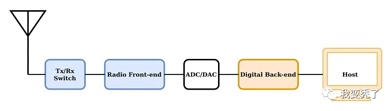

这里的射频指广义的从天线到ADC、DAC这部分，包含了高频/射频，中频IF（如果有），零中频，模拟基带，相关的滤波以及混合信号ADC/DAC。之所以不以数字部分为线索，是因为数字部分的实现方案无外乎以下四种：

- 基于FPGA（亦可接主机）。典型代表：USRP系列
- 基于Xilinx Zynq SoC FPGA。典型代表：Xilinx开发板配合Analog Devices的射频板
- 基于USB单片机/MCU。典型代表：HackRF+portapack（NXP LPC4320），孔雀石Malahit（STM32H7）
- 基于主机或者SBC/单板计算机。典型代表：rtl-sdr电视棒、SDRPlay/RSP1、AIRSPY、RX888；KiwiSDR （采用BBB BeagleBone做主机），CaribouLite RPi HAT （采用树莓派做主机）

不难看出，数字部分相对成熟且标准化程度高，这离不开芯片制程和计算机产业的高度发达。

反观射频部分，由于包含高频以及模拟信号处理，数模混合电路ADC、DAC，结构复杂，较少受惠于高级数字电路制程的进步，往往成为各种SDR硬件性能的决定性因素。因此本文以射频方案为主线，介绍以下SDR射频方案：

- PWM射频：无射频的射频
- AD9361、AD9371、ADRV系列
- LMS6002D、LMS7002M、LimeSDR系列
- AT86RF215（Microchip公司支持I/Q采样的zigbee IoT芯片）
- RFFC5072+MAX2837+MAX5864（HackRF的变频加Maxim WiFi套片）
- E4000/R820T+RTL2832、rtl-sdr电视棒系列
- E4000+TLV320ADC3140音频codec（Funcube Dongle）
- R820T+LPC4370（AIRSPY）
- MSI001+MSI2500（SDRplay/RSP1）
- MSI001+NAU8822音频codec+STM32H7 （俄罗斯 Malahit 孔雀石收音机）
- ADL5350+ADF4350 rtl-sdr 2.4GHz变频方案
- 射频直采（RFSoC、KiwiSDR、RX888、RED PITAYA）
- 传统业余无线电射频（uSDX）

正文开始：

# PWM射频：无射频的射频

是的，你没看错，“剑法的最高境界，则是手中无剑”。随着数字芯片（FPGA、树莓派、单片机）的I/O速度越来越高，仅靠控制I/O基于PWM（脉宽调制）即可发送射频信号。类似原理，把高速I/O当做高速1bit ADC来用，亦可直接恢复射频信号。

比较早期的可以搜索2007年的这篇“An FPGA Based All-Digital Transmitter with Radio Frequency Output for SoftwareDefined Radio”，利用Xilinx Virtex2pro FPGA上的 MGT（multi-gigabit transceiver）高速引脚实现了800MHz载波，20MHz带宽的64QAM信号发射。临信道泄露比（ACLR）45dB，EVM优于1%。

现在FPGA速度比起2007年快了很多，可以搜索2017年的这篇“Real-time all-digital radio-over-fiber LTE transmission”，利用FPGA上的27.5Gbps的数字I/O配合PWM调制产生了3.44GHz载波上的5MHz LTE信号。

基于类似原理，FPGA的高速I/O口也可以看做是一个高速的1bit ADC，配合FPGA高速PWM输出和比较器，可以实现高速射频ADC。大家可以搜索2021年的这篇“All-digital FPGA receiver: on Intel Stratix 10 TX”。

以上都太高端了？不要怕，只需要很便宜的Lattice MachXO2 FPGA再配合三个电阻一个电容，你也可以在家直接用FPGA直连天线听收音机！大家搜索“FPGA + 3 R + 1 C = MW and SW SDR Receiver”。这个收音机长这个样子：

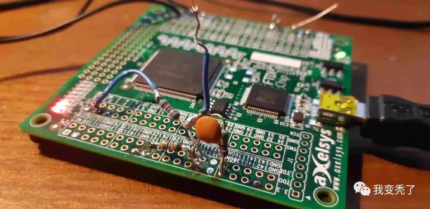

基于类似原理，人们也开发了利用树莓派的I/O口来发射射频信号的程序。比如发射FM广播，自行搜索“Turn Raspberry Pi into FM transmitter”。比如发射传真图像，自行搜索“Emitting Hellschreiber from a Raspberry Pi GPIO: combining gr-hellschreiber with gr-rpitx”。

# AD9361、AD9371、ADRV系列
Analog Devices，我们的老朋友了。AD9361、AD9371、ADRV高集成度射频收发器系列广泛用于各种高端仪器、软件无线电、商用无线通信产品中。支持6GHz以下连续覆盖，带宽可达几十M甚至上百M，各项射频性能优异，灵活可配置。

除了高端商用，在广大软件无线电DIY爱好者中也大受欢迎。毕竟，它一颗芯片把那么大一堆从天线到ADC/DAC所必须的所有处理环节全包括了，而且性能没的说。你只需要给他连接天线和基带，自己在家就能DIY一个性能如此强悍的SDR设备，这在以前是很难想象的。

我们的openwifi（开源WiFi芯片设计）目前也只能跑在FPGA + AD9361的平台上，不得不说这颗射频芯片大包大揽、性能优异且全面。

基于Analog Devices高集成度射频收发器的SDR产品不完全列表：

  - USRP B系列
  - USRP E系列
  - USRP N3xx系列
  - Analog Devices FMCOMMS系列射频板
  - Analog Devices SoM模块 ADRV9361-Z7035，ADRV9364-Z7020
  - PlutoSDR
  - BladeRF二代
  - EPIQ Sidekiq系列
  - 国产 gridrf NH7020
  - 国产 MicroPhase 微相 系列
  - 国产 SDRPI
  - 国产 Pluto plus
  - 国产 Pluto Zynq7020增强版（LibreSDR）
  - 国产 PYNQSDR PYNQ-Z1 + AD936X SDR
  - 国产 Neptune SDR （B站 薛定谔的猫power）
  - 国产 类AD9361芯片
  - 等等

# LMS6002D、LMS7002M、LimeSDR系列

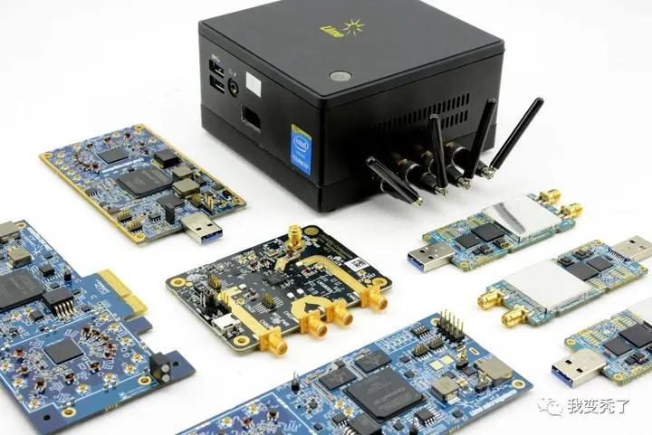

Lime microsystems是一家英国公司，LMS系列是对标Analog Devices的AD93xx系列芯片。许多人熟知的LimeSDR系列设备即是基于LMS7002M。BladeRF第一代是基于LMS6002D（第二代转投AD9361了）。

LMS系列射频芯片几乎是市场上可公开购买到的AD9361唯一竞品，所以它存在的意义巨大。AD9361系列只是庞大的Analog Devices产品线和营收中的一小部分，而LMS射频芯片就是Lime microsystems公司的全部身家。

根据Lime microsystems公司官网，变频器LMS8001+已经支持到12GHz和120MHz带宽，LMS9000将会支持到100GHz和>2GHz带宽。

期待Lime microsystems公司越来越好！

# AT86RF215（Microchip公司支持I/Q采样的Zigbee IoT芯片）
这是Microchip公司（就是出ATMEL单片机那家）的一款IoT芯片，支持sub 1GHz和2.4GHz的Zigbee标准，FSK、OFDM、O-QPSK。

它之所以出现在SDR射频方案里，是因为它在标准协议处理之外，也提供了ADC/DAC的IQ采样接口，因此也可以作为通用SDR射频芯片。支持射频带宽2.5MHz和采样率4MHz。

iotSDR采用了AT86RF215 + Zynq 7010的方案，可以看做是把PlutoSDR里的AD9363替换为了更低端的面向IoT的射频前端。

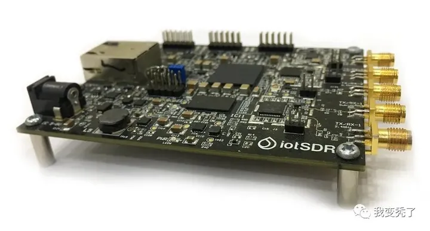

CaribouLite RPi HAT则是把AT86RF215做成了树莓派扩展板的思路，可以直接插在树莓派的IO插座上，构成完整系统。

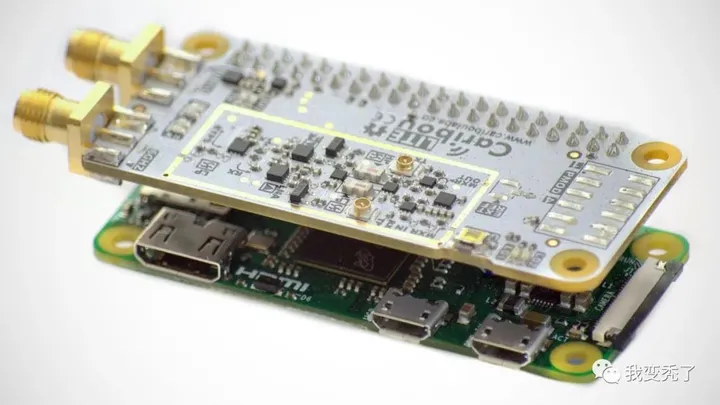

# RFFC5072+MAX2837+MAX5864（HackRF的变频加Maxim WiFi套片）
这是HackRF的射频方案。它实际上是Maxim公司（已被Analog Devices收购）的WiFi射频方案前面加上一个Qorvo的混频器RFFC5072。它将6GHz范围内的目标频率变频到2.4GHz之后，由成熟的2.4GHz WiFi射频套片（MAX2837+MAX5864）接手。

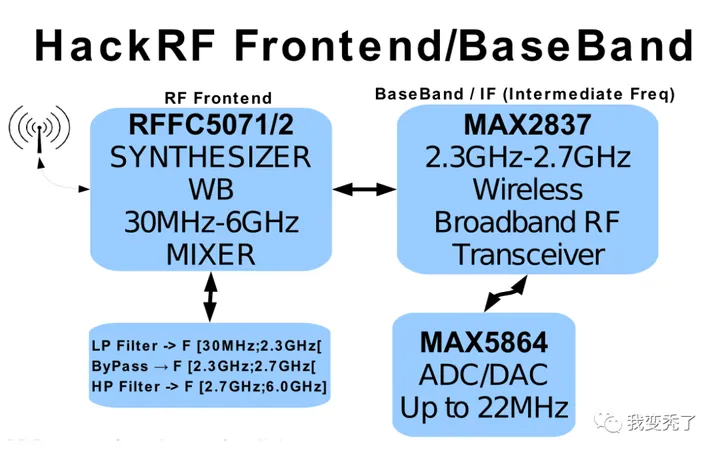

大家也可以上Maxim Integrated公司网站搜索类似的WiFi射频套片方案。使我惊奇的是，这样的射频和ADC/DAC分开的WiFi套片方案，比起当今的许多WiFi芯片指标并不高（或者可以说弱），而且板子面积还大，但仍旧是持续生产的状态，可谓是十分良心了。但，主要客户群是谁呢？

# E4000/R820T+RTL2832、rtl-sdr电视棒系列
rtl-sdr即大名鼎鼎的电视棒。频率覆盖到1.7GHz左右，采样率和带宽最大约3.2MHz。电视棒由调谐器芯片（E4000或R820T，频率范围略有不同）和带有ADC、DVB-T解码器、USB的数字芯片RTL2832U构成（含8051单片机）。调谐器芯片又叫tuner。用过古老电视机的都知道，就是你拧动一个旋钮，就把电视调谐到不同的频率上，调谐器tuner的名字由此而来。

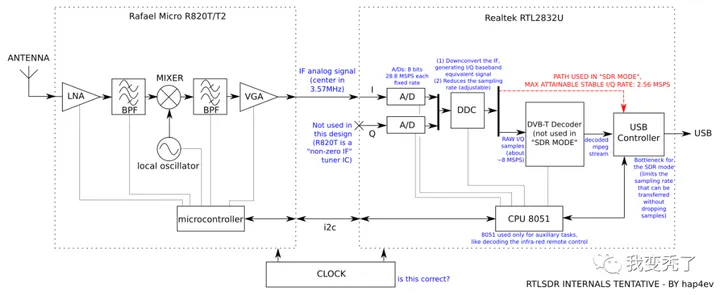

对于软件无线电应用来说，数字芯片里的DVB-T解码器是多余的。这里3.2MHz的带宽/采样率主要受制于RTL2832U数字芯片，毕竟它不是为串流I/Q采样到主机这种SDR应用而设计，怀疑是因为固件上的USB性能有一定瓶颈或内部数字中频架构限制。调谐器tuner芯片R820T并不是带宽限制因素，因为通常一个电视频道为8MHz，为了看电视必须有接收8MHz带宽信号的能力。

由于电视棒极其低廉的价格，群众基础十分庞大，资料也非常多，这里不再用过多篇幅介绍。主要介绍下面几种基于电视棒方案/芯片的各种SDR衍生设备。

# E4000+TLV320ADC3140音频codec（Funcube Dongle）
既然常规电视棒里的DVB-T解码器在软件无线电里并不需要，那么可不可以只用那颗调谐芯片配合更简单的数字芯片来打造一款专门的SDR dongle呢？

Funcube Dongle就是采用这种设计。它使用TI的一颗双声道音频codec充当E4000输出的零中频基带I/Q信号的ADC，然后用Microchip公司的PIC24F USB单片机连接到主机。受限于音频codec ADC采样率，它的最大射频带宽约80KHz。

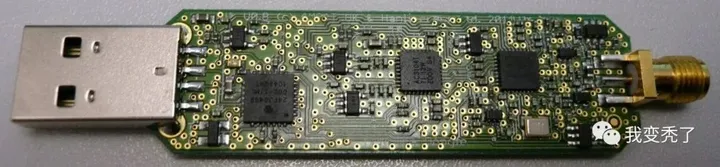

可能由于E4000这个tuner芯片太老了，据说新版的FUNcube Dongle Pro+已经换用MSI001 tuner芯片。参见后面的“MSI001+MSI2500”章节。

# R820T+LPC4370（AIRSPY）
既然rtl-sdr电视棒的采样率/带宽主要受限于数字部分的RTL2832U，而不是调谐器tuner E4000/R820T，那么将数字部分替换为专门的ADC和USB芯片不就完全解锁了tuner的能力？的确，AIRSPY这个SDR设备就是这么做的。

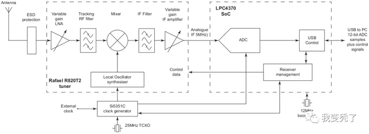

可以看到，它在tuner之后直接接了一个带有80Msps高速ADC的NXP的单片机LPC4370，因此它直接可以支持到大约10MHz带宽（这时就受限于tuner芯片了，单片机80Msps采样率已完全超出tuner芯片带宽范围）。

# MSI001+MSI2500（SDRplay/RSP1）
这是另一种电视棒套片。MSI001是tuner芯片，MSI2500是含ADC、USB等的数字芯片。神奇的是，这个MSI2500数字芯片并不包含电视解调解码器！（还记得rtl-sdr里的数字芯片RTL2832U里是包含了我们并不需要的电视解码器么？）

在MSI的电视棒方案里，电视信号解调解码完全是在主机端用软件做的，也就是这个电视棒本身就是个纯SDR方案。这也意味着这套SDR方案可提供的带宽必然超过8MHz，因为要在主机端软解码电视信号，必然意味着需要将一个电视频道的8MHz带宽I/Q全部实时采集到主机供软解码程序使用。实际上它最大可提供大约10MHz的带宽能力，频率覆盖到约2GHz。

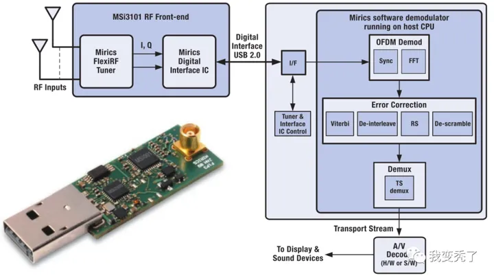

上图中，USB2.0接口左侧就是MSI001+MSI2500构成的电视棒，右侧就是主机侧的电视信号解调解码软件部分。MSI001 tuner内部结构如下。

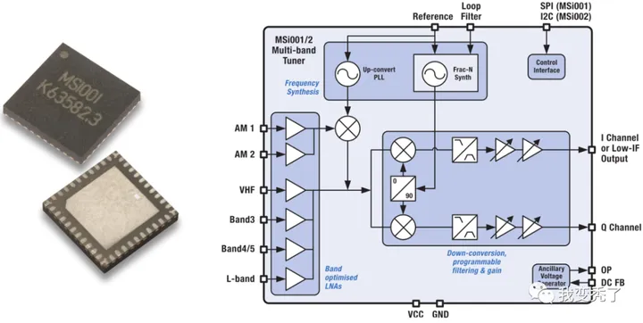

由于这个方案本身就是SDR的，不难想象用它来DIY SDR设备是多么方便，SDRplay/RSP1及其众多的变种（包括众多国产版）就是基于这个方案。

这家Mirics Semiconductor公司貌似有点神秘，如果你访问他们的网站Mirics，只会得到以下信息：We are sorry but we do not offer direct support to end users. Please address any queries you may have to the supplier of your hardware。

从有限的互联网信息来看，这又是一家英国公司，创始人曾经在LSI Corporation 和 Analog Devices 工作。

# MSI001+NAU8822音频codec+STM32H7 （俄罗斯 Malahit 孔雀石收音机）
著名的来自俄罗斯的Malahit孔雀石收音机也是基于上述MSI方案，但它只采用MSI001作为射频前端，其输出的I和Q两路信号（每一路均为差分）连接至音频codec NAU8822，然后连接至主控：性能强劲的主频480MHz的STM32H7单片机。这种SDR完全摆脱对主机的依赖，大屏幕加解调以及声音播放全在掌中完成。以下是国产版孔雀石收音机：

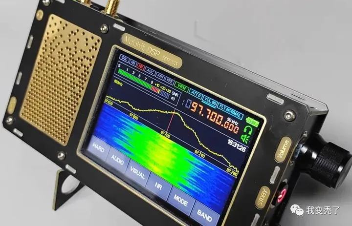

# ADL5350+ADF4350 rtl-sdr 2.4GHz变频方案
各种电视棒方案价格真香，美中不足的是频率覆盖一般都在2GHz以下，那么如何才能玩起更高频段，例如2.4GHz ISM频段，且仍可利用电视棒呢？那就是各种变频方案了。也就是通过混频器将2.4GHz（或者更高频信号）变频到电视棒覆盖的频率范围内，之后交由电视棒。

自行搜索“A LOW COST 2.4 GHZ DOWNCONVERTER FROM OFF THE SHELF DEV BOARDS”，你可以找到这个基于现成Analog Devices评估板的ADL5350+ADF4350 变频方案。ADL5350为混频器，ADF4350为本振，此外还需要一个STM32单片机来对这两颗芯片进行控制，最终完成完整的2.4GHz到1GHz的下变频功能。

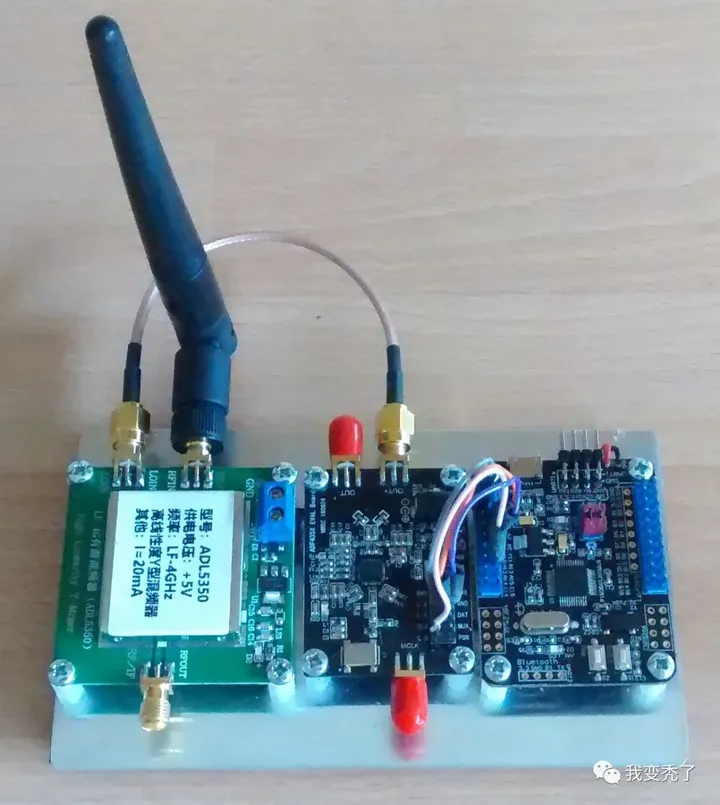

# 射频直采（RFSoC、KiwiSDR、RX888、RED PITAYA）
射频直采可以说是SDR的“圣杯”了。概念上，只要ADC/DAC采样率够高，可以直接接上天线收发空中的信号。对于地面和卫星通信中常用的几GHz甚至几十GHz的信号，射频直采需要非常高速的ADC/DAC，这属于是“禁运”级别的高科技了。请自行搜索Xilinx RFSoC开发板以及USRP X410设备。这些设备采用基于Xilinx RFSoC直采架构FPGA，可以覆盖到6~8GHz载波频率，并提供400MHz的带宽，壕无人性！据说Intel/Altera正在憋大招，会推出一下子能够直采毫米波的射频FPGA！

但对于中波、短波、调频广播以及业余无线电玩家常用的几十MHz频率的信号来说，用ADC直采已经是“飞入寻常百姓家”了。这其中知名设备有KiwiSDR，RX888，RED PITAYA。

KiwiSDR直接用了一个65Msps的LTC2248 14-bit ADC来采集30MHz以下的HF信号，并通过FPGA连接到BBB（BeagleBone）单板计算机上。主要用途还是窄带业余无线电。

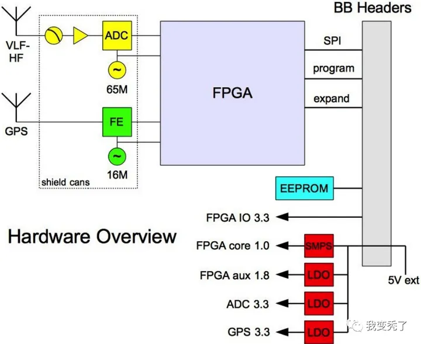

RX888 16BIT ADC SDR Receiver。

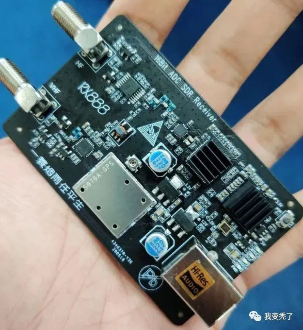

看照片应该是出自国人之手。但据说原始设计是基于BBRF103。

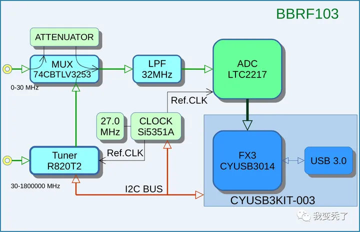

在BBRF103的设计中，使用LTC2217 105Msps 16-bit A/D来直采30MHz以下信号，30MHz以上信号仍旧采用电视棒的R820T来下变频至30MHz以下，以供ADC采集。

RED PITAYA主要用途是测量仪器，但由于它提供了高速ADC串流采样到主机的功能，也被很多人用来直采较低频率的射频信号构成SDR接收机。

此外，某些不知出于何种目的的单片机竟然自带了80M采样率的ADC，理论上可直接收听FM广播以及频段更低的所有广播和业余无线电信号（前提是信号或者天线够强。。。）。对，NXP LPC4370说的就是你！相关单片机直接听广播的方法请大家自行搜索“LPC4370 SDR receiver”。当然它也很适合直接作为软件无线电的中频或者基带数字部分，比如前面提到的AIRSPY。

# 传统业余无线电射频（uSDX）
射频和纯模拟解调是业余无线电传统艺能。当有了计算机，爱好者就开始在超外差接收机中采用低中频12KHz，然后连接到电脑声卡玩SDR。现在有了性能强劲的带有ADC的单片机，电脑也就不需要了，因为调制解调、音频全都可以在单片机内搞定。

为了产生低中频，可以采用传统模拟混频器，也可以采用所谓开关式混频器（类似D类功放？），也叫Quadrature Samplimg detector。它直接将射频信号通过一个高速开关（类似于窄带欠采样的概念）变至低中频。下图中的FST3253高速开关（QSD）就是用作下变频，然后低通滤波加放大后进入ADC。此即最近比较火的“uSDX: micro Software Defined Transceiver”

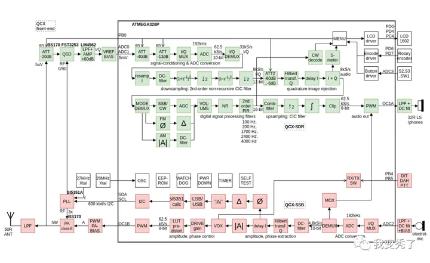

以上基本总结了现在能看到所有SDR方案。有没有被我漏掉的？欢迎留言补充！

<noscript>Please enable JavaScript to view the <a href="http://disqus.com/?ref_noscript">comments powered by Disqus.</a></noscript>

<!-- Global site tag (gtag.js) - Google Analytics -->

