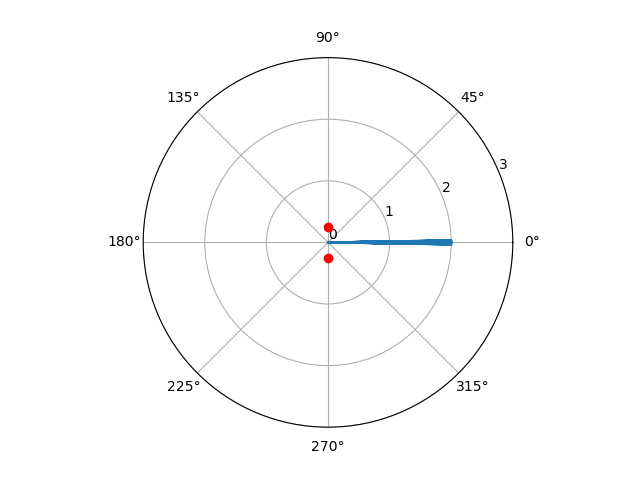
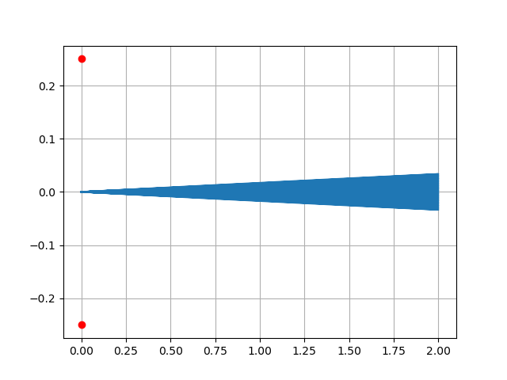
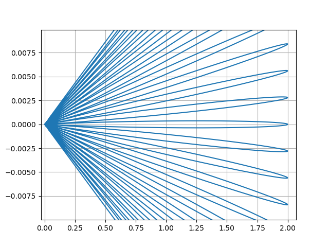
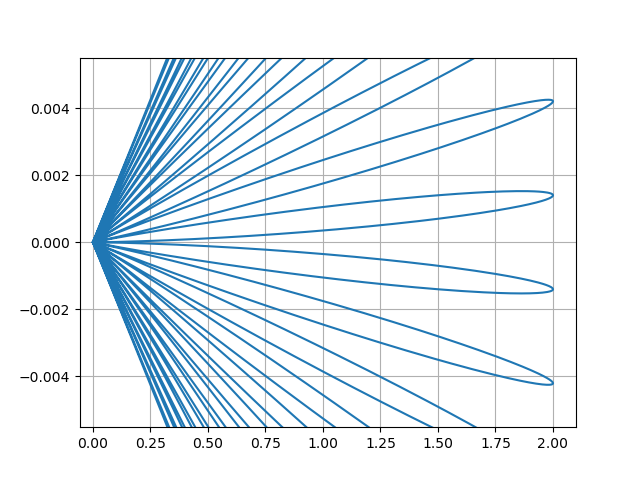

(Beamforming code download: [https://github.com/JiaoXianjun/sdrfun](https://github.com/JiaoXianjun/sdrfun))

The commonly used wavelength of red light in double-slit interference is approximately 620 to 750 nanometers, corresponding to a frequency range of 484 to 400 THz. Here, we take a wavelength of 700 nanometers, which corresponds to a frequency of 428.6 THz. In double-slit interference experiments, it is generally required that the distance between the two slits be less than 1mm. Here, we take 0.5mm, which is about 714 times the wavelength. In this setup, the two slits correspond to the two antennas in our model. To set these parameters in our simulation code, the command is as follows:

```
python3 -c "from beamforminglib import *; ant_array_beam_pattern(freq_hz=428.6e12, array_style='linear', num_ant=2, ant_spacing_wavelength=714, angle_vec_degree=np.arange(-1, 1, 0.0001))"
```

The parameter `np.arange(-1, 1, 0.0001)` at the end means that we are observing the beam within a range of -1 degree to +1 degree (which is near 0 degrees, where the light is shooting from left to right towards the double slits/antennas). Within the -1 to +1 degree range, the step size for observing angles is 0.0001 degrees. Running the above Python program yields the following result:



In the image above, the narrow blue region extending to the right represents the beam simulating light emerging from the two slits. The question is whether there are "interference pattern" within this beam. To facilitate zooming in and out using the mouse in a matplotlib plot, let's redraw the above image in a Cartesian coordinate system:

```
python3 -c "from beamforminglib import *; ant_array_beam_pattern(freq_hz=428.6e12, array_style='linear', num_ant=2, ant_spacing_wavelength=714, angle_vec_degree=np.arange(-1, 1, 0.0001), plot_in_polar=False)"
```



By further zooming in on the image above using the mouse, we obtain the following image:



As we can see, a large number of narrow beams are observed. These very narrow "light beams" hitting the screen showing the interference pattern! The farther the screen is, the larger the spacing between the bright lines. The light is strongest directly to the right (0-degree direction) because there is no path/phase difference from the two slits to this position. In some directions deviating from 0 degrees, strong light/beams appear again because the path/phase difference to the two slits in those directions is already large enough to be an integer multiple of the wavelength, causing the waves to reinforce each other again -- imagine sine waves with a periodic difference of integer multiples of 2π, which is the same as at 0 degree.

Since the strongest beam at 0 degrees is due to the absence of a phase difference, what would happen if we used a method (such as placing a special glass in front of one of the slits) to introduce a phase/delay of half a wavelength more for the light coming out of one slit compared to the other? Would the waves cancel each other out at 0 degrees? To verify this idea, it's just a matter of issuing a single command:

```
python3 -c "from beamforminglib import *; ant_array_beam_pattern(freq_hz=428.6e12, array_style='linear', num_ant=2, ant_spacing_wavelength=714, angle_vec_degree=np.arange(-1, 1, 0.0001), plot_in_polar=False, beamforming_vec_rad=np.array([0, np.pi]))"
```

The last parameter in the above command introduces delays/phases of 0 and π for the light coming from the two slits. Since 2π represents a full period/wavelength, π is half a period/wavelength. The distribution of the beam with this phase difference is shown in the image below (a manually zoomed-in section of the plot from the above command using the mouse):



This time, there is no beam/bright-line at the 0-degree direction (directly to the right). The beam/bright-line have shifted to angles on both sides of 0 degrees. If there is a screen to the right, one would observe that the beam/bright-line have shifted.

(To be continued ...)

<div id="disqus_thread"></div>
<script type="text/javascript">
    /* * * CONFIGURATION VARIABLES: EDIT BEFORE PASTING INTO YOUR WEBPAGE * * */
    var disqus_shortname = 'jiaoxianjun'; // required: replace example with your forum shortname

    /* * * DON'T EDIT BELOW THIS LINE * * */
    (function() {
        var dsq = document.createElement('script'); dsq.type = 'text/javascript'; dsq.async = true;
        dsq.src = '//' + disqus_shortname + '.disqus.com/embed.js';
        (document.getElementsByTagName('head')[0] || document.getElementsByTagName('body')[0]).appendChild(dsq);
    })();
</script>
<noscript>Please enable JavaScript to view the <a href="http://disqus.com/?ref_noscript">comments powered by Disqus.</a></noscript>


<!-- Global site tag (gtag.js) - Google Analytics -->
<script async src="https://www.googletagmanager.com/gtag/js?id=G-01GGQ8JZW7"></script>
<script>
  window.dataLayer = window.dataLayer || [];
  function gtag(){dataLayer.push(arguments);}
  gtag('js', new Date());

  gtag('config', 'G-01GGQ8JZW7');
</script>

<script async src="https://pagead2.googlesyndication.com/pagead/js/adsbygoogle.js?client=ca-pub-1542618827905251"
     crossorigin="anonymous"></script>
