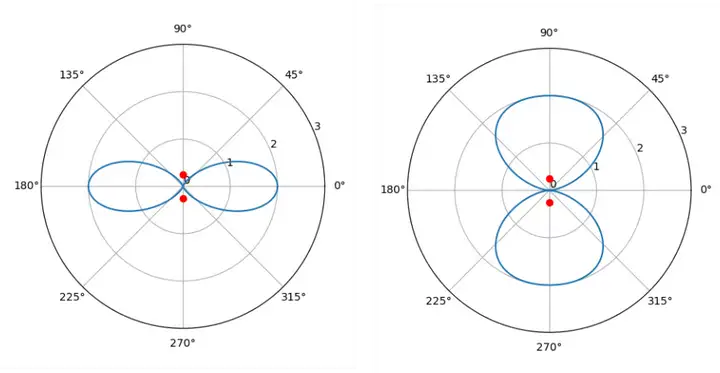
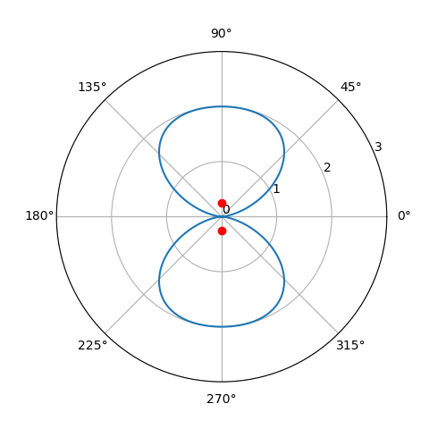

(Beamforming code download: [https://github.com/JiaoXianjun/sdrfun](https://github.com/JiaoXianjun/sdrfun))

Since the double-slit interference pattern can be moved by altering the light delay in one of the slits, you must have realized that if we can control the delay/phase of the radio signal before it leaves the antenna, we might be able to direct the beam where we want it. Indeed, this is the basic principle of beamforming. By applying delay/phase to the signal per antenna, we can shape the beam as desired. Next, let’s start from a simple case: applying phases of 0 and π to the the two rod antennas in the previous article. Run the following command:

```
python3 -c "from beamforminglib import *; ant_array_beam_pattern(freq_hz=2450e6, array_style='linear', num_ant=2, ant_spacing_wavelength=0.5, beamforming_vec_rad=np.array([0, np.pi]))"
```



The figure on the right is obtained by the above command, with the left showing the original beam.

Similar to the double-slit interference case, in this case, there is no signal at 0 degrees (to the right).

Since the beam can be directed towards 0 and 90 degrees by applying phases (0 and π) to the two antennas, wouldn't it be possible to do beam scanning by using some intermediate phase values? The answer is YES. The following command demonstrates beam scanning by continuously changing the phase of the 2nd antenna from -π to π with step size π/8 while keeping the phase of the 1st antenna 0:

```
python3 test_linear2_bf_scan.py
```



If you open the `test_linear2_bf_scan.py`, you will find: it calls the same python function `ant_array_beam_pattern` continuously and gives a series of phase (-π to π with step size π/8) to the 2nd antenna via the 2nd element of the argument `beamforming_vec_rad`.

(To be continued ...)

<div id="disqus_thread"></div>
<script type="text/javascript">
    /* * * CONFIGURATION VARIABLES: EDIT BEFORE PASTING INTO YOUR WEBPAGE * * */
    var disqus_shortname = 'jiaoxianjun'; // required: replace example with your forum shortname

    /* * * DON'T EDIT BELOW THIS LINE * * */
    (function() {
        var dsq = document.createElement('script'); dsq.type = 'text/javascript'; dsq.async = true;
        dsq.src = '//' + disqus_shortname + '.disqus.com/embed.js';
        (document.getElementsByTagName('head')[0] || document.getElementsByTagName('body')[0]).appendChild(dsq);
    })();
</script>
<noscript>Please enable JavaScript to view the <a href="http://disqus.com/?ref_noscript">comments powered by Disqus.</a></noscript>


<!-- Global site tag (gtag.js) - Google Analytics -->
<script async src="https://www.googletagmanager.com/gtag/js?id=G-01GGQ8JZW7"></script>
<script>
  window.dataLayer = window.dataLayer || [];
  function gtag(){dataLayer.push(arguments);}
  gtag('js', new Date());

  gtag('config', 'G-01GGQ8JZW7');
</script>

<script async src="https://pagead2.googlesyndication.com/pagead/js/adsbygoogle.js?client=ca-pub-1542618827905251"
     crossorigin="anonymous"></script>
