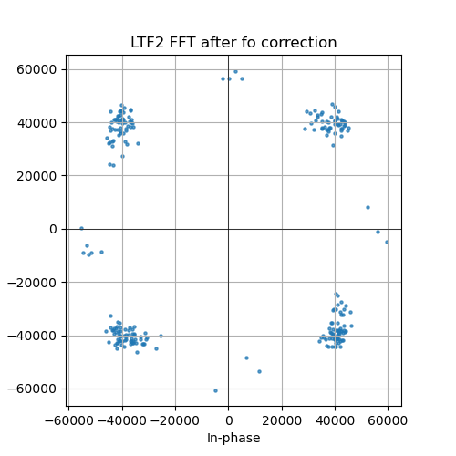
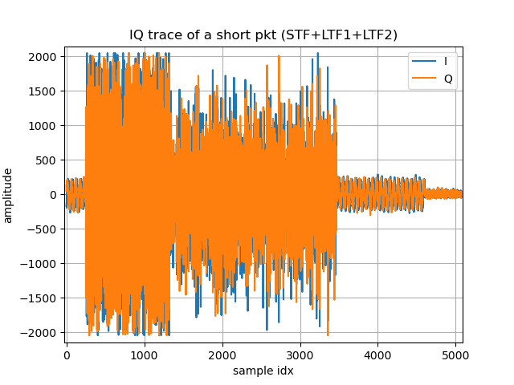
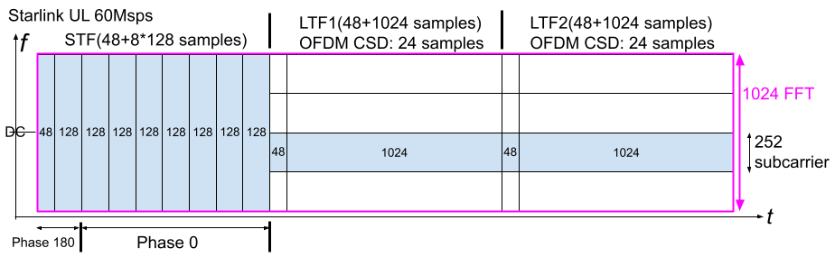
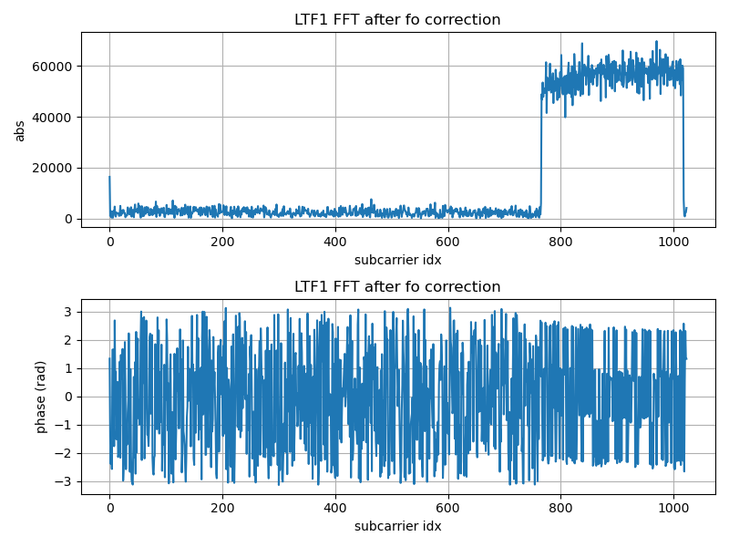
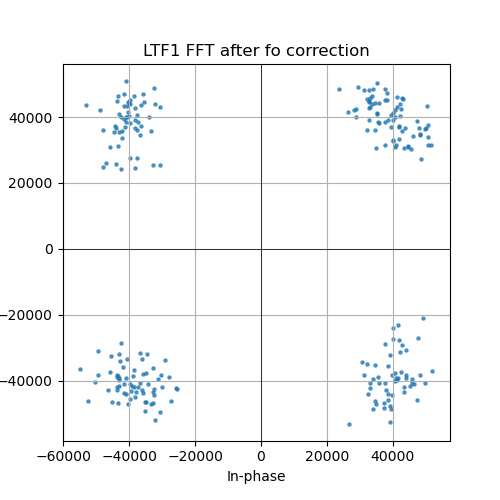
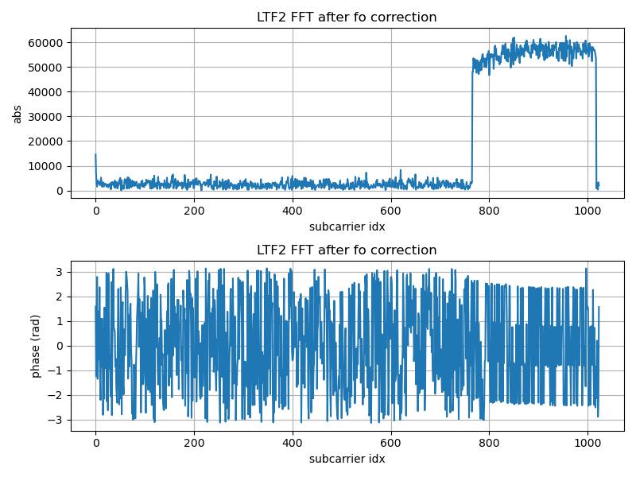

As described in this paper (https://arxiv.org/abs/2304.09535), a 14 GHz LNB can easily capture transmitted signals from Starlink terminals. Thanks to Starlink’s rapid expansion and widespread adoption across Europe, I was able to perform this experiment myself (Yes I have one).

The 60MHz uplink baseband sampling rate of Starlink is fully within the capabilities of the AD9361. Conveniently, I had several AD9361-based SDRs available (thanks to supporters). Although streaming a 60Msps signal in real time over a 1Gbps Ethernet link is not feasible, it is still possible to trigger a capture, store the packet inside the FPGA, and then transfer it out at a slower rate. This allowed me to obtain complete packets with the full 60 MHz bandwidth.

One frequently occurring ultra-short uplink packet is shown below.

The IQ capture:

The analysis result:

The Starlink uplink baseband sampling rate is 60 Msps.

The first 48 + 128 × 8 = 1072 samples (17.8667 μs) form the STF (Short Training Field). It consists of a 48-sample cyclic prefix (CP) followed by eight repetitions of a 128-sample sequence across the full bandwidth. The first 128-sample sequence has a 180° phase offset relative to the other seven sequences.

The next two 1072-sample sections are OFDM symbols corresponding to the LTF (Long Training Field). Each consists of a 48-sample CP and a 1024-sample symbol body (FFT length = 1024). Both use a scheme similar to the Cyclic Shift Diversity (CSD) employed in Wi-Fi, with a delay equal to half of the CP length, i.e., 24 samples.

Only 252 subcarriers are active in this sample of LTFs, occupying just one-quarter of the total bandwidth.

Another interesting observation is that the carrier frequency offset (CFO) continuously changes across the three signal segments (STF, LTF1, and LTF2). This may be caused by hardware warm-up drift, or it may be part of a Doppler pre-compensation mechanism.

This becomes particularly interesting when compared with Wi-Fi uplink OFDMA (client to access point), which was introduced since Wi-Fi6/802.11ax.

Starting from Wi-Fi 6, multiple users can transmit simultaneously to an access point through OFDMA, with different users occupying different resource units (RUs, subbands). However, due to legacy compatibility requirements, before the actual OFDMA uplink transmission begins, every user transmits several identical full-bandwidth legacy fields (L-STF, L-LTF, L-SIG, RL-SIG, etc.), wasting both time and energy. Only afterward do users transmit data within their assigned RU/subband.

Starlink has no such legacy burden. The terminal transmits only a single full-bandwidth STF. After that, time-frequency resources are already divided into subbands (one-quarter bandwidth in this example) and further separated using CSD. This allows the satellite to separate signals from different terminals at a much earlier stage and greatly reduces potential contention and collisions during initial uplink access. It is a very clean and efficient design.

The successful demodulation procedure was:

- Estimate the CP and FFT lengths (with the help of publicly available information, such as papers on the downlink signal).
- Perform the FFT from the expected offset to take a look.
- Estimate and compensate the carrier frequency offset (integer times of the subcarrier width).
- Estimate and compensate the carrier frequency offset (fractional times of the subcarrier width), which is interestingly different for STF, LTF1, and LTF2
- Plot the constellation.

Because my receiver was located very close to the terminal, the channel can be approximated as AWGN, making channel estimation and equalization unnecessary.

The FFT results and demodulated constellations for the two LTF symbols are shown below.

<noscript>Please enable JavaScript to view the <a href="http://disqus.com/?ref_noscript">comments powered by Disqus.</a></noscript>

<!-- Global site tag (gtag.js) - Google Analytics -->

