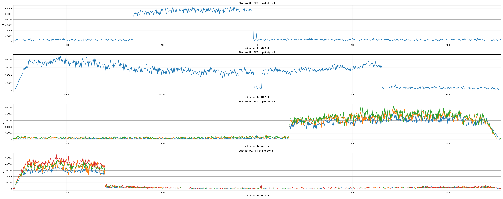
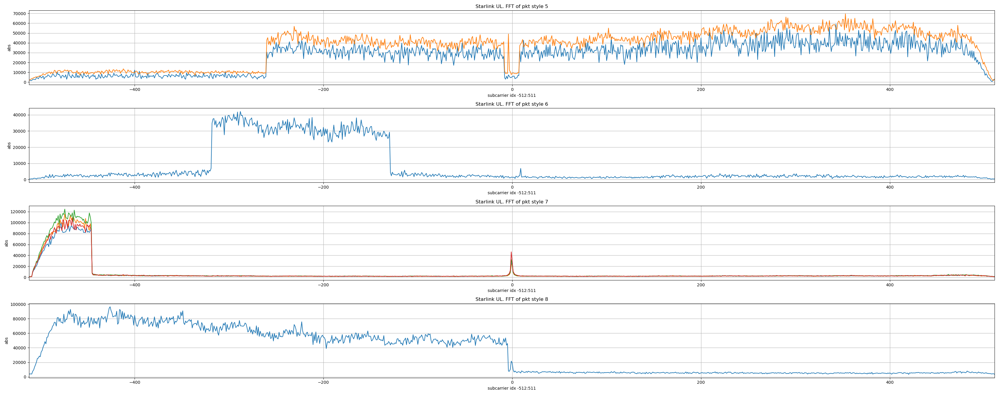

I collected more uplink signals from a Starlink Mini terminal and observed different RU (Resource Unit, borrowing the Wi-Fi OFDMA terminology) sizes used during transmission.

The observed numbers of active subcarriers per RU are:

* 63
* 189 (3 × 63)
* 252 (4 × 63)
* 441 (7 × 63)
* 504 (8 × 63)

All signals were captured from the first uplink channel, centered at 14 GHz + 31.25 MHz.

I identified eight packet types (shown in the figure), each corresponding to a particular OFDMA RU allocation pattern. One important observation is that all OFDM symbols within the same packet use the same RU allocation pattern.





I would like to invite others to help solve this Starlink uplink OFDMA puzzle.

Known facts and current hypotheses are as follows.

* The fractional carrier frequency offset (fractional subcarrier spacing offset) has already been estimated and corrected.
* The integer carrier frequency offset (integer multiples of the subcarrier spacing) still requires estimation and is currently uncertain.

This is because the exact Starlink RU-to-subcarrier mapping is unknown. Even if an RU is shifted by several subcarriers, we can still observe the constellation on those subcarriers.

In addition, the Starlink terminal performs frequency hopping across eight uplink channels, each 62.5 MHz wide. This is likely related to satellite and beam frequency planning. We also do not know whether the inherent frequency offset changes when the terminal hops back to the first channel, although the receive frequency of my AD9361 remains fixed throughout the experiment.

Because of this unknown integer frequency offset, there are two possible ways to align the frequency-domain results of the eight packet types:

1. Align the DC spikes.
2. Align the points where the spectrum edges fall to the noise floor.

Method 2 is used here because it is unclear whether the frequency offset remains constant each time the terminal returns to the first channel. This is also why the DC spikes appear at slightly different locations in the figure.

The measured RU edge subcarrier indices and DC spike indices for the eight packet types are listed below. The subcarrier index range is −512 to 511.

If only one pair of RU edge indices is present, the packet contains one RU. If two pairs are present, the packet contains two RUs.

```
pkt style 1
RU edge subcarrier indices: -260   -9
DC index: -2

pkt style 2
RU edge subcarrier indices: -508   -7    10   261
DC index: -1

pkt style 3
RU edge subcarrier indices: 67   507
DC index: -1

pkt style 4
RU edge subcarrier indices: -508   -320
DC index: 8

pkt style 5
RU edge subcarrier indices: -260   -9    8   507
DC index: -4

pkt style 6
RU edge subcarrier indices: -318   -130
DC index: 9

pkt style 7
RU edge subcarrier indices: -508   -446
DC index: -1

pkt style 8
RU edge subcarrier indices: -508   -5
DC index: -1
```

Who is ready to take on the challenge?

<div id="disqus_thread"></div>
<script type="text/javascript">
    /* * * CONFIGURATION VARIABLES: EDIT BEFORE PASTING INTO YOUR WEBPAGE * * */
    var disqus_shortname = 'jiaoxianjun'; // required: replace example with your forum shortname

    /* * * DON'T EDIT BELOW THIS LINE * * */
    (function() {
        var dsq = document.createElement('script'); dsq.type = 'text/javascript'; dsq.async = true;
        dsq.src = '//' + disqus_shortname + '.disqus.com/embed.js';
        (document.getElementsByTagName('head')[0] || document.getElementsByTagName('body')[0]).appendChild(dsq);
    })();
</script>
<noscript>Please enable JavaScript to view the <a href="http://disqus.com/?ref_noscript">comments powered by Disqus.</a></noscript>


<!-- Global site tag (gtag.js) - Google Analytics -->
<script async src="https://www.googletagmanager.com/gtag/js?id=G-01GGQ8JZW7"></script>
<script>
  window.dataLayer = window.dataLayer || [];
  function gtag(){dataLayer.push(arguments);}
  gtag('js', new Date());

  gtag('config', 'G-01GGQ8JZW7');
</script>

<script async src="https://pagead2.googlesyndication.com/pagead/js/adsbygoogle.js?client=ca-pub-1542618827905251"
     crossorigin="anonymous"></script>
