This post reveals several unusual modulation structures that appear repeatedly in Starlink uplink signals. I also found several hard-decision bit sequences that reoccur across different packets.

(Unless otherwise stated, all analysis in this post is performed on the first OFDM symbol following the STF within each packet.)

First, I would like to correct a previous conclusion: In “Starlink uplink signal analysis (3): demodulation is successful”, I thought that the two OFDM symbols following the full-bandwidth STF were likely training sequences similar to the LTF in Wi-Fi. After analyzing many more packets, I now believe this is probably incorrect. 
The OFDM symbols following the STF frequently appear to contain actual data (or signaling information) rather than fully known pilot patterns like a Wi-Fi LTF. The packet structure is therefore updated as shown below.

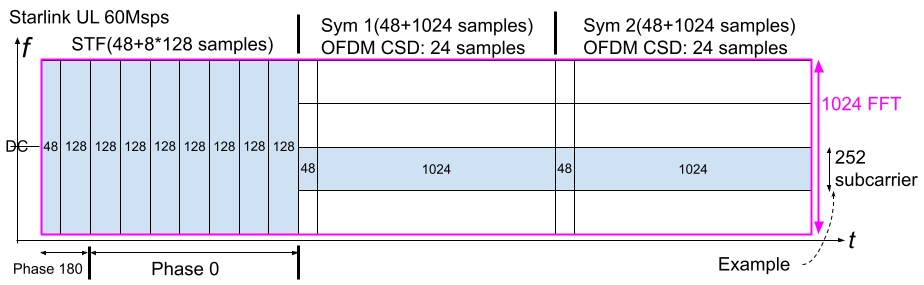

The packet previously classified as Style 1 (the structure shown above) contains a single 252-subcarrier RU (-260 to -9, 14.766 MHz).

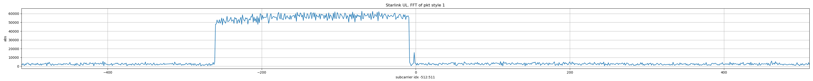

The demodulated constellation of its first OFDM symbol is shown below.

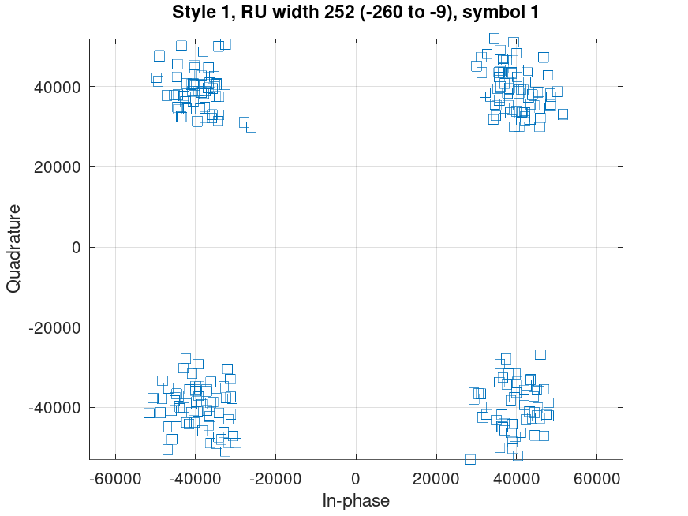

After hard decision, the real and imaginary bits are obtained as follows:
- Mapping: 1 to 0, -1 to 1
- Includes the usual 90° phase ambiguity

style1_sub1_ru1_sym1 real part

1  0  1  1  0  0  1  1  0  1  0  1  1  1  1  0  1  1  0  1  0  1  0  1  0  1  1  0  1  0  1  0  1  0  0  0  0  0  1  1  0  0  1  0  1  1  1  0  1  0  0  0  1  0  1  1  1  0  1  1  0  1  1  0  0  10  0  0  1  0  1  1  1  1  0  0  1  1  0  1  1  1  0  0  0  1  0  1  1  1  1  1  0  1  0  1  1  0  0  1  1  0  1  1  0  1  1  0  0  1  0  1  1  0  1  0  0  1  1  0  0  0  0  0  0  0  0  1  0  0  10  1  1  0  0  1  0  1  0  0  1  0  0  0  0  0  1  0  1  1  0  1  0  0  0  0  0  0  0  1  0  0  0  1  1  1  1  1  0  1  0  0  0  0  0  0  0  1  0  0  0  1  1  0  1  1  0  0  0  1  1  1  1  0  0  11  0  0  0  0  0  1  0  1  0  1  1  0  1  0  1  0  1  0  1  1  0  1  1  0  1  1  0  0  0  0  0  1  1  0  0  1  1  1  1  1  0  1  0  0  0  1  0  1  1  1  1  0  1

style1_sub1_ru1_sym1 imag part

0  1  1  1  0  0  1  0  0  0  0  1  1  1  0  0  0  1  0  1  0  0  1  0  1  1  1  0  0  1  0  1  1  0  0  1  0  0  1  0  0  0  0  0  1  1  0  0  1  1  1  0  1  1  0  1  0  1  1  1  1  0  1  1  0  00  1  0  0  1  1  0  1  0  0  1  0  0  1  0  0  0  1  0  1  0  1  0  0  0  1  1  0  1  0  1  1  1  1  1  1  0  1  1  1  1  1  0  0  1  0  0  1  1  1  0  0  1  0  1  0  0  0  0  0  1  1  0  1  0  10  0  1  1  0  1  0  1  1  0  1  0  1  0  0  1  0  1  0  1  0  1  1  1  0  0  1  1  0  0  0  0  0  0  1  1  0  1  1  1  1  0  1  1  1  0  0  0  1  0  1  0  0  1  0  0  1  0  0  0  1  0  1  1  1  11  0  0  0  0  1  1  1  0  1  0  0  0  0  0  1  0  1  0  0  0  1  1  1  0  1  0  1  1  0  0  0  1  0  0  0  0  1  1  1  0  0  1  1  0  0  1  1  0  1  0  0  0  1

In the first RU of a Style 5 packet (also a 252-subcarrier RU, 14.766 MHz), I obtained exactly the same bit sequence. (A Style 5 packet also contains a second, wider RU (8 to 507, 29.53 MHz). )

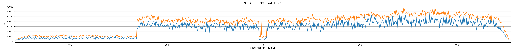

The figure below shows the sliding correlation result between the hard-decision sequences of the 252-subcarrier RU in the Style 5 packet and the corresponding RU in the Style 1 packet.

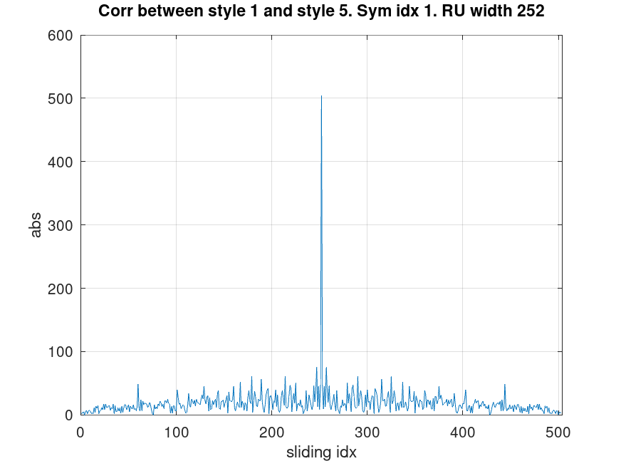

The correlation peak is exactly: 2 × 252 = 504 indicating that the two hard-decision complex sequences are identical.

The second OFDM symbol of the Style 1 packet contains an unusual modulation structure: Most of the 252 subcarriers use QPSK. However, the following subcarrier groups: 17 to 24 and 229 to 236 for a total of: 2 × 8 = 16 subcarriers (or 2 × 0.469 MHz) use a QPSK constellation rotated by 45° (π/4).

The constellation diagrams of these two modulation types are shown in the figures below.

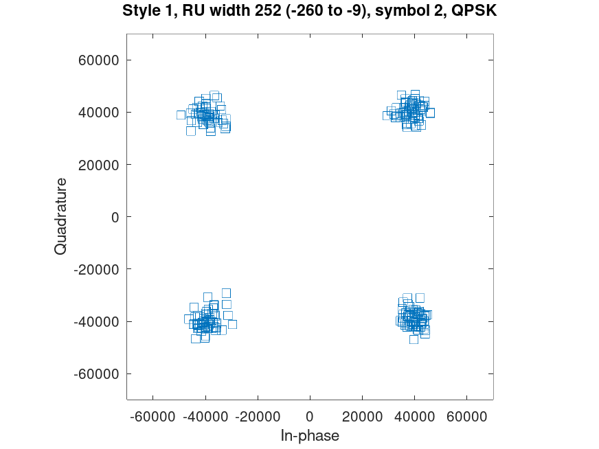

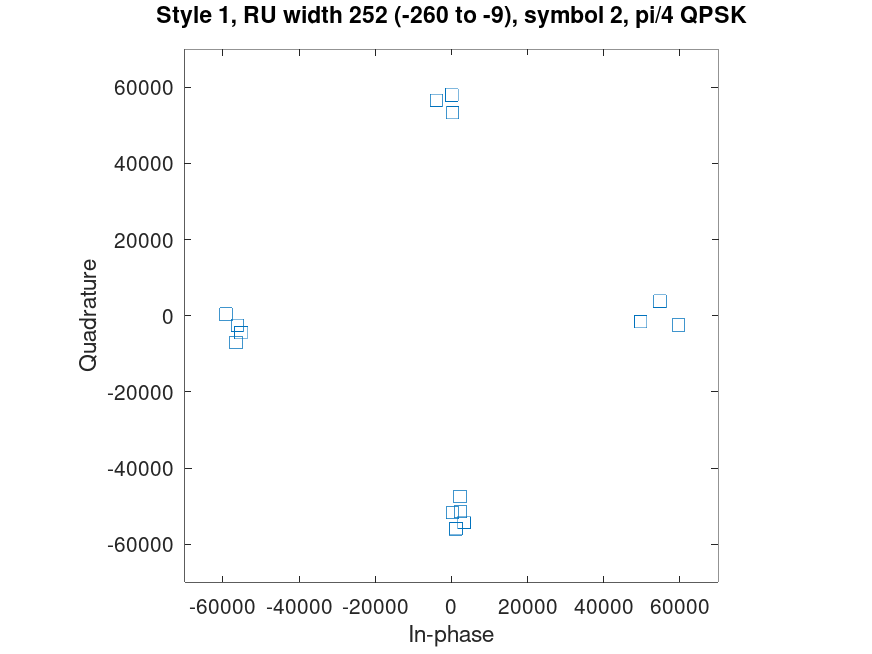

This modulation structure also appears in Style 3 packets. In fact, Style 3 packets contain an even more complicated modulation pattern.

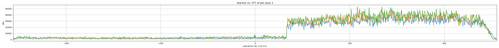

Within the 504-subcarrier RU of the style 3 packet: The first 126 subcarriers (7.38 MHz) have the same modulation structure as the first 126 subcarriers of the Style 1 packet.
- Subcarriers 17 to 24 use π/4-QPSK.
- The remaining subcarriers use standard QPSK.

More interestingly, the further: 504 − 126 = 378 subcarriers (22.15 MHz) appear to use 16-QAM rotated by a fixed angle.

The three modulation types present in this 504-subcarrier RU of the style 3 packet are illustrated in the three constellation plots below.

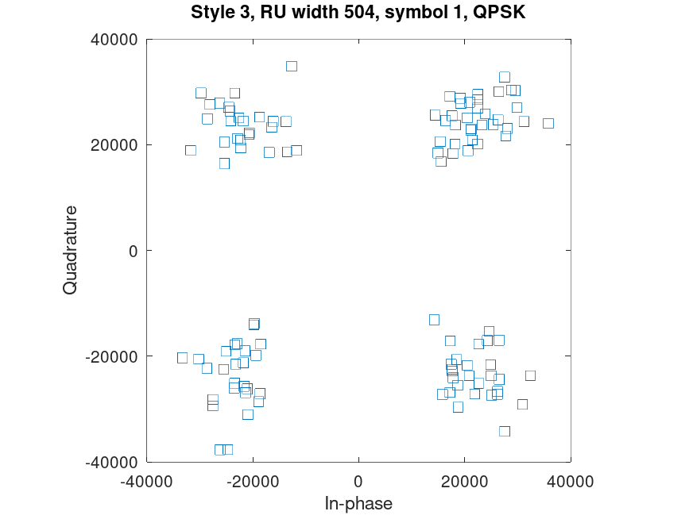

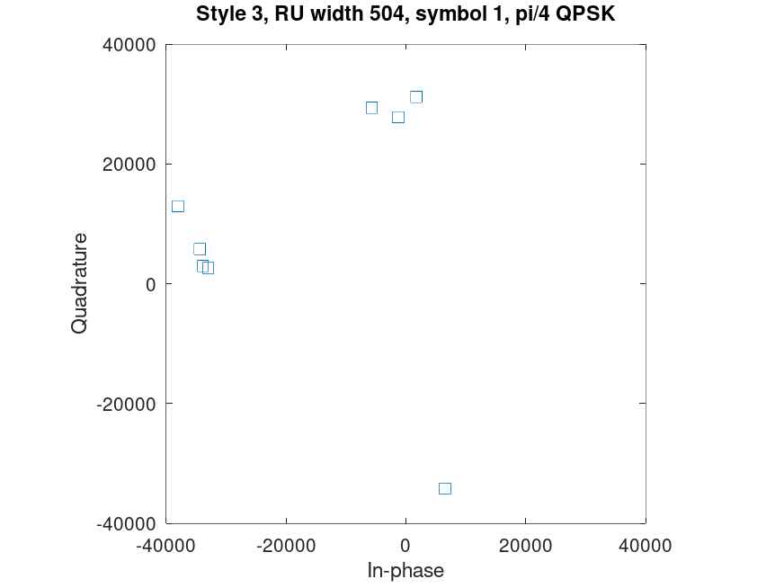

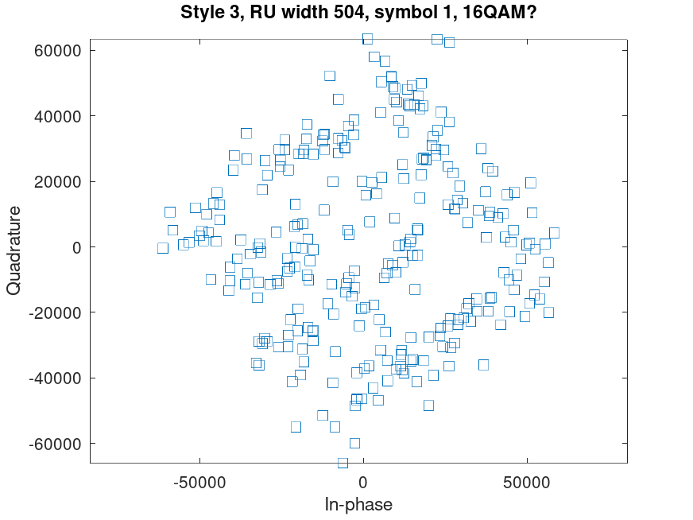

Although similar modulation structures are observed in both Style 1 and Style 3 packets, the hard-decision QAM symbol sequences from the corresponding subcarriers show no significant correlation peaks. This suggests that the transmitted bit contents are different.

An especially interesting result was found for the narrowband Style 7 packets. These packets contain a 63-subcarrier RU (3.69 MHz) located near the lower edge of the channel.

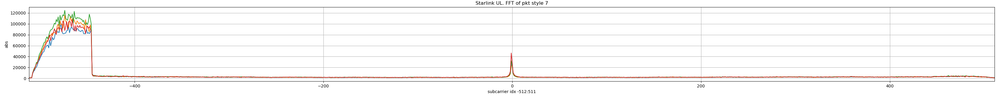

After examining four such packets, I found that the hard-decision QPSK contents of their first OFDM symbols were completely identical.

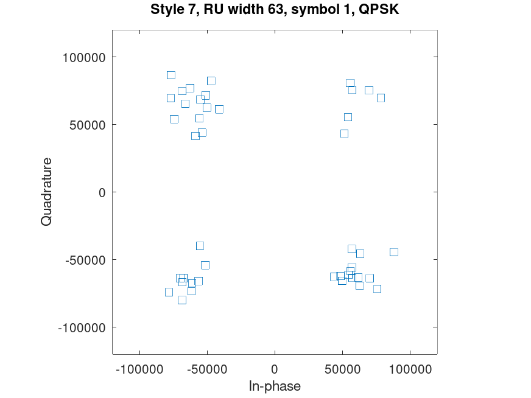

The figure below shows the sliding correlation results among the hard-decision complex sequences from four Style 7 packets. The correlation peak is exactly: 2 × 63 = 126 indicating perfect alignment.

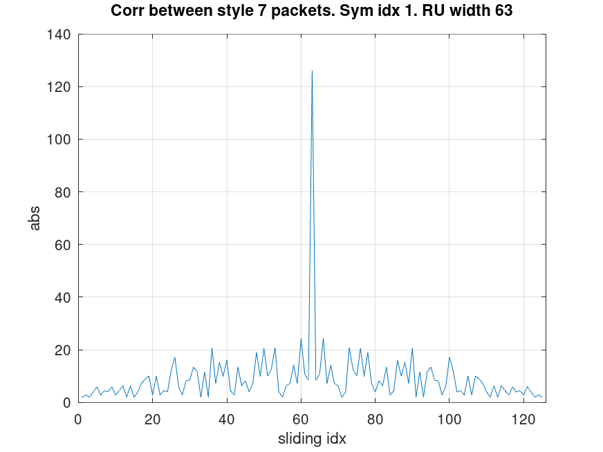

After hard decision, the real and imaginary bits are obtained as follows:
- Mapping: 1 to 0, -1 to 1
- Includes the usual 90° phase ambiguity

style7_sub1_ru1_sym1 real part

1  1  1  1  1  1  0  1  1  1  1  0  0  0  1  0  1  0  0  0  1  1  0  1  0  0  0  1  1  1  0  0  1  0  1  0  1  1  0  1  1  1  1  0  0  1  0  1  1  0  0  1  0  0  1  0  1  1  1  1  0  0  1

style7_sub1_ru1_sym1 imag part

0  0  1  0  0  0  1  0  0  1  1  1  1  1  0  1  1  0  1  1  0  0  1  1  1  0  1  0  0  0  0  1  1  1  0  1  0  1  0  1  1  0  0  1  0  1  0  1  0  1  1  1  1  1  0  0  0  0  1  0  1  1  1

<noscript>Please enable JavaScript to view the <a href="http://disqus.com/?ref_noscript">comments powered by Disqus.</a></noscript>

<!-- Global site tag (gtag.js) - Google Analytics -->

