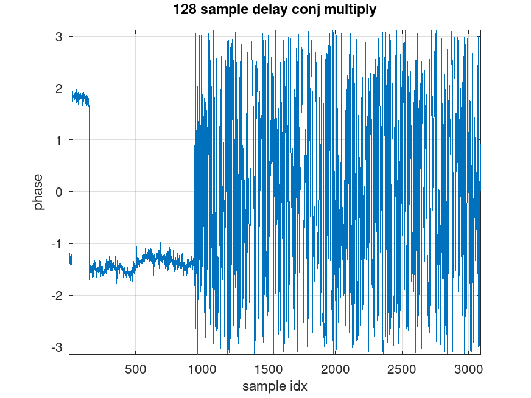
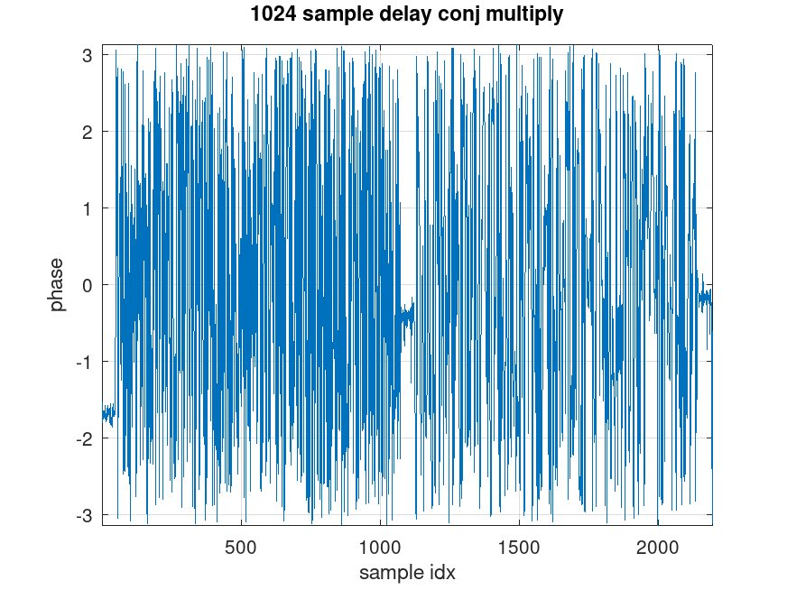
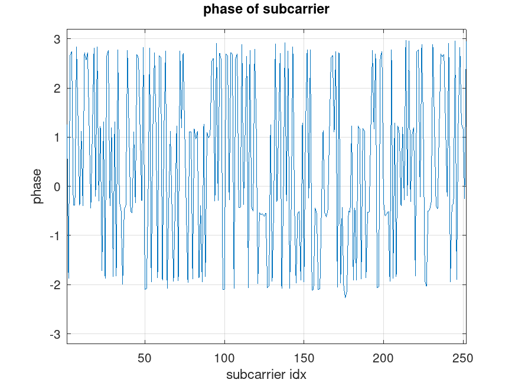
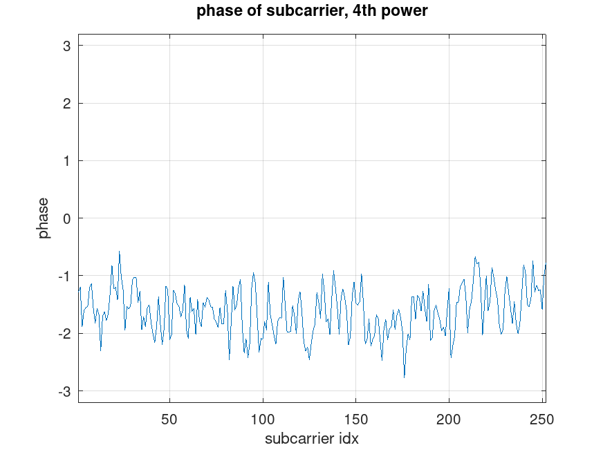
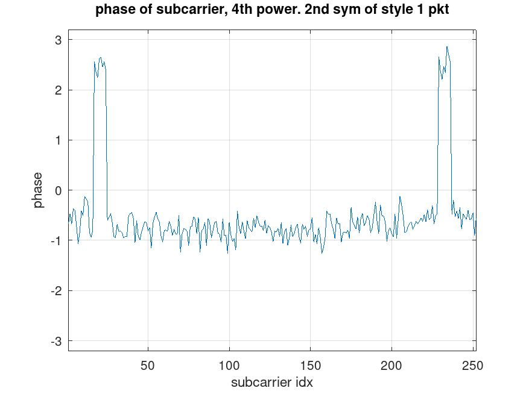
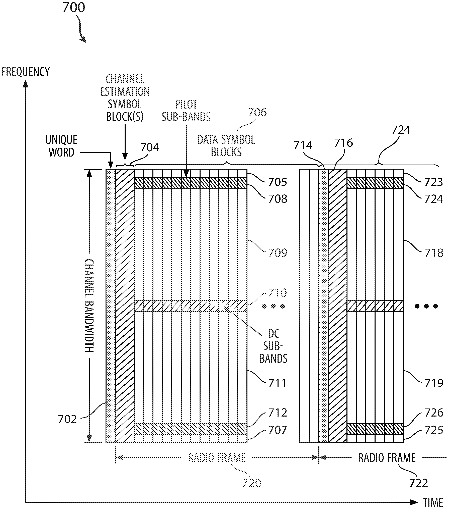

This post introduces two useful signal analysis techniques:
- To analyze time-domain structure, use delayed conjugate multiplication and observe the resulting phase.
- To distinguish between ordinary QPSK and π/4-QPSK, use the fourth-power method.

Example 1: Verifying the Time-Domain Structure

Based on patents and papers, I hypothesized that:
- The uplink baseband sampling rate is 60 MHz.
- The STF consists of eight repetitions of a 128-sample sequence plus a 48-sample CP.
- Each OFDM symbol consists of a 1024-sample symbol body plus a 48-sample CP.

Alternatively, the OFDM symbol can be viewed as having a 24-sample cyclic prefix and a 24-sample cyclic postfix, as described in patent US12003350.

To verify this, delayed conjugate multiplication can be applied to the IQ samples:
- Use a 128-sample delay to detect the eight repeated STF sequences.
- Use a 1024-sample delay to detect the CP and OFDM symbol structure.

Since the signal is multiplied by a delayed version of itself, this method is insensitive to carrier frequency offset.

128-Sample Delayed Conjugate Multiplication (Unless otherwise stated, Style 1 packets are used as examples.)

The result clearly shows the eight repetitions of the 128-sample sequence. It can also be seen that the first sequence has a 180° phase difference relative to the other seven repetitions.

1024-Sample Delayed Conjugate Multiplication

The result confirms that the assumed CP length and OFDM symbol length are correct. The CP region produces a constant phase difference in the delayed conjugate multiplication result.

This property can be used to:
- Locate OFDM symbol boundaries.
- Estimate the fractional carrier frequency offset.

Identifying QPSK Using the Fourth-Power Method

After obtaining the frequency-domain subcarrier symbols, plot their phases. As an example, consider the first OFDM symbol of a Style 1 packet.

The constellation appears to contain only four possible phases, suggesting QPSK modulation. To verify this, plot the phase of the symbols after raising them to the fourth power.

The points collapse near to a single line, it confirms that the original modulation contains only four phase states.

If that line has a non-zero slope, it can also be used to estimate and compensate sampling phase errors, either:
- in the time domain, or
- on a per-subcarrier basis in the frequency domain.

Detecting π/4-QPSK

An interesting result appears when the fourth-power phase is plotted for the second OFDM symbol of a Style 1 packet.

Two groups of subcarriers converge to a phase that differs by 180° from that of most other subcarriers. This indicates that these subcarriers are rotated by 45° (π/4) relative to the others, because:

45° × 4 = 180°

The corresponding constellation diagrams were shown in the previous post.

Connection to Starlink Pilot Sub-Bands

A reasonable hypothesis is that these special subcarrier regions correspond to pilot subcarriers embedded within the data symbols. This is consistent with the PILOT SUB-BANDS shown in the well-known Starlink patent US12003350B1.

The parameter examples described in the patent match the observations reported in the previous post remarkably well:

"For example, the offset can be a 16 tone (another name for subcarrier) pilot sub-band offset from the band edge. "

"a burst 1622 can include N subcarriers 1622 including a first 16 tone (subcarrier) pilot sub-band offset from a band edge 1624 at a low end of the frequency 
spectrum and a second 16 tone pilot sub-band offset from another band edge 1636 at a high end of the frequency spectrum."

<noscript>Please enable JavaScript to view the <a href="http://disqus.com/?ref_noscript">comments powered by Disqus.</a></noscript>

<!-- Global site tag (gtag.js) - Google Analytics -->

