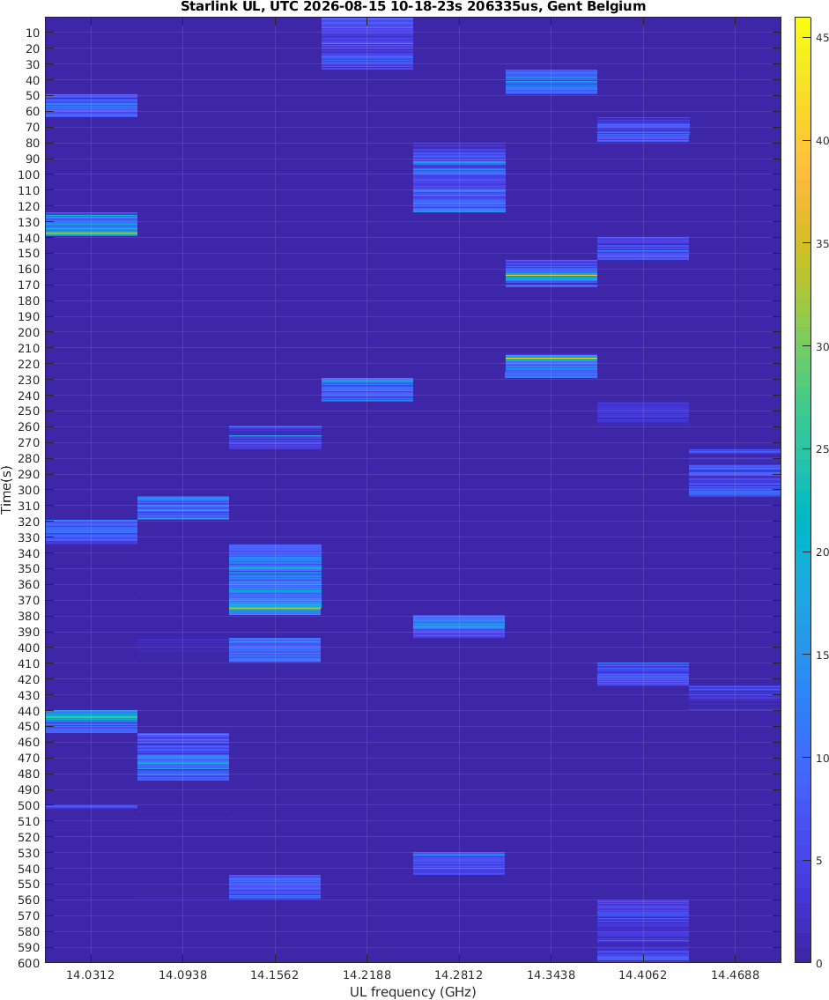

The Starlink system has eight Ku-band downlink channels, each with 250 MHz bandwidth, covering 10.7–12.7 GHz. 
It also has eight Ku-band uplink channels, each with 62.5 MHz bandwidth, covering 14.0–14.5 GHz.

These channels may be dynamically assigned among different satellites, among different beams on the same satellite, and even among multiple terminals within the same beam.

How exactly are these channels dynamically allocated? Is there some pre-planned frequency allocation between satellites and beams, or are the channels dynamically assigned in real time according to channel conditions and traffic load?

To answer these questions, we need to combine satellite ephemeris data, beam ground-track information, and real-time monitoring of the uplink and downlink channels used by the terminal.

My previous series of reverse-engineering experiments, combined with Starlink's basic OFDM patents, have largely revealed the physical-layer parameters, including the signal format, modulation/demodulation, and subcarrier allocation, etc..

In my previous article, `Starlink Terminal Codename “Panda”: Capture IQ Signals? The Complete Satellite Access Procedure Begins to Emerge!`, I tried to obtain real-time channel information through the Starlink terminal's gRPC interface, 
but this approach does not seem very practical. It may have to be combined with reverse engineering of the terminal firmware, and there have already been some such attempts online by others.

However, I do not like doing destructive reverse engineering of the terminal. I prefer purely external, non-invasive measurements.

I only have a few rtl-sdr dongles and some AD9361-based SDRs. The AD9361 supports a maximum sampling rate of 61.44 MHz and a maximum analog bandwidth of 56 MHz. This is clearly insufficient for covering the full 500 MHz Starlink uplink 
spectrum or the 2 GHz downlink spectrum.

At first glance, an RFSoC with several-GHz sampling capability would be the ideal solution. It could easily capture the full-band signals of all eight Starlink channels simultaneously.

But I do not have an RFSoC.

Does this mean the research has reached a dead end?

When one path seems to lead nowhere, another suddenly opens up.

At first glance, an RFSoC seems almost perfectly suited for full-bandwidth Starlink measurements. However, its enormous capability also creates practical problems.

Such measurements need to cover the entire period during which multiple satellites pass overhead, preferably at least 10 minutes. The enormous sampling rate of an RFSoC generates a huge amount of raw IQ data. 
Storing this data losslessly, transferring it to a computer in real time or afterward, and processing the resulting huge files would place extremely high demands on the computer's I/O, CPU and memory.

So let's rethink the actual problem.

Our goal is to study the real-time operating channels. We are not interested in the detailed IQ content of the signals here (I have captured and analyzed the signal before). 
We only need to know whether a signal is present and how long it remains on a given channel.

From this perspective, we do not need extremely high sampling rates and wide bandwidth.

And we should not forget that the AD9361 itself is a remarkably flexible chip with many hidden/unusual functionalities. Its capabilities can be explored extensively through software, the large amount of information in its documentation, and its register 
map document.

My final solution

I configured the AD9361 to perform 10,000 frequency hops per second to scan the eight Starlink uplink channels.

In other words, the receiver changes its center frequency every 100 μs. It therefore takes only 800 μs to scan all eight channels once.

Of course, this is done after downconverting the Starlink uplink signals using a 14 GHz LNB (see my 1st Starlink series post).

This allows me to monitor the uplink frequency of my Starlink Mini continuously for a long period while generating only a very small amount of data. Even my old AMD computer can process it easily.

If anyone has accurate satellite ephemeris data and beam information, the following measurements (see the end) can be combined with that information to further investigate Starlink's frequency/channel allocation strategy:
- frequency allocation between satellites;
- frequency allocation between beams on the same satellite;
- channel switching within a single beam (if any);
- and potentially the relationship between channel allocation and satellite/beam scheduling.

The measurement data
- Measurement start time: UTC 2026-08-15 10:18:23.206335
- Measurement location: Southern Ghent, Belgium

The end

<noscript>Please enable JavaScript to view the <a href="http://disqus.com/?ref_noscript">comments powered by Disqus.</a></noscript>

<!-- Global site tag (gtag.js) - Google Analytics -->

