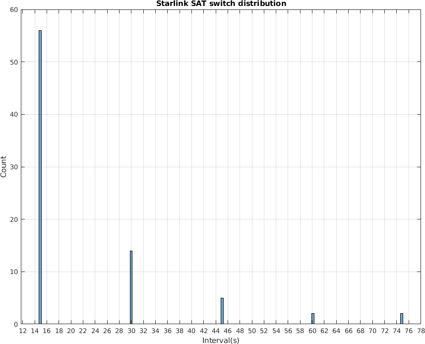
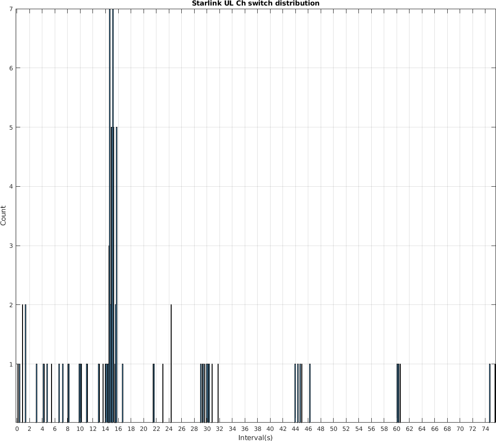
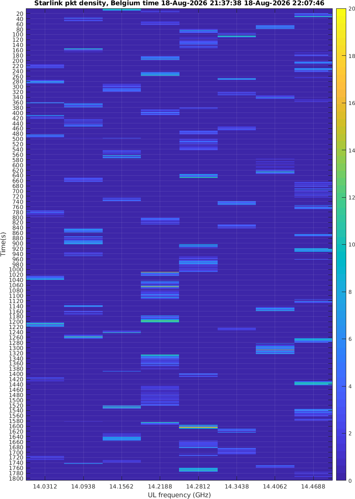
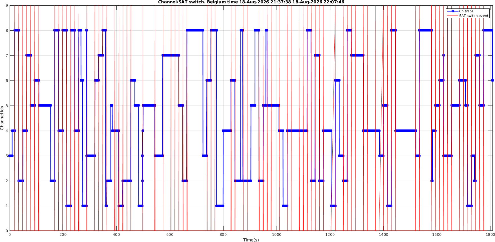
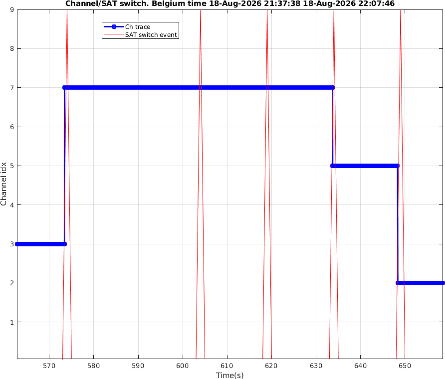
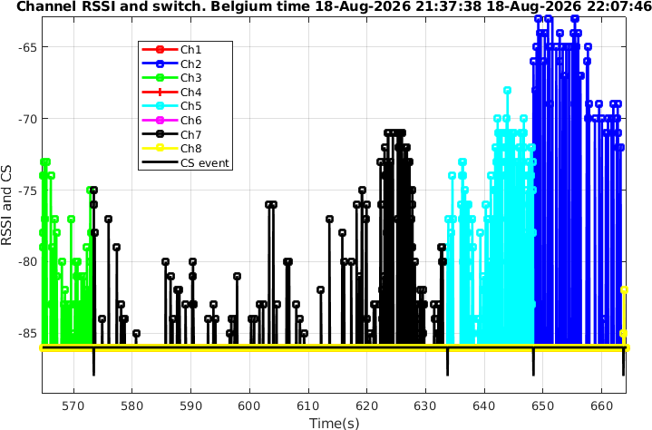
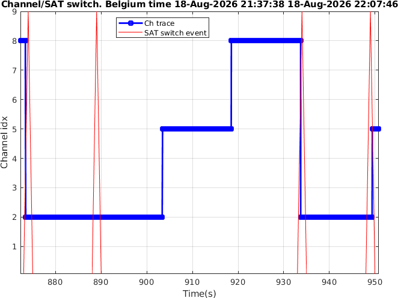
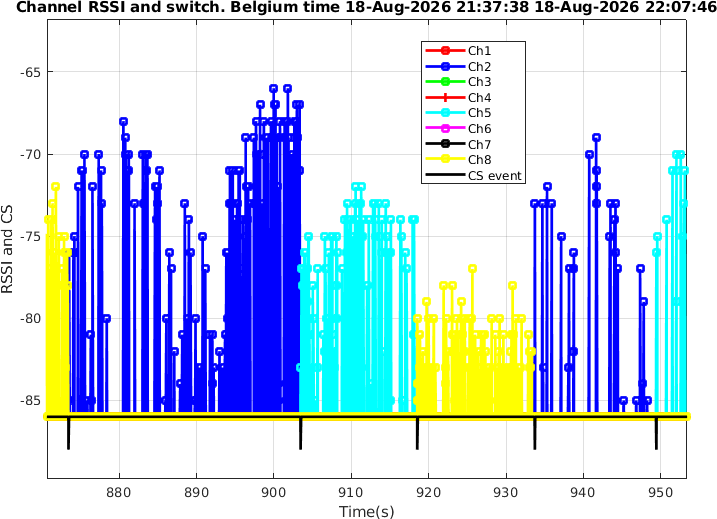

Using the 10,000-hops-per-second AD9361 setup developed in my previous article, I further investigated the relationship between Starlink terminal uplink channel switching and 
satellite switching.

The main findings

Satellite switching and channel switching are synchronized in most cases. The terminal usually switches both every 15 seconds. 15s! I have to say: "ONLY STARLINK CAN DO!" with such a high satellite density. But it does happen:
- Sometimes the satellite switches but the channel does not.
- Sometimes the channel switches but the satellite does not.

Measurement method

The satellite to which the terminal is connected, and when it switches satellites, can be estimated using the open-source GitHub project LEOViz.

Note that LEOViz does not directly get the connected satellite from Starlink system signaling or official terminal state informaion. It estimates it using information obtained through gRPC together with satellite 
ephemeris data, so the result is not guaranteed to be absolutely true (But I believe it is almost true).

The authors of LEOViz mentioned in their paper that the Starlink network updates its configuration every 15 seconds. My independent RF channel measurements also confirm this 
observation, as shown by the detailed data below.

Of course, the reliability of my RF measurement method has not yet been fully validated. I already have some ideas for further verification and improvement. 
My current estimate is that its reliability is probably above 93.6%. :)

I used chronyc to synchronize both the RF channel measurement system and LEOViz to NTP server on internet. I then continuously measured the terminal for 30 minutes and 
compared the RF measurements with the LEOViz results.

The LEOViz records use UTC, while my RF measurement records use local time (currently UTC+2).

Satellite switching statistics

According to the log of LEOViz, during the 30-minute observation period:
- Maximum satellite switching interval: 75 s
- Minimum: 15 s
- Mean: 22 s
- Median: 15 s

The distribution clearly shows that most switching intervals are 15 seconds, with a small number occurring at integer multiples of 15 seconds.



RF channel switching statistics

According to my AD9361 fast hopping based RF measurements:
- Maximum channel switching interval: 75.6127 s
- Minimum: 0.168215 s
- Mean: 19.1157 s
- Median: 15.0495 s

The distribution also shows a clear pattern around 15 seconds and its integer multiples.



However, there are indeed some switching intervals shorter than 15 seconds. This means that the channel can switch without the satellite switching.

The timing jitter visible in the measurements may be caused by measurement errors, or it may be real behavior. Further verification is needed.

The following figure shows the RF channel-switching waterfall plot.



The satellite connection data estimated by LEOViz is stored in a CSV file:
```
2026-08-18 19:37:55+00:00,STARLINK-34039,975.1731036954168
2026-08-18 19:37:56+00:00,STARLINK-34039,973.8658621168312
2026-08-18 19:37:57+00:00,STARLINK-35776,532.9811019171716
2026-08-18 19:37:58+00:00,STARLINK-35776,529.7964872658133
```
Each line contains: UTC time, Satellite ID, Satellite distance

Plotting the LEOVis log and the measured RF channel switching in the same UTC time basis on the same figure:



Red vertical lines indicate satellite switching events along with time (X axis). Blue traces show the uplink channel (Y axis) switching over time (X axis).

Many red lines are separated by exactly 15 seconds, and many blue channel transitions occur at the same times as the red lines. In other words, even from pure RF channel 
measurements, we can still observe the same fundamental 15-second periodicity.

Satellite switches without channel switching

At around 575 s, the satellite switches and the channel changes from 3 to 7. Then: 30 s later: the satellite switches, but the channel remains unchanged. 45 s later: 
the satellite switches again, but the channel still remains unchanged. 60 s later: the satellite switches for the third time, and the channel changes from 7 to 5.



The original RF RSSI measurements also confirm this behavior.



In the figure, the black vertical lines below −85 dBm indicate satellite-switching events. The region above −85 dBm shows the measured RSSI of the individual channels.

Channel switches without satellite switching

After a satellite switch at around 890 s, the channel switches at 905 s and 920 s, while the satellite remains unchanged. At 935 s, the satellite finally switches again, 
accompanied by another channel switch.



The corresponding raw RSSI measurements are shown below.



<div id="disqus_thread"></div>
<script type="text/javascript">
    /* * * CONFIGURATION VARIABLES: EDIT BEFORE PASTING INTO YOUR WEBPAGE * * */
    var disqus_shortname = 'jiaoxianjun'; // required: replace example with your forum shortname

    /* * * DON'T EDIT BELOW THIS LINE * * */
    (function() {
        var dsq = document.createElement('script'); dsq.type = 'text/javascript'; dsq.async = true;
        dsq.src = '//' + disqus_shortname + '.disqus.com/embed.js';
        (document.getElementsByTagName('head')[0] || document.getElementsByTagName('body')[0]).appendChild(dsq);
    })();
</script>
<noscript>Please enable JavaScript to view the <a href="http://disqus.com/?ref_noscript">comments powered by Disqus.</a></noscript>


<!-- Global site tag (gtag.js) - Google Analytics -->
<script async src="https://www.googletagmanager.com/gtag/js?id=G-01GGQ8JZW7"></script>
<script>
  window.dataLayer = window.dataLayer || [];
  function gtag(){dataLayer.push(arguments);}
  gtag('js', new Date());

  gtag('config', 'G-01GGQ8JZW7');
</script>

<script async src="https://pagead2.googlesyndication.com/pagead/js/adsbygoogle.js?client=ca-pub-1542618827905251"
     crossorigin="anonymous"></script>
