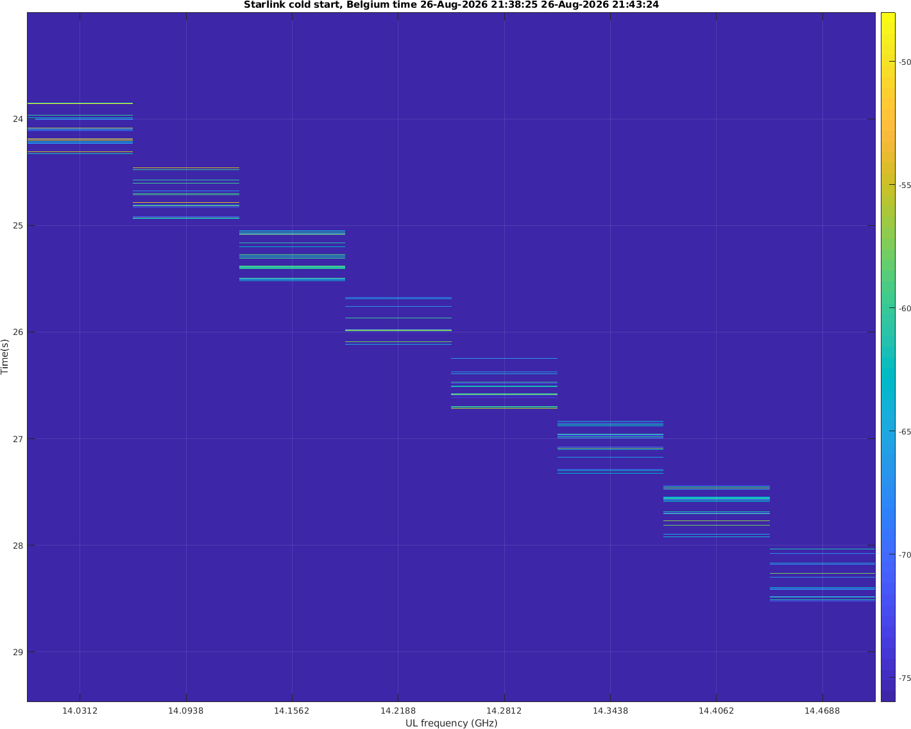
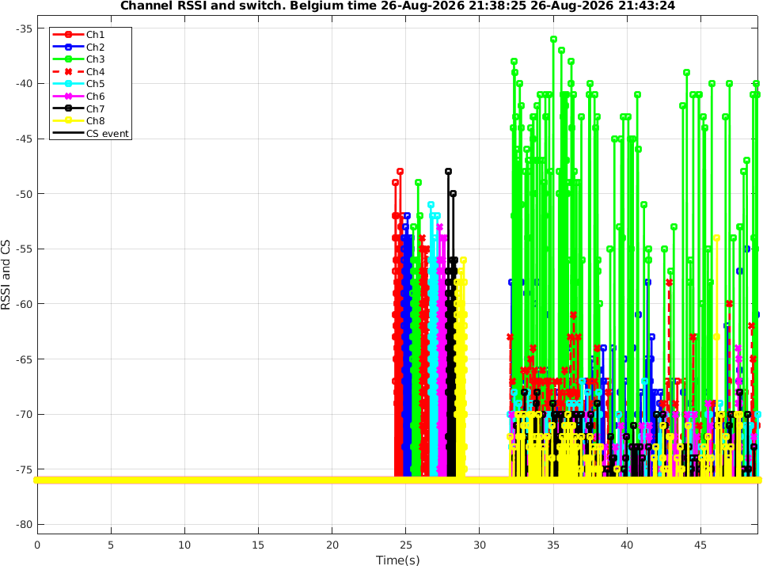
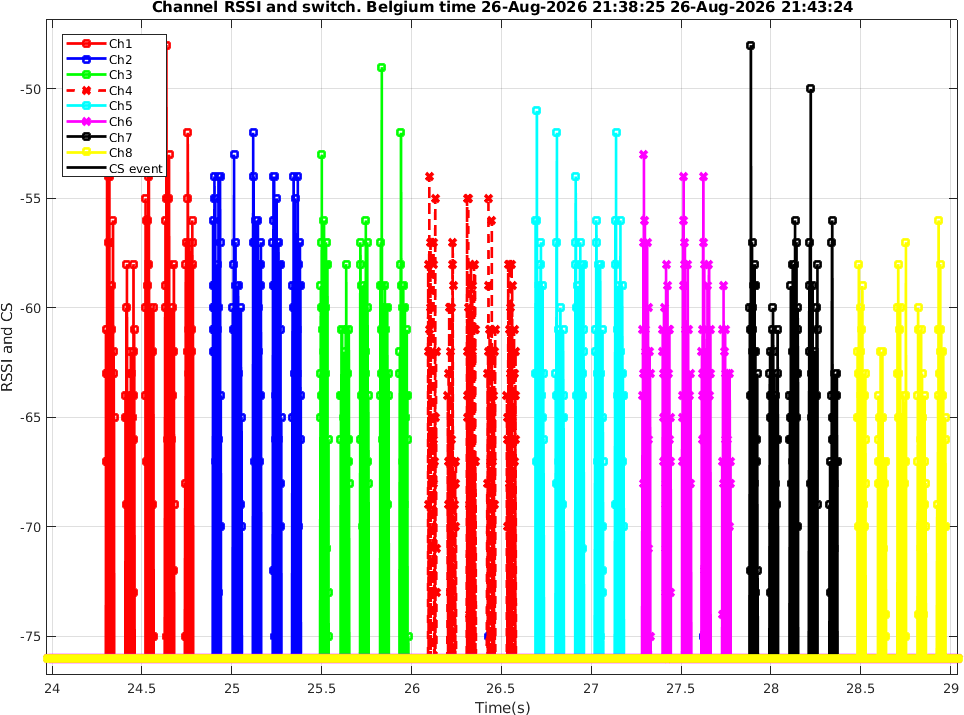
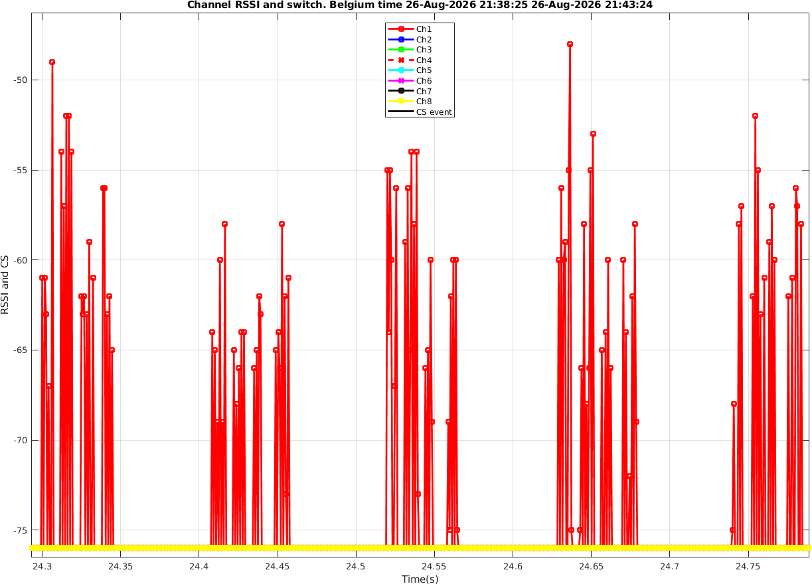
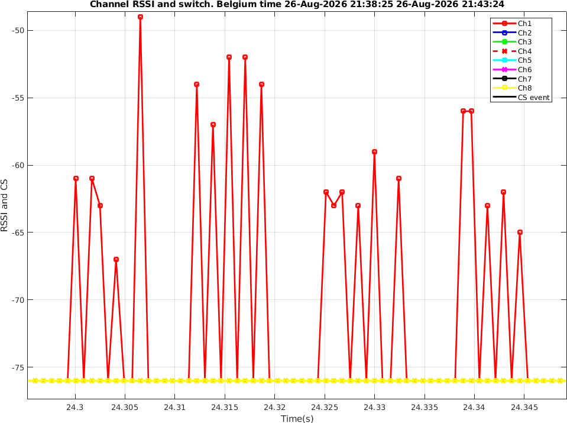
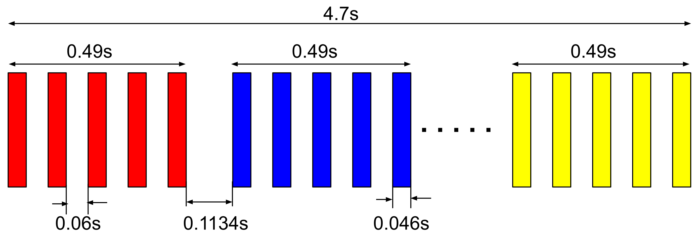

Conclusion first (96.4% confidence): After every cold start, the Starlink terminal begins transmitting sequentially on uplink channels 1–8 at around 24 seconds after power-on. 
On each channel, the transmission consists of five clusters, each containing several shorter bursts.

This fixed-time transmission pattern is highly likely to be an RF and phased-array self-calibration procedure.

After some additional (random) time, likely depends on the currently visible satellites, the terminal begins uplink transmissions for initial network entry and control-plane connection.

Another interesting discovery/guess: The Starlink terminal firmware OS loading (Linux?) costs about 6s.

The detailed information

I continue to use the AD9361 high-speed frequency-hopping measurement system developed in my previous article, to study the RF behavior of the Starlink terminal during cold start.

Measurement Method

I pressed Enter on my 8-channel RF capture program at the same time as I powered on the Starlink terminal. After five minutes of RSSI (all 8 UL channels) and gRPC logging, I examined the RF channel occupancy timeline and compared it with the 
startup timeline reported by gRPC.

I performed eight cold-start measurements, and all eight showed the same behavior.

Here is one example.

Time-frequency waterfall



Raw time-domain RSSI



It is very clear that the terminal begins the channel-scanning transmissions at around 24 seconds after power-on, and ends the channel-scanning transmission at around 29 seconds.

Zoomed-in time-domain view:



Five clusters are transmitted sequentially on each channel.

Zooming in further to channel 1 shows the five clusters:



Zooming in on the first cluster reveals several even shorter bursts inside it:



My AD9361 fast-hopping measurement system has a time resolution of 800 μs, because it completes one scan of all eight channels every 800 μs. Therefore, the exact burst shapes and intervals are not very clear.

But this is not a problem. Once we know the channel transmission pattern during cold start, we can return to my original 60 Msps single-channel capture system and analyze the detailed structure of each cluster on an individual channel.

Detailed Timing



- The complete 8-channel scan takes 4.7 seconds.
- Transmission on each channel: 0.49 s
- Channel switching time: 0.1134 s
- Duration of each of the five burst groups on a channel: 0.046 s
- Interval between burst groups: 0.06 s

Why Is This 8-Channel Scan Probably Not Actual Satellite Communication?

1. The timing is fixed relative to power-on

The 8-channel scanning transmission always appears at approximately the same time after power-on.

If this were actual communication with a satellite, the timing should be random/variable. In a typical communication system, before transmitting to a base station or satellite, the terminal should first obtain downlink synchronization and 
some knowledge of the available time-frequency grids. Its transmission should then occur within specific time-frequency resources pre-defined/allocated by the network.

If the terminal always transmitted at a fixed time after power-on, while power-on itself occurs at a random time, the resulting transmission would occur at essentially random times relative to the network. This would create unnecessary interference.

A fixed-time RF operation after power-on therefore looks much more like an inherent hardware/firmware procedure than actual satellite communication.

2. The phased-array antenna requires self-calibration

The Starlink phased-array antenna contains thousands of RF paths that need to be calibrated. Because: The temperature may be different every time the terminal starts. Hardware aging may also change the RF characteristics, 
and the terminal may even have experienced mechanical shock.

Teardown reports of Starlink phased-array antennas have described a hardware-based near-field self-transmit/self-receive calibration mechanism using air coupling.

The 8-channel scanning signal, together with the multiple clusters within each channel, looks very much like the RF paths of the phased array being calibrated step by step using different frequency and phase settings.

3. The signal power appears lower

The power of the 8-channel scanning signal appears to be lower than that of the actual satellite communication signals that follow.

This is also consistent with a near-field self-calibration mechanism between antenna elements. Because the coupling distance is very short, the transmit power does not need to be high and may need to remain low to avoid receiver saturation.

That's why I believe the 8 channel scanning emission is for self-calibration instead of actual satellite communication.

Identifying the Actual Initial Network Entry

I also measured the time at which a large amount of transmission first appeared after the 8-channel scan.

Unlike the 8-channel scan, this time varies from one cold start to another. This strongly suggests that these transmissions are actual satellite communication signals synchronized to the network's time-frequency resources rather than to 
the terminal's power-on time.

After comparing the gRPC startup records from all eight cold starts, I found that these moments of heavy transmission correspond closely to the initial_network_entry state.

I therefore suspect that they are part of the initial network entry procedure.

For example, the following gRPC status corresponds to the RF capture shown above:

```
"initialization_duration_seconds": {
    "attitude_initialization": 70,
    "burst_detected": 23,
    "ekf_converged": 143,
    "first_cplane": 27,
    "first_pop_ping": 41,
    "gps_valid": 15,
    "initial_network_entry": 25,
    "network_schedule": 29,
    "rf_ready": 23,
    "stable_connection": 0
}
```

An interesting detail is that the measured 8-channel scan ends at approximately 29 seconds, while gRPC consistently reports rf_ready at 23 seconds across many many gRPC logs from many many cold starts.

This 6-second difference may correspond to the startup time of Starlink's internal firmware/operating system (Linux?).

Therefore, the initial_network_entry time reported by gRPC as 25 seconds should be shifted by roughly 6 seconds, giving approximately 31 seconds after power-on.

Using this time-offset compensation, I compared the RF channel measurements with the gRPC records from all eight cold starts.

The results strongly support the conclusion that the moment of heavy RF transmission following the 8-channel scan corresponds to the initial_network_entry stage.

<div id="disqus_thread"></div>
<script type="text/javascript">
    /* * * CONFIGURATION VARIABLES: EDIT BEFORE PASTING INTO YOUR WEBPAGE * * */
    var disqus_shortname = 'jiaoxianjun'; // required: replace example with your forum shortname

    /* * * DON'T EDIT BELOW THIS LINE * * */
    (function() {
        var dsq = document.createElement('script'); dsq.type = 'text/javascript'; dsq.async = true;
        dsq.src = '//' + disqus_shortname + '.disqus.com/embed.js';
        (document.getElementsByTagName('head')[0] || document.getElementsByTagName('body')[0]).appendChild(dsq);
    })();
</script>
<noscript>Please enable JavaScript to view the <a href="http://disqus.com/?ref_noscript">comments powered by Disqus.</a></noscript>


<!-- Global site tag (gtag.js) - Google Analytics -->
<script async src="https://www.googletagmanager.com/gtag/js?id=G-01GGQ8JZW7"></script>
<script>
  window.dataLayer = window.dataLayer || [];
  function gtag(){dataLayer.push(arguments);}
  gtag('js', new Date());

  gtag('config', 'G-01GGQ8JZW7');
</script>

<script async src="https://pagead2.googlesyndication.com/pagead/js/adsbygoogle.js?client=ca-pub-1542618827905251"
     crossorigin="anonymous"></script>
