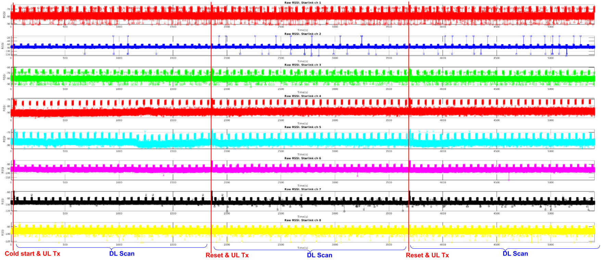
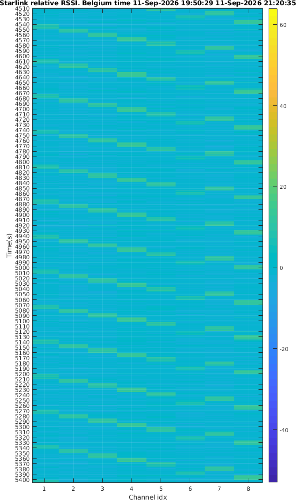

In the previous post, I observed what appears to be a regular downlink channel-scanning behavior after a Starlink terminal cold start. 
The terminal sequentially scans all 8 downlink channels (strictly dwell ~8.26 seconds/channel). However, this behavior becomes irregular and difficult to identify after establishing a satellite connection.

What happens if we block the Starlink satellite signal so that the terminal cannot receive any satellite signal? Will it continue scanning the 8 channels in sequence?

Experiments show that the answer is yes.

Continuous RF measurements for 1.5 hours clearly show that, when the satellite signal is blocked, the terminal continues searching across the 8 downlink channels, switching channels strictly every ~8.26 seconds. 
This behavior remains clearly visible until the terminal reboots after ~1834 seconds.

After rebooting, we clearly observe again the 8 uplink channels being transmitted sequentially, as seen in the previous article. This is likely related to RF calibration. 
After that, the terminal stops transmitting on the uplink and only continues scanning the 8 downlink channels in sequence. It then reboots again after another 1834 seconds.

This is consistent with our previous analysis and also with the design principles of most cellular communication networks: a terminal should not transmit blindly before acquiring system broadcast information.

Because the reboot interval is highly consistent, it is likely a fixed long-timeout mechanism in the terminal firmware that triggers when no Starlink satellite can be found for an extended period.

During the ~8.26 second dwell time on each channel, how many directions in the sky does the phased array scan on the same channel? This requires further investigation.

Below is a waterfall plot taken near the end of the 1.5-hour measurement (5400 seconds). The sequential switching across all 8 downlink frequencies remains unchanged and clear.

<noscript>Please enable JavaScript to view the <a href="http://disqus.com/?ref_noscript">comments powered by Disqus.</a></noscript>

<!-- Global site tag (gtag.js) - Google Analytics -->

