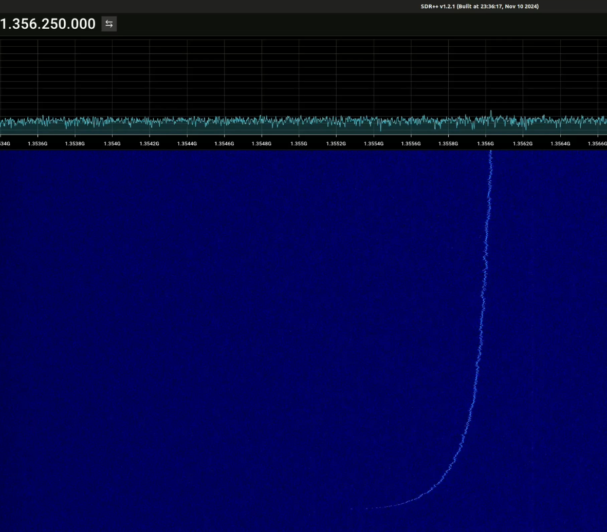
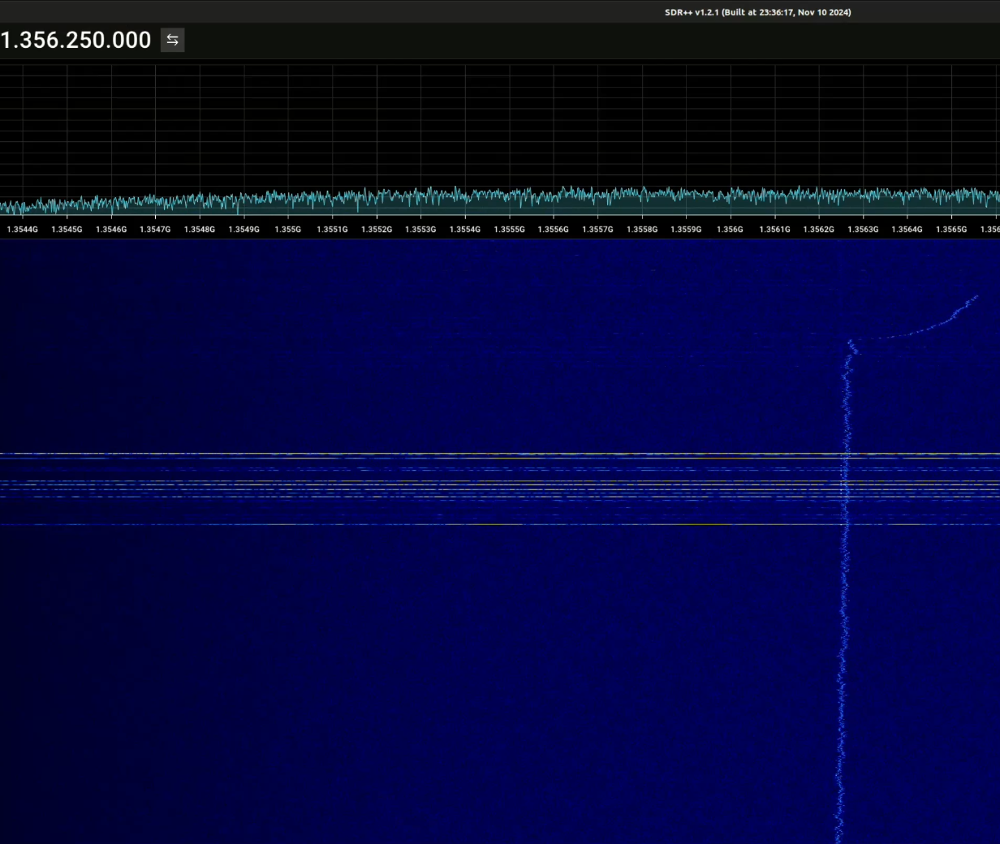
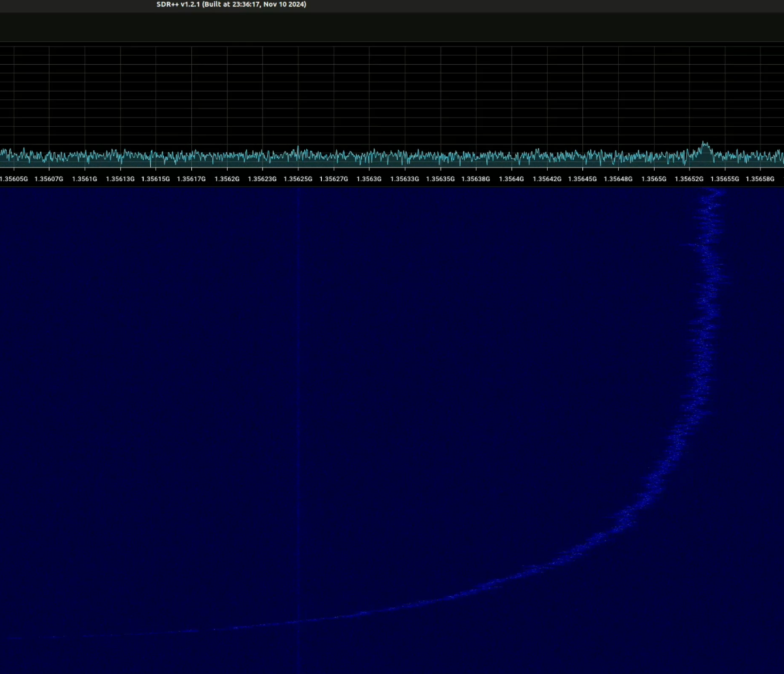
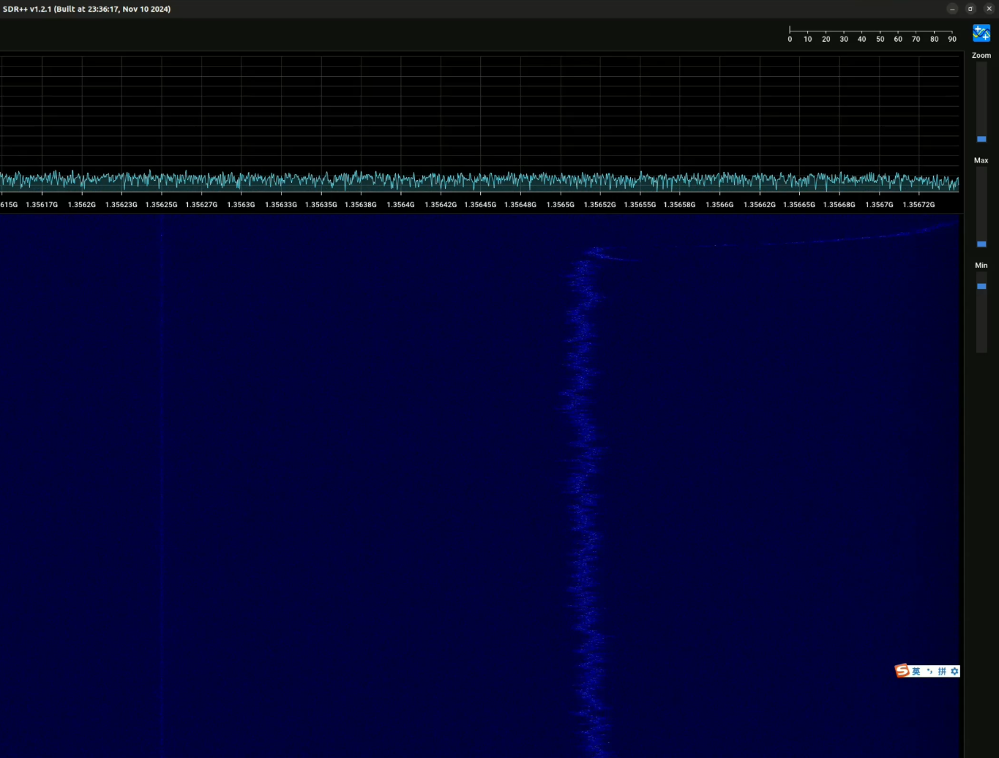
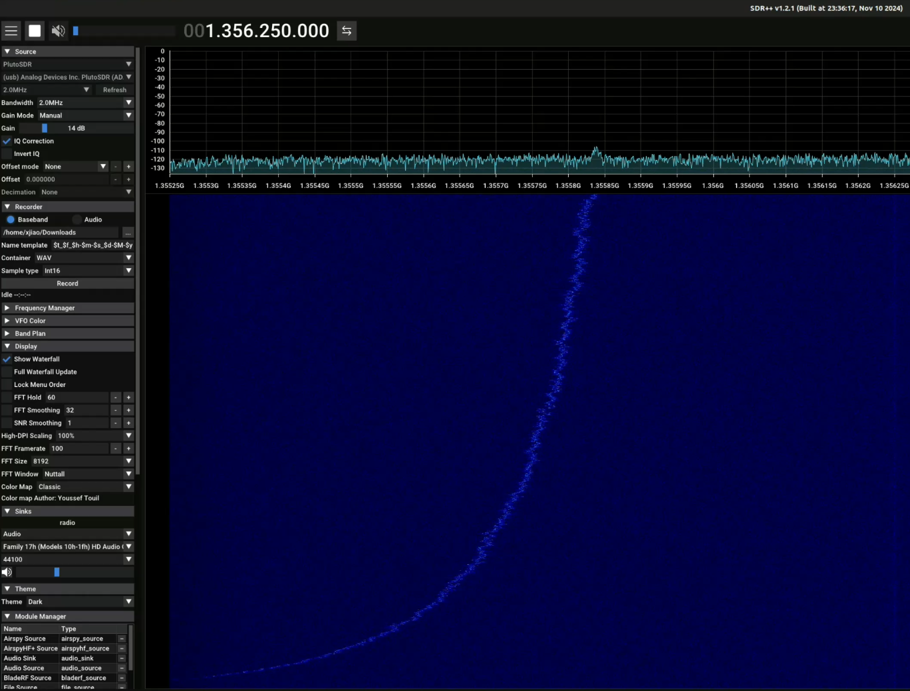
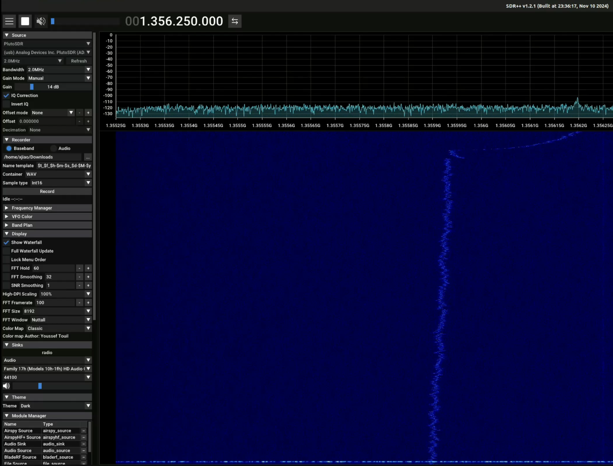

Normal cold start: Power on the Starlink terminal shortly after power off previously.

Deep cold start: Power on the Starlink terminal after it has been powered off for several days.

New finding: During a deep cold start, in addition to the 8-channel scanning transmission we previously observed around 24 seconds after the Starlink terminal starts up (https://sdr-x.github.io/starlink-UL-cold-start/), another mysterious, drifting signal can also be observed. 
This signal can't be observed during the normal cold start.

It starts at a relatively low frequency, gradually becomes stronger, and moves toward higher frequencies.

It finally disappears with a rapid "swoosh" at an even higher frequency.

The center frequency of 1356.25 MHz shown in the screenshot is the center frequency of Starlink uplink channel 3: 14 + 0.03125 + 2 × 0.0625 GHz = 14.15625 GHz. 
after downconversion by a Ku-band LNB with a 12.8 GHz local oscillator.

The phenomenon has been verified with two different SDRs, which largely rules out the possibility that it is caused by the SDR hardware. It has also been observed in two deep cold-start experiments.

Below are more screenshots and videos (). They show that the starting and ending frequencies of this drifting signal can appear at either lower or higher than the center frequency.

<noscript>Please enable JavaScript to view the <a href="http://disqus.com/?ref_noscript">comments powered by Disqus.</a></noscript>

<!-- Global site tag (gtag.js) - Google Analytics -->

